| Name | Image | Upgraded image | Rarity | Type | Cost | Description |
| ---- | ----- | -------------- | ------ | ---- | ---- | ----------- |
| Defend | 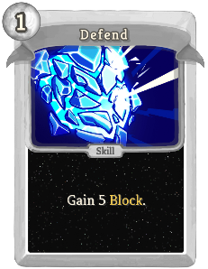 | 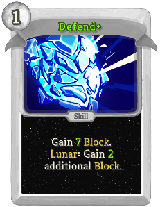 | Basic | Skill | 1 | Gain 5(7) Block.  (astrologer:Lunar: Gain 0(2) additional Block.) |
| Guiding Star | 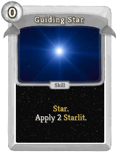 | 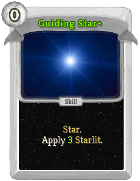 | Basic | Skill | 0 | astrologer:Star. Apply 2(3) astrologer:Starlit. |
| Strike | 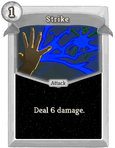 |  | Basic | Attack | 1 | Deal 6(8) damage.  (astrologer:Solar: Deal 0(2) additional damage.) |
| The Fool | 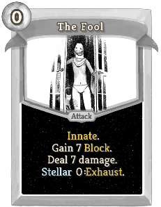 | 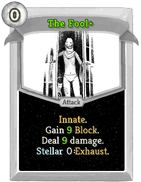 | Basic | Attack | 0 | Innate. Gain 7(9) Block. Deal 7(9) damage. [#ccf3ff]Stellar[] !STELLAR_VARIABLE!: Exhaust. |
| Ominous Star | 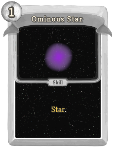 | 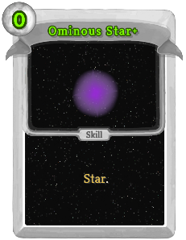 | Special | Skill | 1(0) | astrologer:Star. |
| Comet Strike | 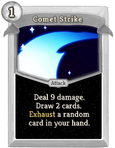 | 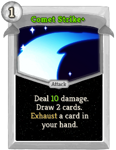 | Common | Attack | 1 | Deal 9(10) damage. Draw 2 cards. Exhaust a random (not random)card in your hand. |
| Conjunction | 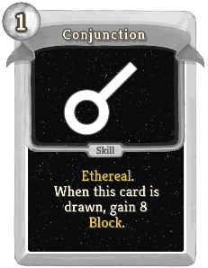 | 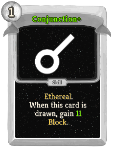 | Common | Skill | 1 | Ethereal. When this card is drawn, gain 8(11) Block. |
| Eclipse | 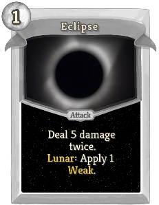 |  | Common | Attack | 1 | Deal 5(6) damage twice. astrologer:Lunar: Apply 1(2) Weak. |
| Frozen Star | 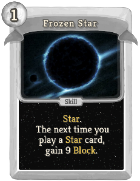 | 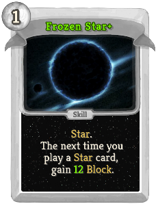 | Common | Skill | 1 | astrologer:Star. The next time you play a astrologer:Star card, gain 9(12) Block. |
| Meteor Shower | 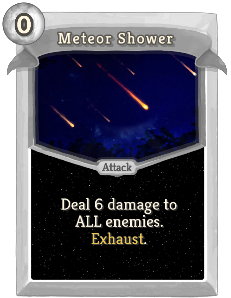 | 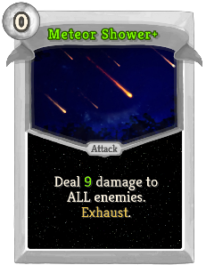 | Common | Attack | 0 | Deal 6(9) damage to ALL enemies. Exhaust. |
| Moonlight | 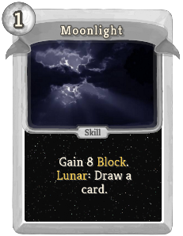 | 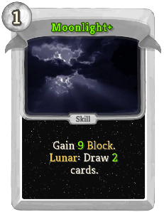 | Common | Skill | 1 | Gain 8(9) Block. astrologer:Lunar: Draw a (1(2)) card(s). |
| Nebula | 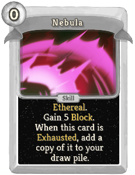 | 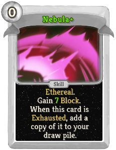 | Common | Skill | 0 | Ethereal. Gain 5(7) Block. When this card is Exhausted, add a copy of it to your draw pile. |
| Opposition | 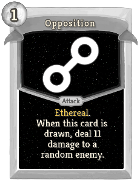 | 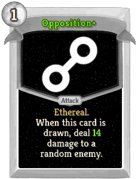 | Common | Attack | 1 | Ethereal. When this card is drawn, deal 11(14) damage to a random enemy. |
| Radiance | 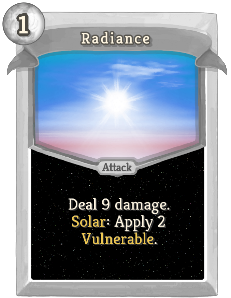 | 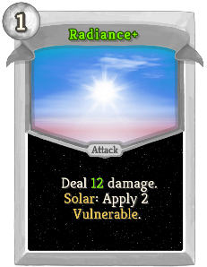 | Common | Attack | 1 | Deal 9(12) damage. astrologer:Solar: Apply 2 Vulnerable. |
| Read The Stars | 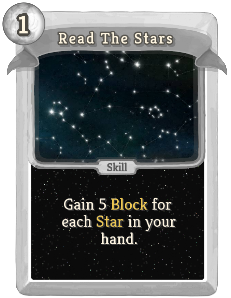 | 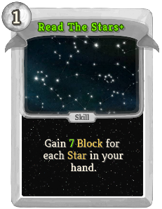 | Common | Skill | 1 | Gain 5(7) Block for each astrologer:Star in your hand. |
| Solar Flare | 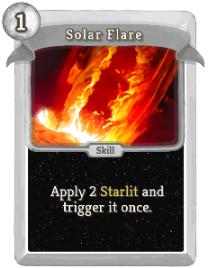 | 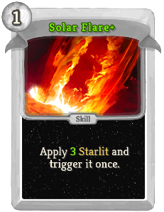 | Common | Skill | 1 | Apply 2(3) astrologer:Starlit and trigger it once. |
| Stardust | 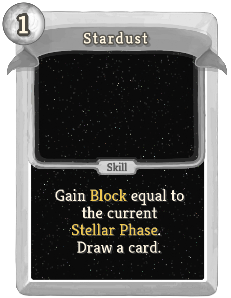 | 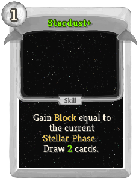 | Common | Skill | 1 | Gain Block equal to the current astrologer:Stellar_Phase. Draw a (1(2)) card(s). |
| Still | 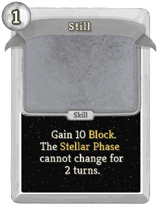 | 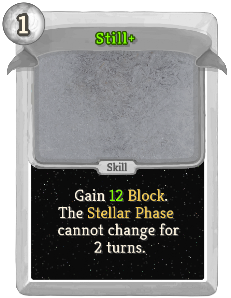 | Common | Skill | 1 | Gain 10(14) Block. The astrologer:Stellar_Phase cannot change for 2 turns. |
| Cataclysm | 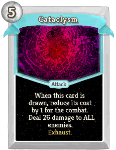 | 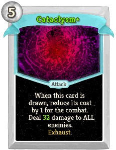 | Uncommon | Attack | 5 | When this card is drawn, reduce its cost by 1 for the combat. Deal 26(32) damage to ALL enemies. Exhaust. |
| Confirmation | 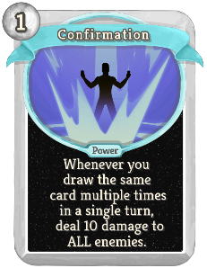 | 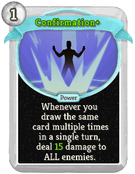 | Uncommon | Power | 1 | Shuffle an astrologer:Ominous_Star into your draw pile. Whenever you draw an astrologer:Ominous_Star, deal 8(13) damage to ALL enemies. |
| Cosmic Expanse | 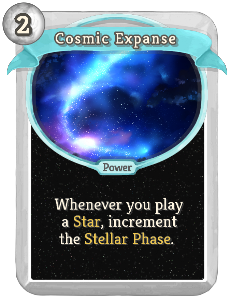 | 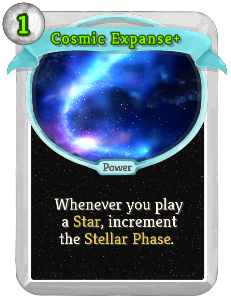 | Uncommon | Power | 2(1) | Whenever you play a astrologer:Star, increment the astrologer:Stellar_Phase. |
| Crystal Ball | 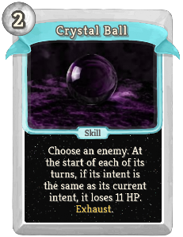 | 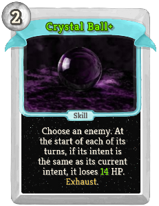 | Uncommon | Skill | 2 | Choose an enemy. At the start of each of its turns, if its intent is the same as its current intent, it loses 11(14) HP. Exhaust. |
| Divination | 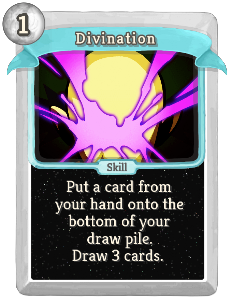 | 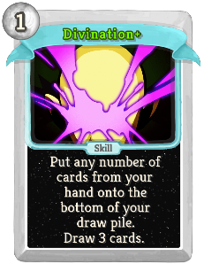 | Uncommon | Skill | 1 | Put a (any number of) card(s) from your hand onto the bottom of your draw pile. Draw 3 cards. |
| Fading Star | 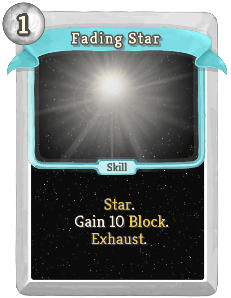 | 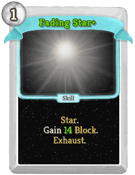 | Uncommon | Skill | 1 | astrologer:Star. Gain 10(14) Block. Exhaust. |
| Fireball | 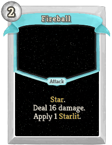 | 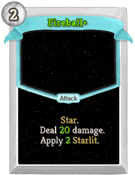 | Uncommon | Attack | 2 | astrologer:Star. Deal 16(20) damage. Apply 1(2) astrologer:Starlit. |
| Glass Star | 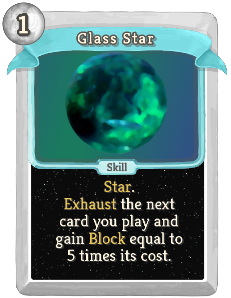 | 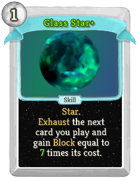 | Uncommon | Skill | 1 | astrologer:Star. Exhaust the next card you play and gain Block equal to 5(7) times its cost. |
| Glimpse |  |  | Uncommon | Power | 1 | Whenever you draw an Ethereal card, gain 3(5) Block. |
| Judgement |  |  | Uncommon | Attack | 3 | Deal 12(15) damage twice. [#ccf3ff]Stellar[] !STELLAR_VARIABLE!: If this kills a non-minion enemy, reduce its cost by 1 permanently. |
| Justice |  |  | Uncommon | Skill | 1 | ALL creatures gain 8(11) Block. [#ccf3ff]Stellar[] !STELLAR_VARIABLE!: ALL enemies lose HP equal to double their current Block. |
| Lonely Star |  |  | Uncommon | Skill | 1 | astrologer:Star. Ethereal. When this card is drawn, draw 2(3) cards. |
| Neutron Star |  |  | Uncommon | Attack | X | astrologer:Star. Apply X astrologer:Starlit. Deal 2(3) damage for each stack of astrologer:Starlit the enemy has. |
| Novile |  |  | Uncommon | Skill | 1 | Ethereal. When this card is drawn, gain [E] [E] ([E]). |
| Observe |  |  | Uncommon | Skill | 2 | Gain Block equal to the number of cards in your draw pile (+ 0(6)). |
| Perihelion |  |  | Uncommon | Attack | 0 | Deal 4 damage. astrologer:Solar: Deal 2(3) times as much damage instead. |
| Premeditation |  |  | Uncommon | Skill | 1(0) | Draw the bottom card of your draw pile, then play and Exhaust it. |
| Prestidigitation |  |  | Uncommon | Power | 1(0) | At the start of your turn, draw 1 card and put 1 card on the bottom of your draw pile. |
| Prismatic |  |  | Uncommon | Power | 1 | The first time you play a astrologer:Star each turn, apply 1(2) astrologer:Starlit to a random enemy. |
| Quincunx |  |  | Uncommon | Skill | 1 | Ethereal. When this card is drawn, a random enemy loses 4(6) Strength this turn. |
| Retelling |  |  | Uncommon | Skill | 0 | Shuffle your hand into your draw pile, then put that many (plus 0(1)) cards from your discard pile into your hand. Exhaust. |
| Shine |  |  | Uncommon | Skill | 2(1) | Play a card in your hand twice and Exhaust it. Exhaust. |
| Shining Star |  |  | Uncommon | Skill | 1 | astrologer:Star. Ethereal. When this card is drawn, apply 3(4) astrologer:Starlit to a random enemy. |
| Shooting Star |  |  | Uncommon | Skill | 0 | astrologer:Star. (Ethereal.)  Draw a card. When this card is Exhausted, add a copy of it to your draw pile. |
| Star Of Change |  |  | Uncommon | Skill | 1 | astrologer:Star. Ethereal. When this card is drawn, Exhaust a card in your hand and add a random (upgraded) card to your hand. It costs 0 this turn. |
| Star Of Regret |  |  | Uncommon | Attack | 1 | astrologer:Star. Deal 8(10) damage. When this card is Exhausted, deal twice as much damage to ALL enemies. |
| Star of Courage |  |  | Uncommon | Skill | 1(0) | astrologer:Star. Exhaust all non-Attack cards in your hand. Gain 1 Strength for each card Exhausted. |
| Star of Misfortune |  |  | Uncommon | Skill | 0 | astrologer:Star. Apply 1(2) Weak. Apply 1(2) Vulnerable. |
| Strength |  |  | Uncommon | Skill | 0 | Gain 1(2) Strength. Exhaust. [#ccf3ff]Stellar[] !STELLAR_VARIABLE!: Gain 1(2) Strength for each enemy in combat. |
| Temperance |  |  | Uncommon | Skill | 0 | Heal 2(3) HP. Exhaust. [#ccf3ff]Stellar[] !STELLAR_VARIABLE!: Exhaust any number of cards in your hand. Heal 2(3) HP for each card Exhausted. |
| The Devil |  |  | Uncommon | Attack | 0 | Deal 10(14) damage. If this does not kill the enemy, lose 6 HP. [#ccf3ff]Stellar[] !STELLAR_VARIABLE!: Deals additional damage equal to your missing health. |
| The Emperor |  |  | Uncommon | Skill | 1 | Enemy loses 4(6) Strength this turn. [#ccf3ff]Stellar[] !STELLAR_VARIABLE!: Enemy loses three times as much Strength. Exhaust. |
| The Empress |  |  | Uncommon | Skill | 2(1) | [#ccf3ff]Stellar[] !STELLAR_VARIABLE!: ALL enemies lose HP equal to the total amount of damage they intend to deal. |
| The Hanged Man |  |  | Uncommon | Skill | 1 | Whenever you draw a card this turn, the enemy loses 4(7) HP. [#ccf3ff]Stellar[] !STELLAR_VARIABLE!: Draw 3 cards. |
| The Hermit |  |  | Uncommon | Skill | 1 | Gain 2(3) Block for each card played this turn. [#ccf3ff]Stellar[] !STELLAR_VARIABLE!: Draw a card from the bottom of your draw pile. It costs 1 less this turn. |
| The Hierophant |  |  | Uncommon | Skill | 0 | Gain 4 Block. Gain 1(2) Dexterity. At the end of the turn, lose 1(2) Dexterity. [#ccf3ff]Stellar[] !STELLAR_VARIABLE!: Remove all debuffs. Exhaust. |
| The High Priestess |  |  | Uncommon | Skill | 2 | (Retain.)  [#ccf3ff]Stellar[] !STELLAR_VARIABLE!: Double the base damage of a card in your hand for the combat. Exhaust. |
| The Lovers |  |  | Uncommon | Skill | 1(0) | Exchange the costs of two cards in your hand for the rest of combat. Exhaust. [#ccf3ff]Stellar[] !STELLAR_VARIABLE!: The chosen cards will be played twice the next time you play them. |
| The Magician |  |  | Uncommon | Attack | 2 | Ethereal. (not Ethereal.) Deal damage equal to the number of cards played this combat. [#ccf3ff]Stellar[] !STELLAR_VARIABLE!: Play a random card from your draw pile. |
| The Moon |  |  | Uncommon | Skill | 2(1) | astrologer:Lunar: Gain Block equal to half of the total damage enemies intend to do. [#ccf3ff]Stellar[] !STELLAR_VARIABLE!: ALL enemies lose 4 Strength. Exhaust. |
| The Tower |  |  | Uncommon | Attack | 1 | Deal 7 damage to a random enemy. [#ccf3ff]Stellar[] !STELLAR_VARIABLE!: Deal 7 damage to a random enemy 3(4) additional times. |
| Alignment |  |  | Rare | Skill | X | Add X (+ 0(1)) copies of the bottom card of your draw pile to your hand. They cost X (+ 0(1)) less this combat. Exhaust. |
| Astral Form |  |  | Rare | Power | 3 | Ethereal. (not Ethereal.) ALL your cards are astrologer:Stars. |
| Black Hole |  |  | Rare | Attack | 2 | Purge all cards in your Exhaust pile. Deal 4(6) damage for each Purged card. Exhaust. |
| Dark Matter |  |  | Rare | Power | 1 | (Innate.)  The first time a card is Exhausted each turn that is not a Status or Curse, add a copy of it to your draw pile. |
| Death |  |  | Rare | Attack | 3(2) | Ethereal. Deal 13 damage. [#ccf3ff]Stellar[] !STELLAR_VARIABLE!: Kill the target non-boss enemy. |
| Fate |  |  | Rare | Skill | 0 | The next [#ccf3ff]Stellar[] card played this turn will be active. Exhaust. (not Exhaust.) |
| Heat Death |  |  | Rare | Attack | 2 | Exhaust ALL your astrologer:Stars. Deal 7(9) damage to a random enemy for each card Exhausted. Exhaust. |
| Nova |  |  | Rare | Power | 1 | Trigger astrologer:Starlit 1(2) time(s) at the end of your turn. |
| Premonition |  |  | Rare | Power | 2(1) | Whenever you draw an Ethereal card, draw a card. |
| Reject Reality |  |  | Rare | Attack | 3 | Gain 24(30) Block. Deal 18(22) damage. Shuffle 3 Dazed into your draw pile. |
| The Chariot |  |  | Rare | Power | 2 | Gain 10(14) Temporary_HP. [#ccf3ff]Stellar[] !STELLAR_VARIABLE!: Gain 1 Intangible. |
| The Star |  |  | Rare | Attack | 1(0) | astrologer:Star. Deal damage equal to the current astrologer:Stellar_Phase to ALL enemies. [#ccf3ff]Stellar[] !STELLAR_VARIABLE!: Deals twice as much damage. |
| The Sun |  |  | Rare | Attack | 2 | astrologer:Star. astrologer:Solar: Deal 16(22) damage to ALL enemies. [#ccf3ff]Stellar[] !STELLAR_VARIABLE!: ALL enemies lose 33(44) HP. |
| The World |  |  | Rare | Skill | 1 | Draw 4(5) cards. [#ccf3ff]Stellar[] !STELLAR_VARIABLE!: Before drawing, reset your deck to the beginning of combat, except for this card. Purge. |
| Trine |  |  | Rare | Skill | 1(0) | Ethereal. When this card is drawn, the next card you play this turn is played twice. |
| Wheel of Fortune |  |  | Rare | Skill | 1 | Lose 10 Gold. [#ccf3ff]Stellar[] !STELLAR_VARIABLE!: Play 2(3) random [#ccf3ff]Stellar[] cards. Their [#ccf3ff]Stellar[] effects are triggered. |
| Wish |  |  | Rare | Skill | 4 | Costs 1 less [E] for each astrologer:Star card Exhausted this combat. Gain 12(18) Block. Draw 2 card. |
