## Potions

| Image | Name | Rarity | Description |
| ----- | ---- | ------ | ----------- |

## Relics

| Image | Name | Rarity | Color | Description | Flavor |
| ----- | ---- | ------ | ----- | ----------- | ------ |
|  | Bombinator | Starter |  | #pActivate: Deal #b10 damage to ALL enemies. #b3 #rCharges. | Emergency use only. |
|  | First Drone | Starter |  | #pPassive: Deal #b1 damage to a random enemy and gain #b1 #yBlock. | The first drone you ever constructed. Certainly not near the last. |
|  | Multi-tool | Starter |  | #pActivate: Deal #b6 damage and gain #b6 #yBlock. #rCooldown #b2. | A tiny, helpful bundle of tricks. |
|  | Snap-Guard | Starter |  | #pActivate: Gain #b4 #yBlock. #rCooldown #b3. | Out and ready in a flash! |
|  | Suppression Spray | Starter |  | #pActivate: Apply #b1 #yWeak. #rCooldown #b4. | Competitor to Louse-B-Gone. |
| 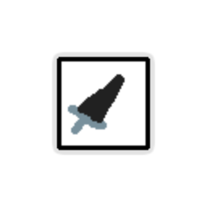 | Sword Launcher | Starter |  | #pActivate: Deal #b10 damage to the frontmost enemy. #rCooldown #b3. | Especially helpful in simple combat. |
| 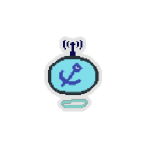 | Anchor Drone | Common |  | Start each combat with #b5 #yBlock. #pPassive: Deal #b1 damage to a random enemy. | But why does it carry this anchor!? |
| 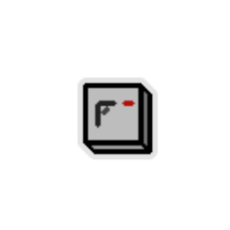 | Blastinator | Common |  | #pActivate: Deal #b12 damage. #b3 #rCharges. | Blast awaaaay! |
| 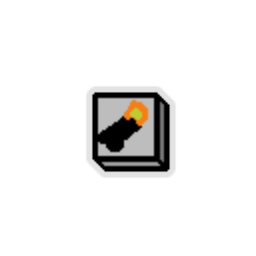 | Cannon-inator | Common |  | #pActivate: Deal #b15 damage to the backmost enemy. #b3 #rCharges. | 1...2...3... BLAM! |
|  | Confusionator | Common |  | #pActivate: Apply #b2 #yWeak to ALL enemies. #b3 #rCharges. | What was I doing again? Intending to attack? |
|  | Defensinator | Common |  | #pActivate: Gain #b8 #yBlock. #b3 #rCharges. | You shall never pierce my defenses now! Bwahaha! |
|  | Energinator | Common |  | #pActivate: Reduce the #rCooldown of your #yTools on #rCooldown by #b1. #b3 #rCharges. | I'm on the outsiiide now. |
| 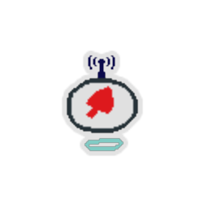 | Fighter Drone | Common |  | #pPassive: Alternates between gaining #b3 #yBlock and dealing #b3 damage to ALL enemies. | Basic combat AI. |
| 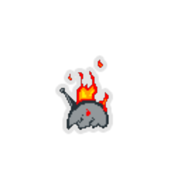 | Flame Drone | Common |  | #pPassive: Deal #b3 damage to ALL enemies. | Liable to overheat. |
| 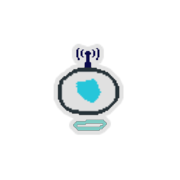 | Guard Drone | Common |  | #pPassive: Gain #b2 #yBlock. | To serve, and protect. |
|  | Handgun | Common |  | #pActivate: Deal #b3 damage to a random enemy. #rCooldown #b2. | But where's the key? |
|  | Heavy Medal | Common |  | #pActivate: Gain #b10 #yBlock. #rCooldown #b5. | Quite small, but still heavy. |
|  | Hecklinator | Common |  | #pActivate: Deal #b5 damage. Apply #b1 #yWeak. #b4 #rCharges. | BOO! BOO! YOU MAKE MY PARTS ACHE! |
| 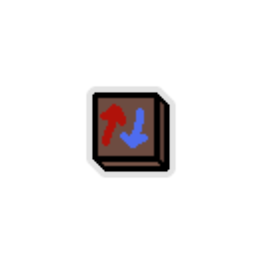 | Iron-Wavinator | Common |  | #pActivate: Deal #b5 damage. Gain #b5 #yBlock. #b6 #rCharges. | An immense amount of mean output!', |
|  | Louse-B-Gone | Common |  | #pActivate: Apply #b1 #yWeak to ALL enemies. #rCooldown #b5. | Got a Louse in your house? No problem. |
|  | Megacharginator | Common |  | #pActivate: Deal #b7 damage. Reduce the #rCooldown of a random #yTool on #rCooldown by #b1. #b4 #rCharges. | Damage and boosting? Count me in. |
|  | Mini Tazer | Common |  | #pActivate: Deal #b9 damage. #rCooldown #b3. | Tastes electrifying. |
|  | Neurotoxinator | Common |  | #pActivate: Apply #b5 #yPoison to ALL enemies. #b3 #rCharges. | The 'deadly' was in massive sarcasm quotes. |
|  | Pester Drone | Common |  | #pPassive: A random enemy loses #b1 #yStrength this turn. | The most annoying drone known. |
|  | Portable Cannonball | Common |  | #pActivate: Deal #b15 damage to the backmost enemy. #rCooldown #b5. | More of a WHUNK than a WHAM. |
|  | Prevention Drone | Common |  | Start each combat with #b2 #yTemporary_HP. #pPassive: Gain #b1 #yBlock. | Blood Vial tech meets a defensive core! |
|  | Punchometer | Common |  | #pActivate: Deal #b5 damage and apply #b1 #yWeak to the frontmost enemy. #rCooldown #b4. | Bif! Baf! Boof. |
|  | Reducer | Common |  | #pActivate: Reduce the #rCooldown of a random #yTool on #rCooldown by #b2. #rCooldown #b3. | Simple yet effective. |
|  | Reductionator | Common |  | #pActivate: Enemy loses #b3 #yStrength this turn. #b4 #rCharges. | A reduction in attack power, okay!? |
| 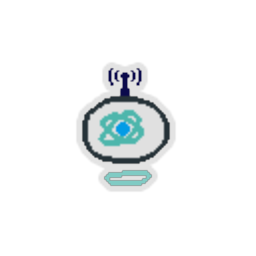 | Science Drone | Common |  | #pPassive: Reduce the #rCooldown of a random #yTool on #rCooldown by #b1. | An invaluable adviser. |
| 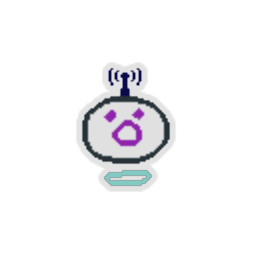 | Second Drone | Common |  | #pPassive: Deal #b2 damage to a random enemy and gain #b1 #yBlock. | A basic design outlined and executed well. An improvement on First Drone. |
|  | Shield-O-Tron | Common |  | #pActivate: Gain #b6 #yBlock. #rCooldown #b3. | Provides armor upon request. |
|  | Spraygun | Common |  | #pActivate: Deal #b9 damage to ALL enemies. #rCooldown #b4. | But does it spray water ... or bullets!? |
| 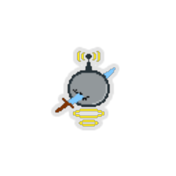 | Sword Drone | Common |  | #pPassive: Deal #b3 damage to the frontmost enemy. | A drone, for swording. |
| 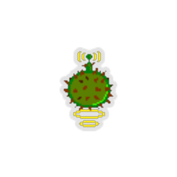 | Thorny Drone | Common |  | Start each combat with #b2 #yThorns. #pPassive: Deal #b1 damage to a random enemy. | A spiked defensive and offensive trooper. |
|  | Whackaball | Common |  | #pActivate: Deal #b6 damage, increased by #b2 for each stack of Weak the enemy has. #rCooldown #b3. | Spikes and spinning and chains, oh my! |
|  | All-Round Drone | Uncommon |  | #pPassive: Deal #b1 damage to a random enemy. Gain #b1 #yBlock. Reduce the #rCooldown of a random #yTool on #rCooldown by #b1. | Simple and effective. Useful no matter what. |
|  | Bedazzler | Uncommon |  | #pActivate: Deal #b8damage. Apply #b1 #yWeak. #rCooldown #b5. | As opposed to the Gem Gun. |
| 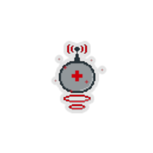 | Bolster Drone | Uncommon |  | #pPassive: Gain #b1 #yTemporary_HP. | Helps boost your defensive capabilities. |
| 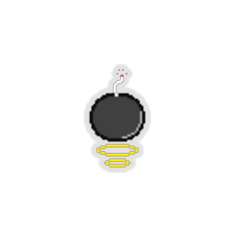 | Bomb Drone | Uncommon |  | #pPassive: Deal #b2 damage to the frontmost enemy. Deal #b1 damage to ALL enemies. | More of a piercing weapon drone. |
|  | Buffinator | Uncommon |  | #pActivate: Gain #b8 #yTemporary_HP. #b3 #rCharges. | No, not the scaling kind. |
|  | Card Generationator | Uncommon |  | #pActivate: Add a #yStolen #yCard into your hand. #b4 #rCharges. | Offers 50 flavors of Strike and Defend! |
| 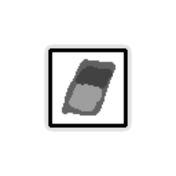 | Card Pirater | Uncommon |  | #pActivate: Add a #yStolen #yCard into your hand. #rCooldown #b4. | Ha, totally stole that idea! |
| 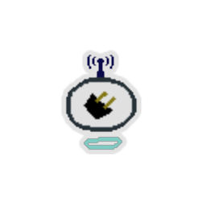 | Charger Drone | Uncommon |  | Whenever you enter a #yRest #ySite, reset the #rCooldown of your #yTools. #pPassive: Deal #b1 damage to the frontmost enemy. | Plugging in and CCHARGIN UP!!! |
| 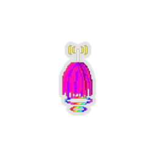 | Cheerleader Drone | Uncommon |  | Whenever you #pActivate a #yTool, gain #b1 #yBlock. #pPassive: Gain #b1 #yBlock. | Please no fanart. |
|  | Crashinator | Uncommon |  | #pActivate: Deal #b8 damage. Deal #b8 damage to ALL enemies. #b3 #rCharges. | From a past age. |
|  | Curse Launcher | Uncommon |  | #pActivate: Enemy takes #b4 damage at the end of each of its turns. #rCooldown #b4. | We don't do that bestowing thing here. |
|  | Daze Bomb | Uncommon |  | #pActivate: ALL enemies lose #b4 #yStrength this turn. #rCooldown #b4. | Confusingly catastrophic! |
|  | Debuff-Pow-Inator | Uncommon |  | #pActivate: Apply #b1 #yWeak to ALL enemies. Reduce the #rCooldown of a random #yTool on #rCooldown by #b1. #b5 #rCharges. | Debuff em, then POW! |
|  | Debuffinator | Uncommon |  | #pActivate: ALL enemies lose #b1 #yStrength. #b3 #rCharges. | Yes, the unscaling kind. |
|  | Drain-o-tron | Uncommon |  | #pActivate: Deal #b8 damage. Gain #b4 #yTemporary_HP. #rCooldown #b6. | Deeply offensive. |
|  | Drone DJ | Uncommon |  | #pActivate: Trigger the #pPassive abilities of your #yDrones. #rCooldown #b4. | Just the guy to keep your Drones feeling peppy. |
|  | Drone Feeder | Uncommon |  | #pActivate: Trigger the #pPassive ability of a random held #yDrone. #rCooldown #b3. | Flavor is mainly nuts and bolts. |
|  | Drone-Charge-inator | Uncommon |  | #pActivate: Trigger the #pPassive abilities of your #yDrones. #b5 #rCharges. | A ridiculous yet suitable name. |
| 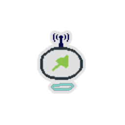 | Fighter Drone Mk. II | Uncommon |  | #pPassive: Alternates between gaining #b2 #yTemporary_HP and applying #b2 #yPoison to a random enemy. | Not a direct improvement on Fighter Drone... |
| 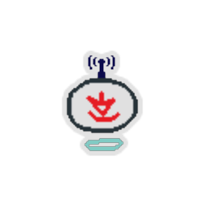 | First-Striker Drone | Uncommon |  | At the start of each combat, deal #b8 damage to ALL enemies. #pPassive: Deal #b2 damage to the frontmost enemy. | Aww yeah, get the drop on 'em! |
|  | Gas Cloud | Uncommon |  | #pActivate: Apply #b4 #yPoison to a random enemy. #rCooldown #b3. | One breath... and it's over. |
|  | Gem Gun | Uncommon |  | The first time you #pActivate this each combat, gain #b8 Gold. #pActivate: Deal #b8 damage. #rCooldown #b4. | A bejeweled weapon... |
| 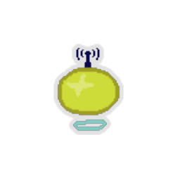 | Golden Drone | Uncommon |  | Whenever an enemy dies, gain #b5 Gold. NL #pPassive: Deal #b1 damage to a random enemy. | Gold is ineffective for combat purposes. |
|  | Goldinator | Uncommon |  | #pActivate: Gain #b10 Gold. Deal #b10 damage. #b4 #rCharges. | B-but gold is truly a very soft metal! |
|  | Optimizinator | Uncommon |  | #pActivate: Reduce the base #rCooldown of a random #yTool by #b1 this combat. #b4 #rCharges. | Perfect for data enthusiasts. |
|  | Overcharged Printer | Uncommon |  | #pActivate: Add an #yUpgraded #yStolen #yCard into your hand. #rCooldown #b4. | Slap one Infernal Forge on and... |
| 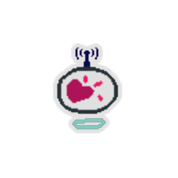 | Refreshment Drone | Uncommon |  | Whenever you enter a #yRest #ySite, raise your Max HP by #b2. #pPassive: Deal #b2 damage to a random enemy. | Mmm, soda! Just what I was looking for. |
|  | Resetinator | Uncommon |  | #pActivate: Reset the #rCooldown of a random #yTool on #rCooldown. #b4 #rCharges. | More like Rebootinator. |
|  | Sadness Spray | Uncommon |  | #pActivate: Enemy loses #b8 #yStrength this turn. #rCooldown #b8. | Add a dash of sadness to your life with three easy payments! |
|  | Scrapper Drone | Uncommon |  | Whenever you #yScrap, gain an additional #b50 Gold. #pPassive: Deal #b1 damage to ALL enemies. | All too eager to dismantle former comrades... |
|  | Tanglinator | Uncommon |  | #pActivate: Enemy takes #b4 damage at the end of each of its turns. #b5 #rCharges. | Augh, it's all over me! |
|  | Upgraded Cardinator | Uncommon |  | #pActivate: Add an #yUpgraded #yStolen #yCard into your hand. #b5 #rCharges. | A tiny Ironclad Smiths endlessly within. |
|  | Waiter Drone | Uncommon |  | #pPassive: Gain #b2 #yBlock. | Not tables, just Cooldowns. |
| 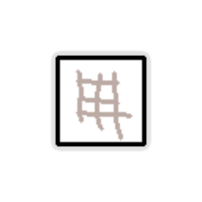 | Wheat-Bran | Uncommon |  | #pActivate: Gain #b5 #yTemporary #yHP. #rCooldown #b4. | Delicious! Good for your heart! |
|  | Wind-Upper | Uncommon |  | #pActivate: Reduce the #rCooldown of the #yTool on the lowest #rCooldown by #b1. #rCooldown #b2. | As opposed to the box-jacker. |
|  | Adapter | Rare |  | #pActivate: Give a random #yMachine #b1 additional #rCharge. #rCooldown #b12. | Supports Lightning and USB-3. |
| 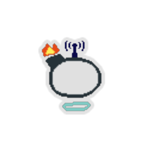 | Booster Drone | Rare |  | Whenever you enter a #yRest #ySite, give a random held #yMachine #b1 additional #rCharge. #pPassive: Deal damage to a random enemy equal to the number of held #yMachines with #b0 #rCharges. | A plug allows this Drone to interface with Machines. |
|  | Card Blaster | Rare |  | #pActivate: Deal #b8 damage. Add a #yStolen #yCard into your hand. #rCooldown #b5. | Utilized in Showman tricks infrequently. |
| 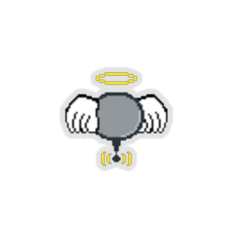 | Cleric Drone | Rare |  | At the end of combat, raise your Max HP by #b1. #pPassive: Deal #b1 damage to a random enemy. | No debuff clearing? Not a good Cleric. |
|  | Constrictor Drone | Rare |  | #pPassive: Frontmost enemy takes #b1 damage at the end of each of its turns. | Long arms squeeze and entangle. Exemplary! |
|  | Coolinator | Rare |  | #pActivate: Reduce the base #rCooldown of your #yTools by #b1 this combat. #b2 #rCharges. | Mr. Freeze, no! |
|  | Cracked Core??? | Rare |  | Start each combat with #b3 Orb slots. #pActivate: #yChannel #b1 #yLightning. #rCooldown #b5. | Pillaged this off some defective wreck. Ha! |
| 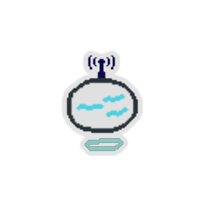 | Crippler Drone | Rare |  | #pPassive: Apply #b1 #yWeak to a random enemy. | Spams Leg Sweep with reckless abandon. |
|  | Drone-blast-inator | Rare |  | #pActivate: Trigger the #pPassive abilities of your #yDrones #b2 times. #b3 #rCharges. | I should phone security! |
|  | Dual Cardinator | Rare |  | #pActivate: Add #b2 #yStolen #yCards into your hand. #b4 #rCharges. | Double the cards, half the power. |
|  | Emergency Shieldinator | Rare |  | #pActivate: Gain #b1 #yIntangible. #b3 #rCharges. | FOR EMERGENCIES ONLY |
| 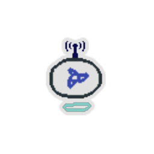 | Fighter Drone Mk. III | Rare |  | #pPassive: Alternates between adding a #yStolen #yCard into your hand and reducing an enemy's #yStrength by #b2 this turn. | The final iteration of Fighter Drone. |
| 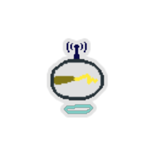 | Finger-O-Death Drone | Rare |  | Start each combat with #b4 #yTemporary_HP. #pPassive: Deal damage equal to your #yTemporary_HP to a random enemy. | Shockingly effective! |
|  | Gold Tossinator | Rare |  | #pActivate: Lose #b24 Gold. Deal #b12 damage to ALL enemies. #b8 #rCharges. | Wasteful yet incredibly effective. |
|  | Gravity Launcher | Rare |  | #pActivate: Deal #b15 damage and apply #b2 #yWeak to ALL enemies. #rCooldown #b8. | A rather bardic invention. |
|  | Megabuffer | Rare |  | #pActivate: Reduce the base #rCooldown of a random #yTool by #b1 this combat. #rCooldown #b8. | Alternatively, you could have 1 Artifact right now. |
| 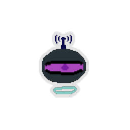 | Mimic Drone | Rare |  | #pPassive: Copies the #pPassive of a random held #yDrone. | Hey, this isn't a drone at all! |
|  | Mimic Machine | Rare |  | #pActivate: Copies the #pActivate of a random held #yMachine. #b5 #rCharges. | Gross, it's slimy! |
|  | Mimic Tool | Rare |  | #pActivate: Copies the #pActivate of a random held #yTool. #rCooldown #b3. | But the sticky note says 'NOT A MIMIC'! |
|  | Mirror Drone | Rare |  | Whenever you receive attack damage, deal #b50% of that damage back. #pPassive: Gain #b1 #yBlock. | A unique drone enord euqinu A |
|  | Orbinator | Rare |  | Start each combat with #b3 Orb slots. #pActivate: #yChannel #b1 #yLightning and #b1 #yFrost. #b4 #rCharges. | Not an Orbitater. |
|  | Phylactinator | Rare |  | Whenever you would receive lethal damage, if this has #rCharges, this loses #rCharges instead. #pActivate: Deal #b2 damage. #b15 #rCharges. | Soul-lockin, and totally hip! |
|  | Pocket Sand | Rare |  | #pActivate: Stun the enemy for #b1 turn. #rCooldown #b10. | MY EYES!!! |
|  | Recharginator | Rare |  | #pActivate: Reset the #rCooldown of your #yTools. #b4 #yCharges. | The solution to all our energy problems! Not Energy problems, though. |
|  | Resettear | Rare |  | #pActivate: Reset the #rCooldown of a random #yTool on #rCooldown. #rCooldown #b4. | Resets like crazy. |
| 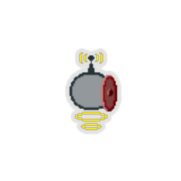 | Shield Drone | Rare |  | Reduce all your HP loss by #b1. #pPassive: Deal #b1 damage to a random enemy. | First Drone with a shield attached. Incredible. |
| 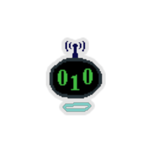 | Techie Drone | Rare |  | #pPassive: Reduce the #rCooldown of the #yTool on the highest #rCooldown by #b2. | Can you come over? I accidentally installed a toolbar! |
|  | Throne of Doom | Rare |  | #pActivate: Deal #b5 damage. Reduce this tool's #rCooldown by #b1 this combat. #rCooldown #b3. | Not very throne-y. |
|  | Two Handed Wheel | Rare |  | #pActivate: Add #b2 #yStolen #yCards into your hand. #rCooldown #b7. | Whoa, how do you drive this? |
| 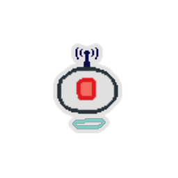 | Collector Drone | Boss |  | #pPassive: Add a #yStolen #yCard into your hand. | The Last Drone. |
|  | Damage-Blockinator | Boss |  | #pActivate: Gain #b10 #yBlock. Deal #b10 damage. #b10 #rCharges. | Isn't that what we all are? |
|  | Deheatinator | Boss |  | #pActivate: Reduce the #rCooldown of a random #yTool on #rCooldown by #b1. #b15 #rCharges. | Cooling down. Dooling cown... |
| 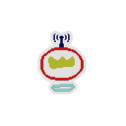 | Drone Leader | Boss |  | You can carry #b1 additional #yDrone. #pPassive: Trigger the #pPassive abilities of your other #yDrones. | Typically relaxes in a hoard. |
|  | Ghost Suit | Boss |  | #pActivate: Gain #b1 #yIntangible. #rCooldown #b6. | Ooooo, spooky. |
| 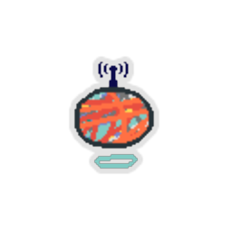 | Hoarder Drone | Boss |  | You can carry #b2 additional #yTools, #yMachines, and #yDrones. #pPassive: Deal #b1 damage to a random enemy. | NEEDS MORE BOLTS |
|  | Immortal Armor | Boss |  | When you would die, if this is not on #rCooldown, put it on #rCooldown and heal to #b1 HP instead. #pActivate: Gain #b5 #yBlock. #rCooldown #b12. | I am INVINCIBLE! After 12 turns. |
|  | Machine King | Boss |  | #pActivate: Give your other #yMachines #b1 additional charge. #b2 #rCharges. | Lord of the Inators. |
| 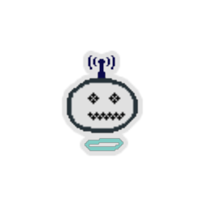 | Machine Necromancer Drone | Boss |  | #pPassive: #yActivate a random #yMachine. | Gesundheit! |
|  | Safe Nuclear Reactor | Boss |  | #pActivate: Reset the #rCooldown of your other #yTools. #rCooldown #b6. | Among the unicorns. |
|  | Stuninator | Boss |  | #pActivate: Stun the enemy for #b1 turn. #b3 #rCharges. | Almost named Power Word: Stuninator. |
|  | Tezzeret's Necklace | Boss |  | #pActivate: Give your #yMachines #b1 additional #rCharge. #rCooldown #b10. | Who owned this? |
|  | The Real Cannon | Boss |  | #pActivate: Deal #b33 damage to ALL enemies. #rCooldown #b10. | BOOOOOOM! |
|  | Toolmaster Drone | Boss |  | At the start of each combat, reduce the base #rCooldown of your #yTools by #b1. #pPassive: None. | Alas, if only I could be a tool too... |
|  | Top Tier Cardinator | Boss |  | #pActivate: Add #b2 #yUpgraded #yStolen #yCards into your hand. #b5 #rCharges. | Ban and nerf incoming. |
|  | Toxidrone | Boss |  | #pPassive: Apply #b2 #yPoison to ALL enemies. | I wassss the true Firssst Drone... and I shall be... the lassst... |
|  | Amongator | Shop |  | #pActivate: Trigger a random #yTool, #yDrone, and other #yMachine. #b3 #rCharges. | We are all among the gator. |
| 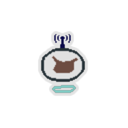 | Courier Drone | Shop |  | You can carry #b1 additional #yTool, #yMachine, and #yDrone. #pPassive: Deal #b1 damage to a random enemy. | No PLATINUM CHIP detected. |
| 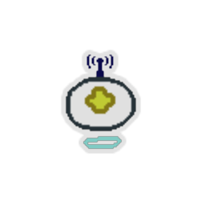 | Guardian Drone | Shop |  | #pPassive: Gain #b1 #yArtifact. | SO USEFUL... or is it? |
|  | Last Resortinator | Shop |  | #pActivate: Does something. #b6 #rCharges. | Anomalous and dangerous. |
|  | Life Tapper | Shop |  | #pActivate: Lose #b9 Max HP. Deal #b20 damage. #rCooldown #b0. | Taps anything... except enchantments. |
| 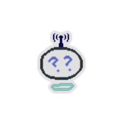 | Mastermind Drone | Shop |  | #pPassive: Reduce the #rCooldown of #b2 random #yTools on #rCooldown by #b1, then #yActivate ALL usable #yTools. | More of an idle game kind of Drone. |
|  | Plated Arminator | Shop |  | #pActivate: Gain #b2 Plated Armor. #b4 #rCharges. | Newfangled tech! Not as strong as a pen and needle. |
| 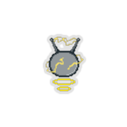 | Recharger Drone | Shop |  | Whenever you #yRecharge a #yMachine, it gains #b1 additional #rCharge. #pPassive: Gain #b1 #yBlock. | What a cutie! |
|  | Sand-blast-inator | Shop |  | #pActivate: Stun a random enemy for #b1 turn. #b2 #rCharges. | Pocket sand without the pocket. |
|  | Sapper | Shop |  | #pActivate: Enemy loses #b1 #yStrength. #rCooldown #b5. | It's so... hard to walk... |
|  | Smokinator | Shop |  | #pActivate: Escape from a non-boss combat. Receive no rewards. #b2 #rCharges. | Poof! I'm gone. |
| 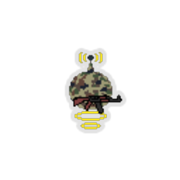 | Treasure Hunter Drone | Shop |  | Combats contain #b10 more Gold. #pPassive: Deal #b2 damage to a random enemy. | The HP loss is from rolling boulder traps. |

| Image | Name |
| ----- | ---- |
|  | the Artificer |

