| Name | Image | Upgraded image | Rarity | Type | Cost | Description |
| ---- | ----- | -------------- | ------ | ---- | ---- | ----------- |
| Brush Bash |  | 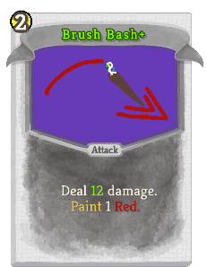 | Basic | Attack | 2 | Deal 10(14) damage. Paint 1 [#b0120a]Red. |
| Darken Drawing | 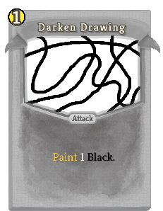 | 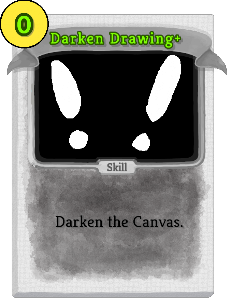 | Basic | Skill | 1(0) | [#000000]Darken [#000000]the [#000000]Canvas. |
| Palette Parry | 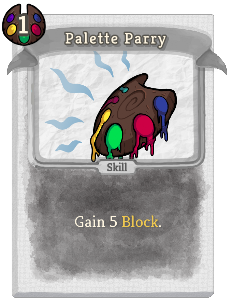 | 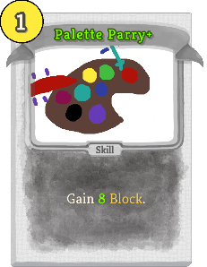 | Basic | Skill | 1 | Gain 5(8) Block. |
| Striking Stroke | 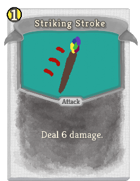 | 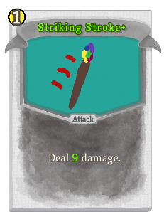 | Basic | Attack | 1 | Deal 6(9) damage. |
| Aqua Annoyance | 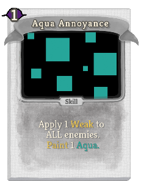 | 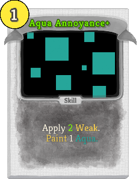 | Common | Skill | 1 | Apply 1(2) Weak. Paint 1 [#26a69a]Aqua. |
| Blue Burst | 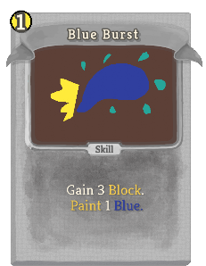 | 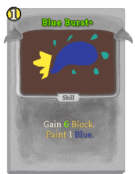 | Common | Skill | 1 | Gain 6(9) Block. Paint 1 [#303f9f]Blue. |
| Canvas Catapult | 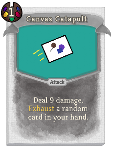 | 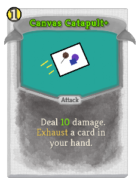 | Common | Attack | 1 | Deal 9(11) damage. Exhaust a random (not random)card in your hand. |
| Chroma Crash | 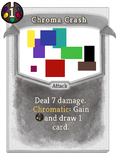 | 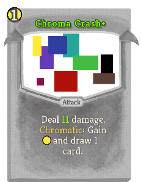 | Common | Attack | 1 | Deal 7(10) damage. Chromatic: Gain [E] and draw 1 card. |
| Clear Chroma | 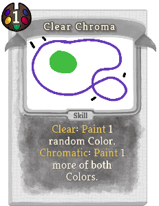 | 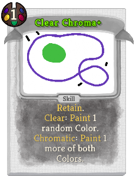 | Common | Skill | 1 | (Retain.)  Clear: Paint 1 random Color. Chromatic: Paint 1 more of both Colors. |
| Color Copy | 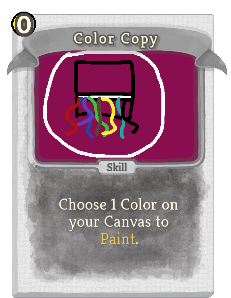 | 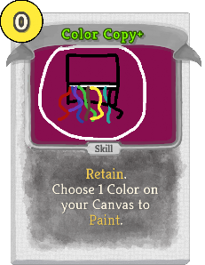 | Common | Skill | 0 | (Retain.)  Choose 1 Color on your Canvas to Paint. |
| Colorful Clobber | 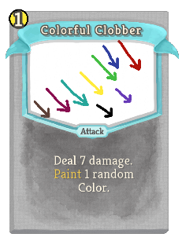 | 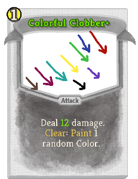 | Common | Attack | 1 | Deal 9(12) damage. Clear: Paint 1 random Color. |
| Cursed Clash |  | 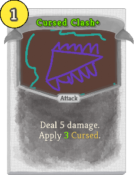 | Common | Attack | 1 | Deal 5 damage. Apply 2(3) Cursed. |
| Double Draw | 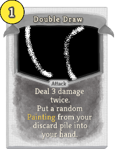 | 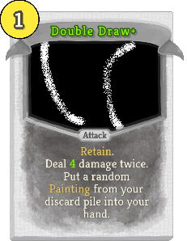 | Common | Attack | 1 | (Retain.)  Deal 3(4) damage twice. Put a random Painting from your discard pile into your hand. |
| Indigo Incapitation | 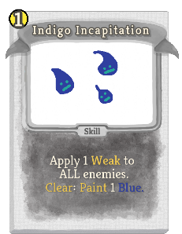 | 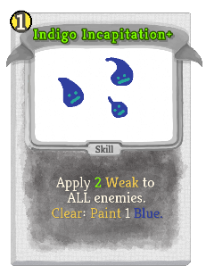 | Common | Skill | 1 | Apply 1(2) Weak to ALL enemies. Clear: Paint 1 [#303f9f]Blue. |
| Magenta Madness | 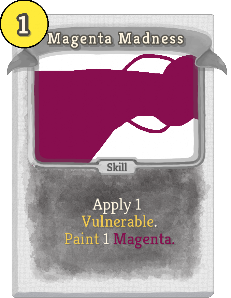 | 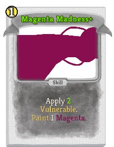 | Common | Skill | 1 | Apply 1(2) Vulnerable. Paint 1 [#880e4f]Magenta. |
| Pink Paint | 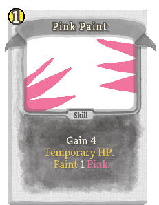 | 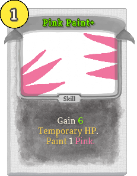 | Common | Skill | 1 | Gain 3(5) Temporary_HP. Paint 1 [#f0749e]Pink. |
| Prismatic Puncture |  | 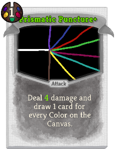 | Common | Attack | 1 | Deal 3(4) damage and draw 1 card for every Color on the Canvas. |
| Purple Pain |  | 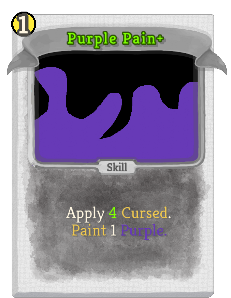 | Common | Skill | 1 | Apply 2(4) Cursed. Paint 1 [#673ab7]Purple. |
| Red Rage | 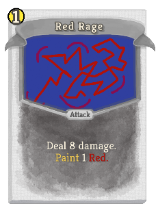 | 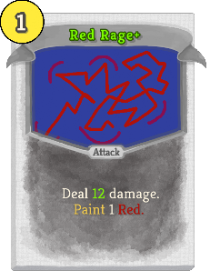 | Common | Attack | 1 | Deal 8(12) damage. Paint 1 [#b0120a]Red. |
| Red Razzing |  | 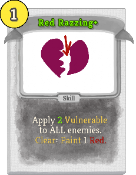 | Common | Skill | 1 | Apply 1(2) Vulnerable to ALL enemies. Clear: Paint 1 [#b0120a]Red. |
| Superb Schooling | 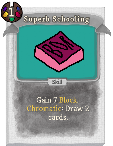 | 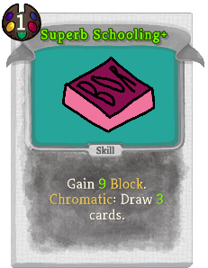 | Common | Skill | 1 | Gain 7(9) Block. Chromatic: Draw 2(3) cards. |
| Yellow Yearning | 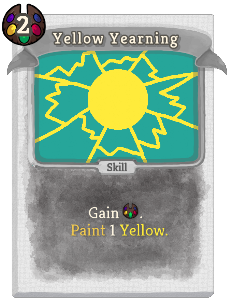 | 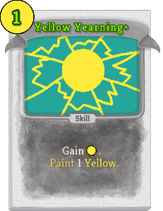 | Common | Skill | 2(1) | Gain [E] . Paint 1 [#ffeb3b]Yellow. |
| Accursed Aggression | 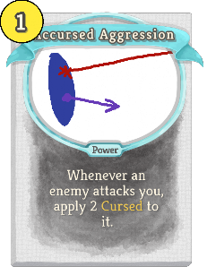 | 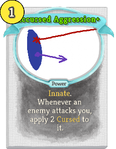 | Uncommon | Power | 1 | (Innate.)  Whenever an enemy attacks you, apply 2 Cursed to it. |
| Amaranth Amalgam |  |  | Uncommon | Skill | 1 | (Retain.)  Paint 1 [#f0749e]Pink. Paint 1 [#673ab7]Purple. |
| Amber Attack | 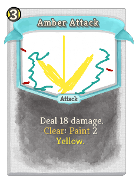 | 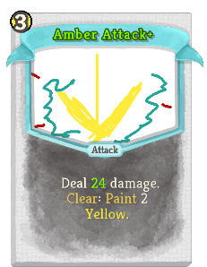 | Uncommon | Attack | 3 | Deal 16(22) damage. Clear: Paint 2 [#ffeb3b]Yellow. |
| Ardent Aqua | 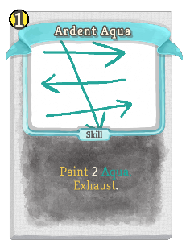 | 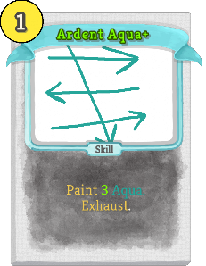 | Uncommon | Skill | 1 | Paint 1(2) [#26a69a]Aqua. Gain 1 Dexterity. Exhaust. |
| Blue Brews | 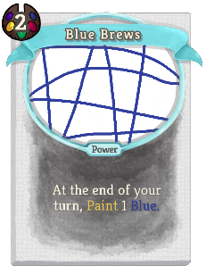 | 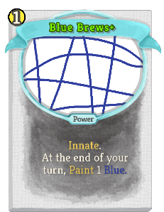 | Uncommon | Power | 2(1) | At the end of your turn, Paint 1 [#303f9f]Blue. |
| Chosen Colors | 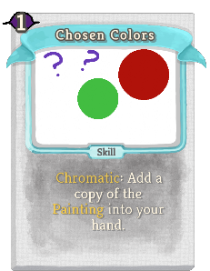 | 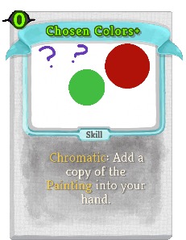 | Uncommon | Skill | 1(0) | Chromatic: Add a copy of the Canvas into your hand. |
| Colored Collision | 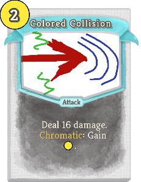 |  | Uncommon | Attack | 2 | Deal 16(20) damage. Chromatic: Gain [E] . |
| Constrasting Clash |  |  | Uncommon | Skill | 1 | (Retain.)  Paint 1 [#b0120a]Red. Paint 1 [#303f9f]Blue. |
| Crushing Canvas |  |  | Uncommon | Attack | 2 | Deal 8(10) damage. Deals 2(3) additional damage for ALL your Paintings. |
| Darker Danger |  |  | Uncommon | Skill | 0 | Gain 4(6) Block. Clear: [#000000]Darken [#000000]the [#000000]Canvas. |
| Double Demolition |  |  | Uncommon | Attack | 2 | Deal 6(8) damage to ALL enemies twice. Chromatic: Paint 1 more of both Colors. |
| Dual Dash |  |  | Uncommon | Skill | 1 | Gain 7(10) Block. Chromatic: Apply 1 Weak. |
| Dual Debuffs |  |  | Uncommon | Skill | 1 | (Retain.)  Paint 1 [#26a69a]Aqua. Paint 1 [#880e4f]Magenta. |
| Enlightened Epiphany |  |  | Uncommon | Skill | 1(0) | Add a random card with Paint into your hand. It costs 0 this turn. Exhaust. |
| Green Greed |  |  | Uncommon | Skill | 1 | Draw 2(3) cards. Paint 1 [#42bd41]Green. |
| Growing Greens |  |  | Uncommon | Power | 2(1) | At the end of your turn, Paint 1 [#42bd41]Green. |
| Horrid Harvest |  |  | Uncommon | Attack | 1 | Deal 10(13) damage. If this deals unblocked damage to a Cursed enemy, Paint 1 [#f0749e]Pink. |
| Hue Huffer |  |  | Uncommon | Power | 1 | (Innate.)  At the end of your turn, Paint 1 random Color for each Painting played this turn. |
| Ichor Ink |  |  | Uncommon | Power | 1 | (Innate.) Whenever you take unblocked attack (Attack) damage, Paint 1 random Color. |
| Insane Inspiration |  |  | Uncommon | Skill | 1(0) | Play the top card of your draw pile. If it's a Painting, play this again. |
| Mean Magenta |  |  | Uncommon | Skill | 1 | Paint 1(2) [#880e4f]Magenta. Gain 1 Strength. Exhaust. |
| Paintball Pelt |  |  | Uncommon | Power | 1 | Whenever you draw a Painting, deal 4(6) damage to ALL enemies. |
| Paintbrush Panic |  |  | Uncommon | Skill | X | Paint X (X+1) random Colors. Exhaust. |
| Palette Pick |  |  | Uncommon | Skill | 1(0) | Choose 1 Color to Paint. |
| Purple Purpose |  |  | Uncommon | Skill | 2(1) | Paint 2 [#673ab7]Purple. Put a card from your discard pile on top of your draw pile. |
| Rainbow Razor |  |  | Uncommon | Attack | 2 | Deal 15 damage to a random enemy. Paint 1 (2) random Color(s). |
| Rainbow Reality |  |  | Uncommon | Skill | 1(0) | Paint 1 [oobley]Rainbow. Clear: Paint 2 [oobley]Rainbow instead. |
| Raring Repaint |  |  | Uncommon | Skill | 1 | (Retain.)  Gain 4(5) Block. Return a Painting from your discard pile to your hand. |
| Reddening Rampage |  |  | Uncommon | Power | 2(1) | At the end of your turn, Paint 1 [#b0120a]Red. |
| Shiny Shiv |  |  | Uncommon | Attack | 0 | Deal 4(6) damage. Clear: Paint 1 [oobley]Rainbow. |
| Simple Studies |  |  | Uncommon | Skill | 1 | Gain 8(10) Block. Chromatic: Shuffle a copy of the Painting into your draw pile. |
| Sweeping Sadness |  |  | Uncommon | Skill | 2 | Gain 10(12) Block. Apply 3(4) Cursed. |
| Treasure Trove |  |  | Uncommon | Power | 1(0) | At the start of your turn, add a random Uncommon card into your hand. |
| Vibrant Vision |  |  | Uncommon | Skill | 1 | Paint 1 random Color. (not) Draw 1(2) card(s). |
| Vivacious Virescence |  |  | Uncommon | Skill | 1 | (Retain.)  Paint 1 [#42bd41]Green. Paint 1 [#ffeb3b]Yellow. |
| Watercolor Wallop |  |  | Uncommon | Attack | 1 | Deal 8(10) damage. Draw 3(4) cards. Discard all non-Painting cards drawn this way. |
| Abstruse Abstraction |  |  | Rare | Skill | 1 | Add a copy of the Canvas into your hand. Exhaust (Exhaustive !stslib:ex!). |
| Aquamarine Aposematism |  |  | Rare | Skill | 1 | Apply 2(3) Weak to ALL enemies. Paint 2 [#26a69a]Aqua. Exhaust. |
| Baneful Bucket |  |  | Rare | Skill | 2(1) | Chromatic: Double the amount of Paint on the Canvas. Exhaust. |
| Cerulean Coverage |  |  | Rare | Skill | 2 | Gain 6(9) Block.  Paint 3(4) [#303f9f]Blue. Exhaust. |
| Combustive Chiaroscuro |  |  | Rare | Skill | X | (Retain.)  [#000000]Darken [#000000]the [#000000]Canvas X times. Next turn, gain [E]. Exhaust. |
| Coruscating Corona |  |  | Rare | Power | 3(2) | At the end of your turn, Paint 1 [#ffeb3b]Yellow. |
| Cosummate Conflagration |  |  | Rare | Attack | 3 | (Retain.)  Exhaust ALL your Paintings. Deal 6 damage to a random enemy for each Painting Exhausted. Exhaust. |
| Fantasy Form |  |  | Rare | Power | 2 | Whenever you draw a Painting, draw 1 (2) card(s). |
| Fuschia Fugue |  |  | Rare | Skill | 1 | Apply 2(3) Vulnerable to ALL enemies. Paint 2 [#880e4f]Magenta. Exhaust. |
| Gayness Generator |  |  | Rare | Power | 2 | (Innate.)  At the end of your turn, Paint 1 [oobley]Rainbow. |
| Glorious Gallery |  |  | Rare | Skill | 1(0) | Put all Paintings from your draw pile into your hand. Put all Paintings from your discard pile into your hand. Exhaust. |
| Mauve Malediction |  |  | Rare | Skill | 2 | Apply 6(9) Cursed to ALL enemies. Paint 3 [#673ab7]Purple. Exhaust. |
| Mysterious Masterpiece |  |  | Rare | Skill | 4(3) | Ethereal. Permanently add a Painting based on the Canvas to your deck. Fleeting. |
| Paint Profusion |  |  | Rare | Skill | 2 | Chromatic: Paint 1(2) random Color. Shuffle 2 copies of the Painting into your draw pile. Exhaust. |
| Pollock's Potluck |  |  | Rare | Skill | 3 | (Innate.)  Paint 1 of each Color. Exhaust. |
| Roseate Rejuvenation |  |  | Rare | Skill | 2 | Gain 3(4) Temporary_HP. Paint 3(4) [#f0749e]Pink. Exhaust. |
| Ruby Reaper |  |  | Rare | Attack | 3 | Deal 12(16) damage to ALL enemies. Paint 3(4) [#b0120a]Red. Exhaust. |
| Verdant Vainglory |  |  | Rare | Skill | 1(0) | Draw cards until your hand is full. Paint 3 [#42bd41]Green. Exhaust. |
