| Name | Image | Upgraded image | Rarity | Type | Cost | Description |
| ---- | ----- | -------------- | ------ | ---- | ---- | ----------- |
| Brush Bash |  |  | Basic | Attack | 2 | Deal 8(12) damage. Paint 1 [#b0120a]Red. |
| Daring Defend | 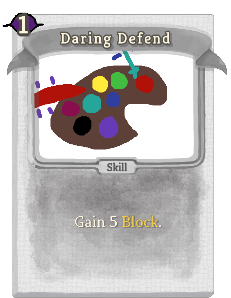 | 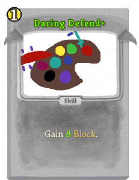 | Basic | Skill | 1 | Gain 5(8) Block. |
| Darken Drawing |  |  | Basic | Attack | 1(0) | Paint 1 [#000000]Black. |
| Stroke Strike | 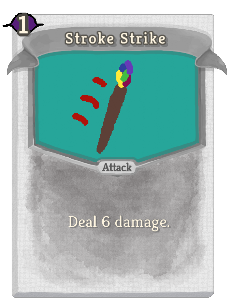 | 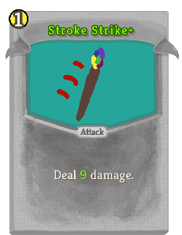 | Basic | Attack | 1 | Deal 6(9) damage. |
| Aqua Annoyance |  |  | Common | Skill | 1 | Apply 1(2) Weak to ALL enemies. Paint 1 [#26a69a]Aqua. |
| Blue Burst |  |  | Common | Skill | 1 | Gain 3(6) Block. Paint 1 [#303f9f]Blue. |
| Chroma Crash |  |  | Common | Attack | 1 | Deal 8(11) damage. Chromatic: Gain [E] and draw 1 card. |
| Color Copy |  |  | Common | Skill | 0 | (Retain.)  Choose 1 Color on your Canvas to Paint. |
| Magenta Madness |  |  | Common | Skill | 1 | Apply 1(2) Vulnerable to ALL enemies. Paint 1 [#880e4f]Magenta. |
| Red Rage |  |  | Common | Attack | 1 | Deal 4(8) damage. Paint 1 [#b0120a]Red. |
| Brown Brush | 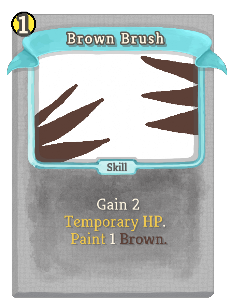 |  | Uncommon | Skill | 1 | Gain 2(4) Temporary_HP. Paint 1 [#5d4037]Brown. |
| Chosen Colors |  |  | Uncommon | Skill | 1(0) | Chromatic: Add a copy of the Painting into your hand. |
| Colorful Clobber |  |  | Uncommon | Attack | 1 | Deal 7(10) damage. Paint 1 random Color. |
| Double Demolition |  |  | Uncommon | Attack | 2 | Deal 8(10) damage to ALL enemies twice. Chromatic: Paint 1 of each Color on the Canvas. |
| Green Greed |  |  | Uncommon | Skill | 1 | Draw 1(2) card(s). Paint 1 [#42bd41]Green. |
| Palette Pick |  |  | Uncommon | Skill | 1 | Choose 1(2) Color to Paint. |
| Purple Pain |  |  | Uncommon | Skill | 1 | Apply 2(4) Cursed. Paint 1 [#673ab7]Purple. |
| Rainbow Razor |  |  | Uncommon | Attack | 2 | Deal 12(16) damage to a random enemy. Paint 1 [rainbow]Rainbow. |
| Rainbow Reality |  |  | Uncommon | Skill | 1(0) | Paint 1 [rainbow]Rainbow. Clear: Paint 2 [rainbow]Rainbow instead. |
| Watercolor Wallop |  |  | Uncommon | Attack | 1 | Deal 8(10) damage. Draw 3(4) cards. Discard all non-Painting cards drawn this way. |
| Yellow Yearning |  |  | Uncommon | Skill | 1(0) | Gain [E] . Paint 1 [#ffeb3b]Yellow. |
| Aqua Anger | 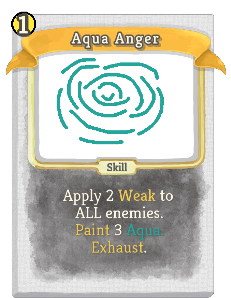 | 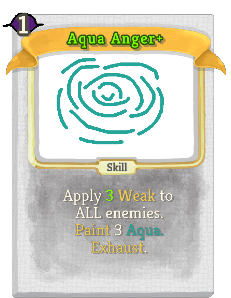 | Rare | Skill | 1 | Apply 2(3) Weak to ALL enemies. Paint 3 [#26a69a]Aqua. Exhaust. |
| Artificial Art | 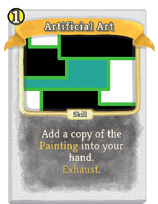 | 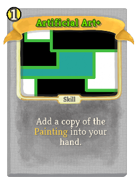 | Rare | Skill | 1 | Add a copy of the Painting into your hand. Exhaust. (not Exhaust.) |
| Artistic Agony | 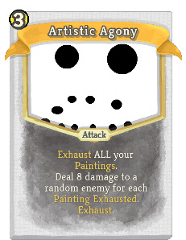 | 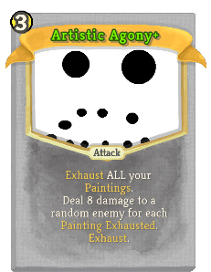 | Rare | Attack | 3 | Exhaust ALL your Paintings. Deal 8 damage to a random enemy for each Painting Exhausted. Exhaust. |
| Baneful Bucket |  |  | Rare | Skill | 2(1) | Chromatic: Double the amount of Paint on the Canvas. Exhaust. |
| Big Brown | 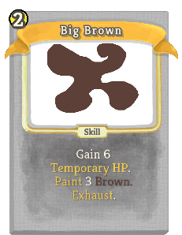 | 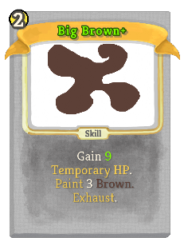 | Rare | Skill | 2 | Gain 6(9) Temporary_HP. Paint 3 [#5d4037]Brown. Exhaust. |
| Black Bang | 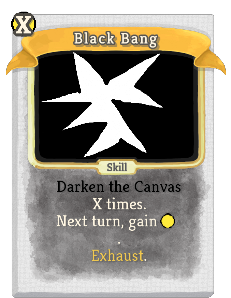 | 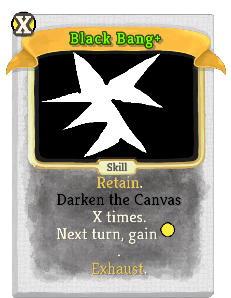 | Rare | Skill | X | (Innate.)  Paint X [#000000]Black. Next turn, gain [E]. Exhaust. |
| Blue Barrier | 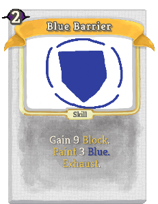 | 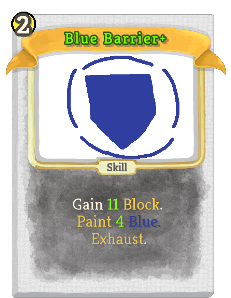 | Rare | Skill | 2 | Gain 9(11) Block.  Paint 3(4) [#303f9f]Blue. Exhaust. |
| Deep Dream | 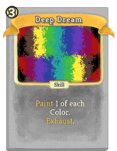 |  | Rare | Skill | 3 | (Innate.)  Paint 1 of each Color. Exhaust. |
| Green Greatness | 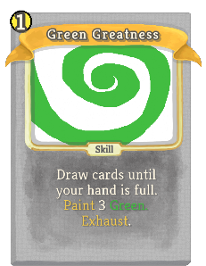 |  | Rare | Skill | 1(0) | Draw cards until your hand is full. Paint 3 [#42bd41]Green. Exhaust. |
| Magenta Mist | 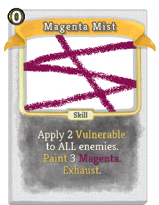 | 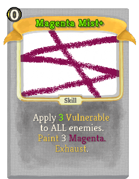 | Rare | Skill | 0 | Apply 2(3) Vulnerable to ALL enemies. Paint 3 [#880e4f]Magenta. Exhaust. |
| Profound Purple | 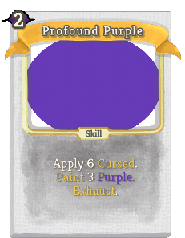 |  | Rare | Skill | 2 | Apply 6(9) Cursed. Paint 3 [#673ab7]Purple. Exhaust. |
| Radical Rainbows | 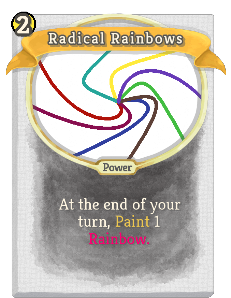 | 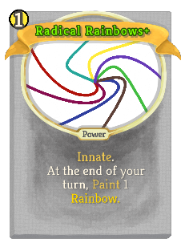 | Rare | Power | 1 | (Innate.)  At the end of your turn, Paint 1 [rainbow]Rainbow. |
| Red Reaper | 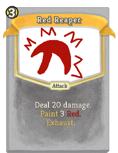 | 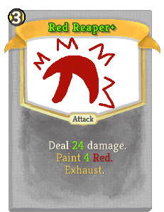 | Rare | Attack | 3 | Deal 20(24) damage. Paint 3(4) [#b0120a]Red. Exhaust. |
| Yellow Youth | 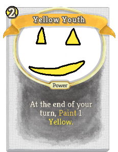 | 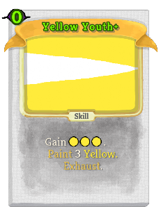 | Rare | Skill | 1(0) | Gain [E] [E] [E] . Paint 3 [#ffeb3b]Yellow. Exhaust. |
