| Name | Image | Upgraded image | Rarity | Type | Cost | Description |
| ---- | ----- | -------------- | ------ | ---- | ---- | ----------- |
| Deathstare | 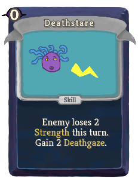 |  | Basic | Skill | 0 | Enemy loses 2(3) Strength this turn. Gain !deathGaze! gorgonmod:Deathgaze. |
| Defend | 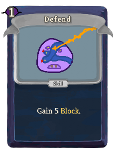 | 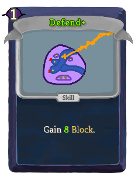 | Basic | Skill | 1 | Gain 5(8) Block. |
| Snake Skin | 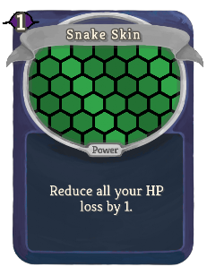 | 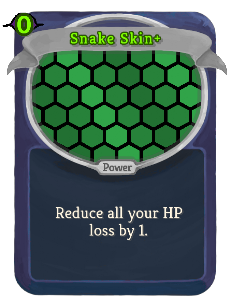 | Basic | Power | 1(0) | Reduce all your HP loss by 1. |
| Strike | 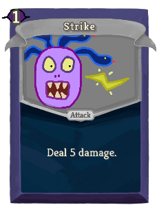 |  | Basic | Attack | 1 | Deal 5(8) damage. |
| Allomantic Circle | 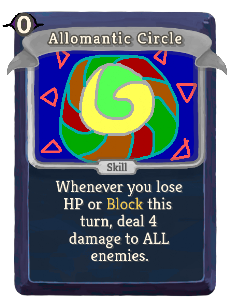 | 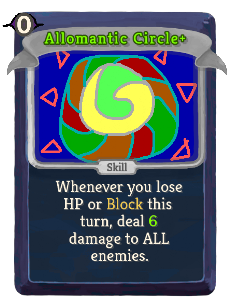 | Common | Skill | 0 | Whenever you lose HP or Block this turn, deal 4(6) damage to ALL enemies. |
| Beamburn | 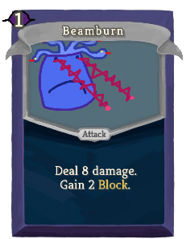 | 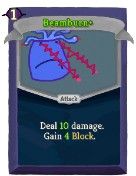 | Common | Attack | 1 | Deal 8(10) damage. Gain 2(4) Block. |
| Blazeblast | 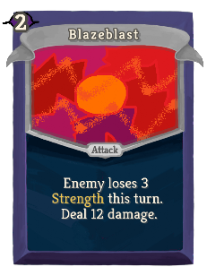 |  | Common | Attack | 2 | Enemy loses 3(4) Strength this turn. Deal 12(15) damage. |
| Bloodshield | 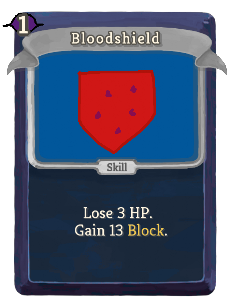 | 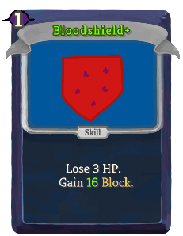 | Common | Skill | 1 | Lose 3 HP. Gain 13(16) Block. |
| Bubble Shield | 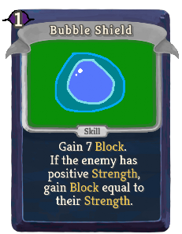 | 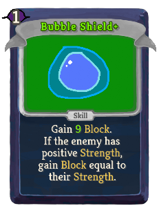 | Common | Skill | 1 | Gain 7(9) Block. If the enemy has positive Strength, gain Block equal to their Strength. |
| Burning Eyes | 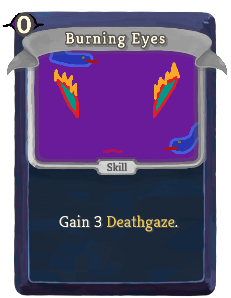 | 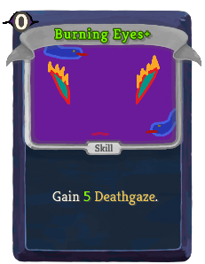 | Common | Skill | 0 | Gain !deathGaze! gorgonmod:Deathgaze. |
| Dark Presence | 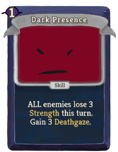 | 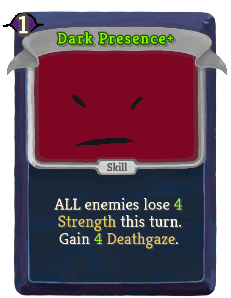 | Common | Skill | 1 | ALL enemies lose 3(4) Strength this turn. Gain !deathGaze! gorgonmod:Deathgaze. |
| Fixation | 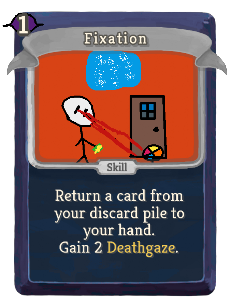 | 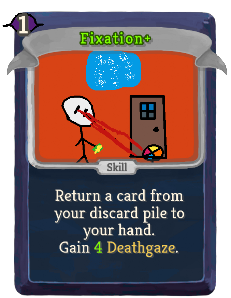 | Common | Skill | 1 | Return a card from your discard pile to your hand. Gain !deathGaze! gorgonmod:Deathgaze. |
| Flamelock | 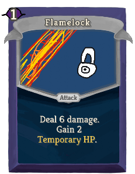 | 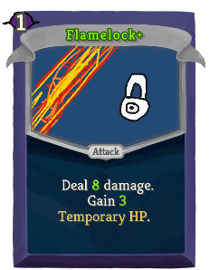 | Common | Attack | 1 | Deal 6(8) damage. Gain 2(3) Temporary_HP. |
| Harden Skin | 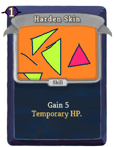 | 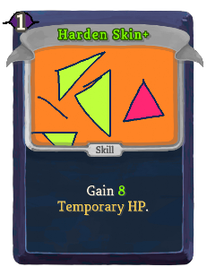 | Common | Skill | 1 | Gain 5(8) Temporary_HP. |
| Meditate | 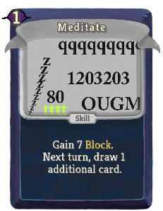 | 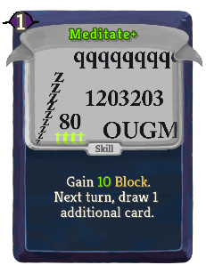 | Common | Skill | 1 | Gain 7(10) Block. Next turn, draw 1 additional card. |
| Refreshment | 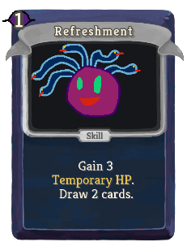 | 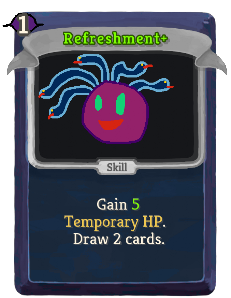 | Common | Skill | 1 | Gain 3(5) Temporary_HP. Draw 2 cards. |
| Scale Shrapnel | 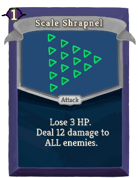 | 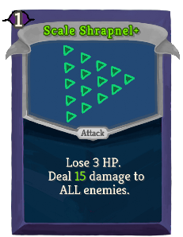 | Common | Attack | 1 | Lose 3 HP. Deal 12(15) damage to ALL enemies. |
| Shielded |  | 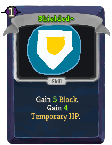 | Common | Skill | 1 | Gain 4(5) Block. Gain 3(4) Temporary_HP. |
| Shocker | 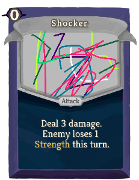 |  | Common | Attack | 0 | Deal 3(4) damage. Enemy loses 1(2) Strength this turn. |
| Snakebite | 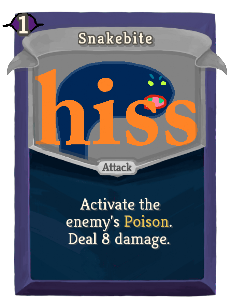 | 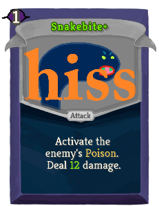 | Common | Attack | 1 | Activate the enemy's Poison. Deal 8(12) damage. |
| Stoneglare | 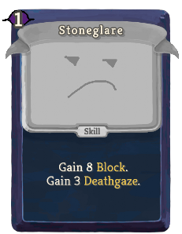 | 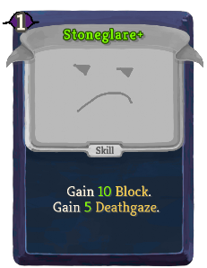 | Common | Skill | 1 | Gain 8(10) Block. Gain !deathGaze! gorgonmod:Deathgaze. |
| Triposte | 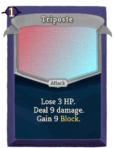 | 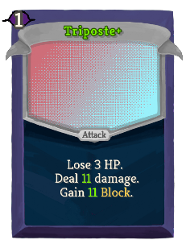 | Common | Attack | 1 | Lose 3 HP. Deal 9(11) damage. Gain 9(11) Block. |
| Zap | 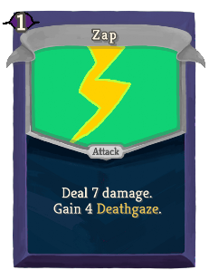 | 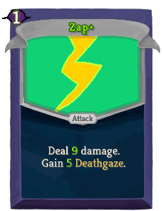 | Common | Attack | 1 | Deal 7(9) damage. Gain !deathGaze! gorgonmod:Deathgaze. |
| Accelerate | 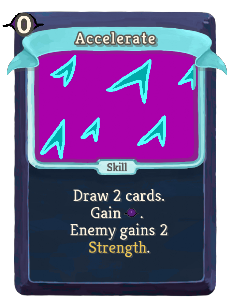 | 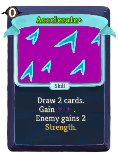 | Uncommon | Skill | 0 | Draw 2 cards. Gain [E] ([E]). Enemy gains 2 Strength. |
| Backslash | 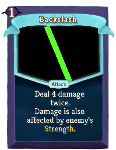 |  | Uncommon | Attack | 1 | Deal 4(6) damage twice. Damage is also affected by enemy's Strength. |
| Blare | 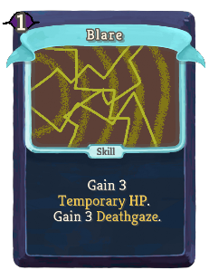 | 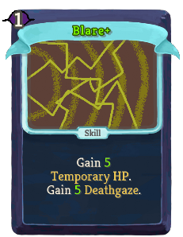 | Uncommon | Skill | 1 | Gain 3(5) Temporary_HP. Gain !deathGaze! gorgonmod:Deathgaze. |
| Bloodcast | 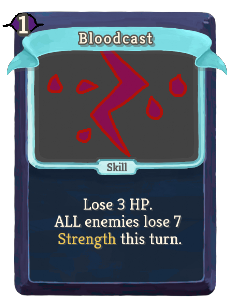 | 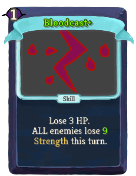 | Uncommon | Skill | 1 | Lose 3 HP. ALL enemies lose 7(9) Strength this turn. |
| Blooderstanding | 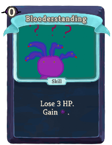 | 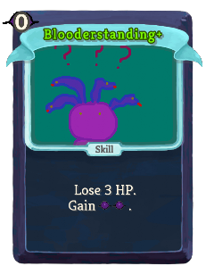 | Uncommon | Skill | 0 | Lose 3 HP. Gain [E] ([E]). |
| Bloodsight |  |  | Uncommon | Skill | 0 | Lose 3 HP. Draw 3(4) cards. |
| Bzzt |  |  | Uncommon | Power | 1 | At the end of your turn, deal 3(5) damage to ALL enemies. |
| Cliposte |  |  | Uncommon | Attack | 2 | Lose 4 HP. Deal 14(18) damage. Gain 12(14) Block. |
| Cripple |  |  | Uncommon | Skill | 1 | Enemy loses 3(4) Strength for 2 turns. |
| Cursed Piercing |  |  | Uncommon | Attack | 1(0) | Deal 5 damage. In 2 turns, play a Cursed Piercing. |
| Defreshment |  |  | Uncommon | Attack | 1 | Deal 3(4) damage. Draw 2(3) cards. Gain !deathGaze! gorgonmod:Deathgaze. |
| Glare |  |  | Uncommon | Skill | 1 | Gain !deathGaze! gorgonmod:Deathgaze. |
| Leaning Spire of Pisa |  |  | Uncommon | Attack |  | Unplayable. Retain. Whenever you draw this card, deal 9(13) damage to ALL enemies. |
| Life Drain |  |  | Uncommon | Skill | 0 | Enemy loses !deathGaze! HP. Gain 3(4) Temporary_HP. |
| Masterful Stab??? |  |  | Uncommon | Attack | 0 | Can only be played if you have exactly 2 cards in your hand. Deal 12(15) damage. |
| On Guard |  |  | Uncommon | Skill | 1 | Gain 8(10) Block. Whenever you lose HP this turn, gain 2(3) Block next turn. |
| Passion of the Cultist |  |  | Uncommon | Skill |  | Unplayable. Retain. Whenever you draw this card, gain [E] ([E]). |
| Postpone |  |  | Uncommon | Skill | 1 | Gain 12(16) Block. Enemy gains 2 Strength. |
| Presto! Curse |  |  | Uncommon | Skill | 1 | (Innate.)  Enemy loses 3 HP at the start of each of its turns. |
| Pyroball |  |  | Uncommon | Attack | 2 | Deal 12(16) damage. Gain !deathGaze! gorgonmod:Deathgaze. |
| Reflector Shield |  |  | Uncommon | Skill | 2 | Gain 12(16) Block. Whenever you lose HP or Block this turn, gain 2(3) gorgonmod:Deathgaze. |
| Retaliation |  |  | Uncommon | Power | 1 | (Innate.)  Whenever you lose HP or Block, gain 1 gorgonmod:Deathgaze. |
| Revolve |  |  | Uncommon | Power | 1(0) | Whenever you lose HP, draw 1 card. |
| Seduce |  |  | Uncommon | Skill | 1 | Lose 3 HP. Enemy loses (ALL enemies lose) HP equal to its (their) attacking intent. |
| Seen In Half |  |  | Uncommon | Attack | 1 | Deal 8(12) damage. If the enemy has positive Strength, it loses its Strength this turn. |
| Sightsing |  |  | Uncommon | Skill | X | Gain X (X+1) gorgonmod:Deathgaze 3 times. Enemy loses X (X+1) Strength this turn 3 times. |
| Snake Stance |  |  | Uncommon | Power | 1(0) | At the end of your turn, gain 2 Temporary_HP. |
| Statue Smash |  |  | Uncommon | Skill | 0 | Discard 1 card at random. Draw 1(2) card(s). If there is a statue in combat, break it and prevent the next time you would lose HP. |
| Statute of Libertations |  |  | Uncommon | Skill |  | Unplayable. Retain. Whenever you draw this card, gain 4(6) Temporary_HP. |
| Stealing Stare |  |  | Uncommon | Skill | 1 | Enemy loses 3(4) Strength this turn. Gain 3(4) Temporary_HP. |
| The Thonker |  |  | Uncommon | Skill |  | Unplayable. Retain. Whenever you draw this card, draw 2(3) cards. |
| Tickle |  |  | Uncommon | Attack | 1 | Steal the enemy's Block. Deal 6(9) damage. |
| Binlor's Ironshield |  |  | Rare | Power | 1 | (Innate.)  Gain 8 Temporary_HP. |
| Ceasefire |  |  | Rare | Power | 2(1) | You and ALL enemies gain 2 Intangible. |
| Doomsight |  |  | Rare | Skill | 3(2) | Innate. Double your gorgonmod:Deathgaze. |
| Entrap |  |  | Rare | Skill | 3 | Lose 16(12) HP. Stun the enemy for 2 turns. |
| Eye Beam |  |  | Rare | Attack | 2(1) | Deal damage equal to your gorgonmod:Deathgaze. |
| Forbidden Magic |  |  | Rare | Skill | 1 | Apply 1(2) Weak. Apply 1(2) Vulnerable. Exhaust a card in your hand. |
| Foresight |  |  | Rare | Attack | 1 | Deal 10(15) damage. Play the top card of your draw pile. |
| Inferno |  |  | Rare | Skill | 1(0) | Draw 2 cards, then discard your hand. If 9 cards were discarded this way, ALL enemies lose 50 HP. |
| Lich Form |  |  | Rare | Power | 2(1) | Gain 12 Invincible. If you already have Invincible, lose 3 instead. |
| Lifecast |  |  | Rare | Skill | 1 | Grave. (not Grave.) Whenever you lose HP this turn, gain [E] and draw 1 card. |
| Mirror Shield |  |  | Rare | Skill | 1(0) | Reflect Weak and Vulnerable this turn. |
| Mirror Shock |  |  | Rare | Power | 1 | At the start of your turn, lose 3(2) HP, gain [E] , and draw 1 card. |
| Paralyzing Stare |  |  | Rare | Skill | 2 | Stun the enemy (ALL enemies) for 1 turn. Increase this card's cost by 1 this combat. |
| Slot Machine |  |  | Rare | Skill | 2 | Play a (lucky) slot machine. |
| Slow Drain |  |  | Rare | Skill | 1 | (Innate.)  Enemy loses 1 Strength. Gain 1 Strength. |
| Spiketime |  |  | Rare | Skill | 1 | Gain 3(4) Thorns. ALL enemies gain 1 Thorns. |
| Statue Shield |  |  | Rare | Skill | 1 | Gain 10(12) Block. Shuffle a (an upgraded) Leaning Spire of Pisa into your draw pile. |
| Statue Toss |  |  | Rare | Attack | 2 | Discard 1 card. Deal 18(22) damage. 5(10) % chance: Stun the enemy for 1 turn. |
| Stunning Pose |  |  | Rare | Skill |  | Unplayable. Retain. Whenever you draw this card, Stun a random enemy (ALL enemies) for 1 turn. |
| Water Level |  |  | Rare | Power | 2 | Grave. (not Grave.) At the start of your turn, deal 5 damage to all enemies and increase this damage by 5. |
