## Cards

| Name | Image | Upgraded image | Rarity | Type | Cost | Description |
| ---- | ----- | -------------- | ------ | ---- | ---- | ----------- |
| 52 Card Pickup | 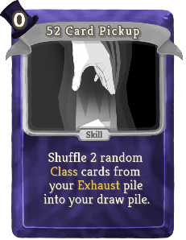 | 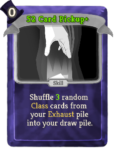 | Basic | Skill | 0 | Shuffle 2(3) random theshowman:Class cards from your Exhaust pile into your draw pile. |
| Defend |  | 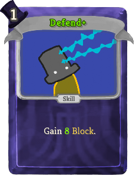 | Basic | Skill | 1 | Gain 5(8) Block. |
| Ladies and Gentlemen... | 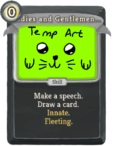 | 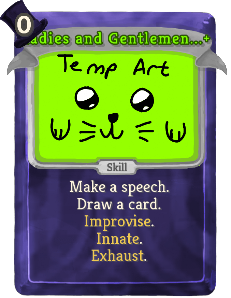 | Basic | Skill | 0 | Make a speech. Draw a card. theshowman:Improvise. Innate. Fleeting (Exhaust). |
| Stage Hook | 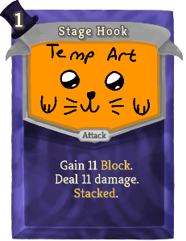 |  | Basic | Attack | 1 | Gain 11(14) Block. Deal 11(14) damage. theshowman:Stacked. |
| Strike | 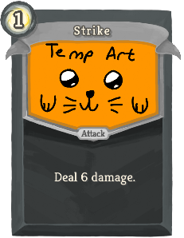 | 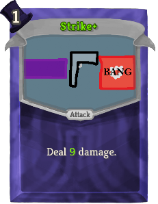 | Basic | Attack | 1 | Deal 6(9) damage. |
| Vanishing Defend |  | 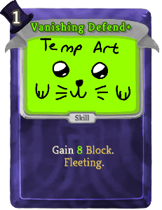 | Basic | Skill | 1 | Gain 5(8) Block.  (Fleeting.) |
| Vanishing Strike |  | 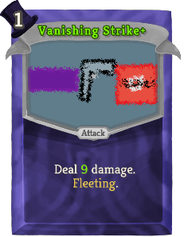 | Basic | Attack | 1 | Deal 6(9) damage.  (Fleeting.) |
| Baffling Shuffle | 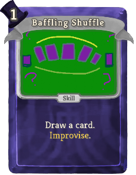 |  | Common | Skill | 1(0) | Draw a card. theshowman:Improvise. |
| Crashing Lights | 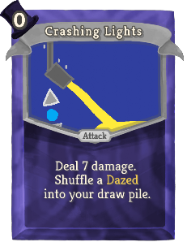 | 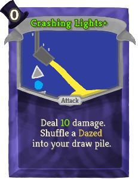 | Common | Attack | 0 | Deal 7(10) damage. Shuffle a Dazed into your draw pile. |
| Extra Wide Sleeves | 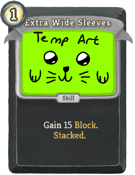 | 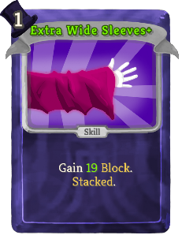 | Common | Skill | 1 | Gain 15(19) Block. theshowman:Stacked. |
| Flashy Flourish | 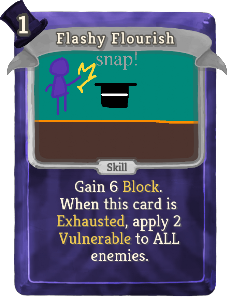 | 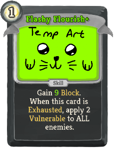 | Common | Skill | 1 | Gain 6(9) Block. When this card is Exhausted, apply 2 Vulnerable to ALL enemies. |
| Full House | 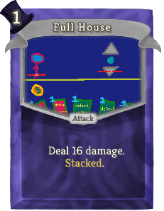 |  | Common | Attack | 1 | Deal 16(20) damage. theshowman:Stacked. |
| Got Your Nose | 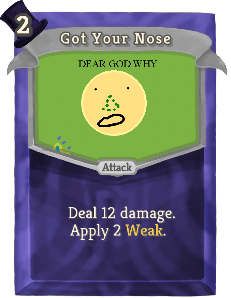 | 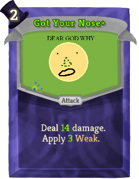 | Common | Attack | 2 | Deal 12(14) damage. Apply 2(3) Weak. |
| Now You Don't | 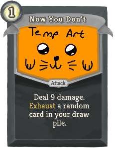 | 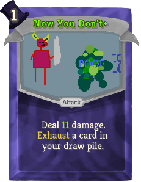 | Common | Attack | 1 | Deal 9(11) damage. Exhaust a random (not random)card in your draw pile. |
| Now You See Me |  | 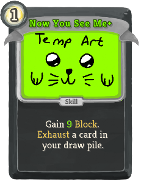 | Common | Skill | 1 | Gain 7(9) Block. Exhaust a random (not random)card in your draw pile. |
| One-Up | 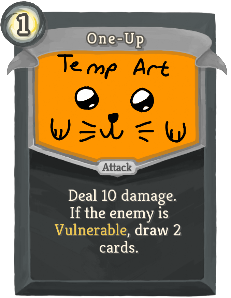 | 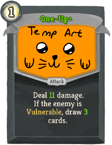 | Common | Attack | 1 | Deal 10(11) damage. If the enemy is Vulnerable, draw 2(3) cards. |
| Open The Curtain | 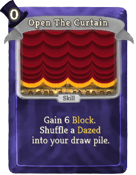 | 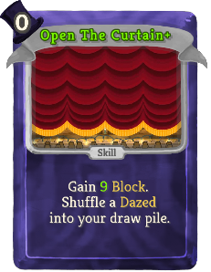 | Common | Skill | 0 | Gain 6(9) Block. Shuffle a Dazed into your draw pile. |
| Pocket Sand | 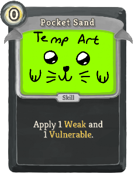 | 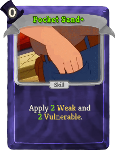 | Common | Skill | 0 | Apply 1(2) Weak and 1(2) Vulnerable. |
| Prestidigitation | 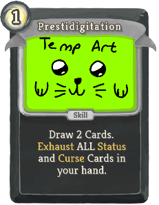 |  | Common | Skill | 1 | Draw 2(3) Cards. Exhaust ALL Status and Curse Cards in your hand. |
| Razzle Dazzle | 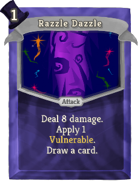 | 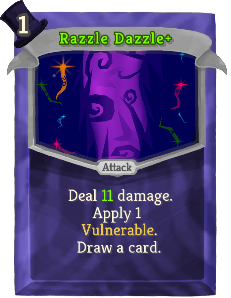 | Common | Attack | 1 | Deal 8(11) damage. Apply 1 Vulnerable. Draw a card. |
| Sleeve Stash |  | 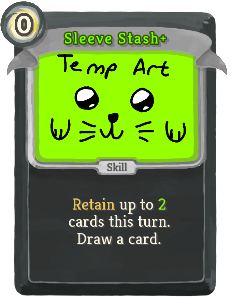 | Common | Skill | 0 | Retain up to 1(2) cards this turn. Draw a card. |
| Sleighted Flourish | 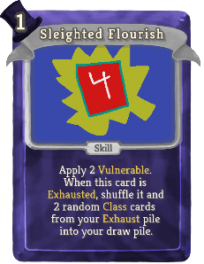 | 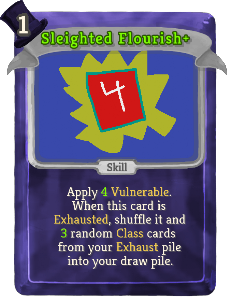 | Common | Skill | 1 | Apply 2(4) Vulnerable. When this card is Exhausted, shuffle it and !theShowman:SecondMagic! random theshowman:Class cards from your Exhaust pile into your draw pile. |
| Sleighted Hand | 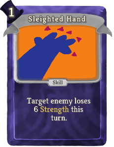 | 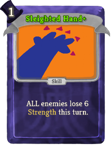 | Common | Skill | 1 | Target enemy loses (ALL enemies lose) 6 Strength this turn. |
| Startling Showmanship | 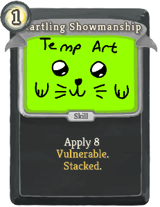 | 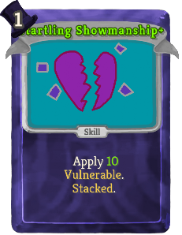 | Common | Skill | 1 | Apply 8(10) Vulnerable. theshowman:Stacked. |
| Wild Flourish | 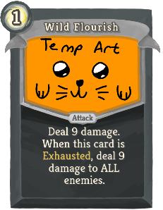 | 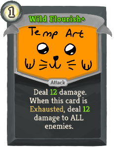 | Common | Attack | 1 | Deal 7(10) damage. When this card is Exhausted, deal 7(10) damage to ALL enemies. |
| Begone Thought | 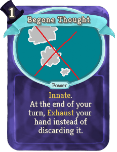 | 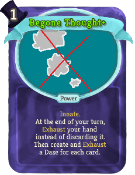 | Uncommon | Power | 1 | Innate. At the end of your turn, Exhaust your hand instead of discarding it.  (Then create and Exhaust a Daze for each card.) |
| Behind Curtain #3... | 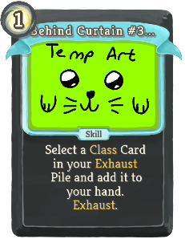 | 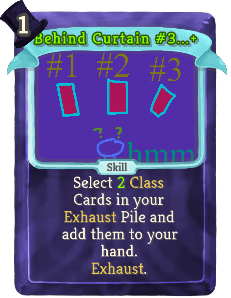 | Uncommon | Skill | 1 | Select a (1(2)) theshowman:Class Card(s) in your Exhaust Pile and add it (them) to your hand. Exhaust. |
| Black Jack | 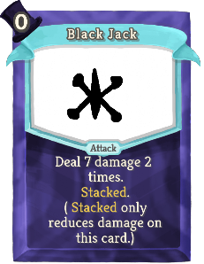 | 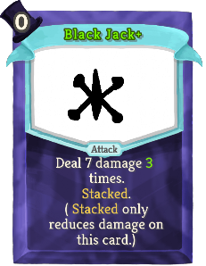 | Uncommon | Attack | 0 | Deal 7 damage !theShowman:SecondMagic! times. theshowman:Stacked. ( theshowman:Stacked only reduces damage on this card.) |
| Bottom Deal | 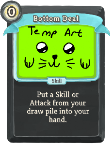 | 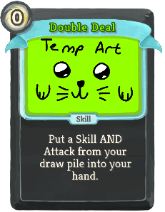 | Uncommon | Skill | 1 | Put a Skill or (AND) Attack from your draw pile into your hand. |
| Curtain Call | 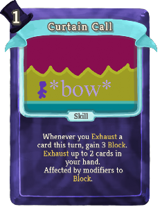 |  | Uncommon | Skill | 1 | Whenever you Exhaust a card this turn, gain 3 Block. Exhaust up to 2(3) cards in your hand. Affected by modifiers to Block. |
| Dapper Flourish |  |  | Uncommon | Attack | 2 | Deal 12(16) damage to ALL enemies. When this card is Exhausted, gain 1 theshowman:Buffer this turn. |
| Disembodied Hand |  |  | Uncommon | Skill | 1 | Exhaust a random (not random)card in your hand. Play it at the start of your next turn. Exhaust. |
| Diverting Display |  |  | Uncommon | Power | 1 | (Innate.)  Whenever you Exhaust a card, apply 1 Vulnerable to a random enemy. |
| Encore! |  |  | Uncommon | Skill | 1 | Gain 8(11) Block. Add a copy of the next card you play this turn to your hand. |
| Exaggerated Arm Sweeps |  |  | Uncommon | Attack | 2 | Deal 40 damage. theshowman:Stacked. theshowman:Stacked. theshowman:Stacked. (not theshowman:Stacked.) |
| Fist Full Of Cards |  |  | Uncommon | Attack | 2 | Deal 4(6) damage for each card in your hand. |
| For My Next Trick! |  |  | Uncommon | Skill | 2 | Exhaust a card in your hand. Next turn, add 2(3) copies to your hand that cost 1 less that turn. Exhaust. |
| Grand Gambit |  |  | Uncommon | Skill | 1 | Exhaust any number of cards in your hand. Draw that many cards (+1). Exhaust. |
| Hare-Brained Scheme |  |  | Uncommon | Skill | 3 | Draw 6(8) cards. theshowman:Improvise. |
| Hat Trick |  |  | Uncommon | Skill | 1 | Gain 1(2) theshowman:Buffer this turn. Exhaust. |
| Hype The Crowd |  |  | Uncommon | Skill | 1 | Gain 4(5) [E]. theshowman:Stacked. |
| It's Showtime |  |  | Uncommon | Skill | X | Replay X (X+1) random theshowman:Class cards from your Exhaust pile. |
| Juxtaposed Juggling |  |  | Uncommon | Attack | 2 | Deal 6(10) damage. Vulnerability stacks additively for this attack. |
| Kibler Flick |  |  | Uncommon | Attack | 1(0) | Deal 3 damage. Apply that much Vulnerable. |
| Knock The Pile |  |  | Uncommon | Attack | 2 | Deal 15(17) damage. Look at the top 2(4) cards of your draw pile. Exhaust any number of them. |
| Mischief Managed |  |  | Uncommon | Attack | 2(1) | Deal 10 damage. If this deals unblocked damage to a Vulnerable enemy, gain temporary Strength next turn equal to that enemy's Vulnerable. |
| Parlor Trick |  |  | Uncommon | Skill | 1(0) | Draw 10 Cards. theshowman:Stacked. |
| Presto! |  |  | Uncommon | Skill | 1(0) | Put a random non-Status, non-Curse card from your Exhaust pile into your hand. It costs 0 this turn. |
| Prop Manacles |  |  | Uncommon | Skill | 1 | Target Enemy loses (ALL Enemies lose) 1 Strength this turn for each card in your Exhaust Pile. |
| Prop Show |  |  | Uncommon | Attack | 1 | Deal 6 damage to ALL enemies. Draw 1(2) cards. theshowman:Improvise. |
| Reappearing Trick |  |  | Uncommon | Attack | 1 | Deal 11(15) damage to ALL enemies. Shuffle ALL non-Curse, non-Status cards from your Exhaust pile into your draw pile. |
| Second Act |  |  | Uncommon | Skill | 0 | Exhaust 2 cards in your hand. Gain [E] ([E]). |
| Sleeve Aces |  |  | Uncommon | Skill | 1 | Add a copy (1(2) copies) of a non-Status, non-Curse card from your Exhaust pile to your discard pile and draw pile. Exhaust. |
| Stack The Deck |  |  | Uncommon | Power | 1 | At the end of your turn, put up to 1(2) card(s) from your hand on top of your draw pile. |
| Strong Arm |  |  | Uncommon | Skill | 1 | Gain 9(11) Strength until the end of turn. theshowman:Stacked. |
| Stupefy |  |  | Uncommon | Attack | 2 | Deal 16(20) damage. Add 8 Dazed to your hand. |
| Subtle Misdirections |  |  | Uncommon | Power | 1 | Whenever you draw a Status for the first (two) time(s) in a turn, Exhaust it and draw a card. |
| Sybil Flourish |  |  | Uncommon | Skill | 2 | Gain 13(18) Block. When this card is Exhausted, gain [E] [E]. |
| Three Card Monty |  |  | Uncommon | Skill | 1(0) | Draw a card. Add 2 copies of it to your hand. |
| Throwing Cards |  |  | Uncommon | Power | 1 | Whenever you Exhaust a card, deal 2(3) damage to a random enemy. |
| Toro! |  |  | Uncommon | Power | 0 | Whenever you are attacked, apply 2(3) Vulnerable to the attacker. |
| Troubling Trope |  |  | Uncommon | Attack | 0 | Innate. Deal 1 damage to ALL enemies. Increase this card's damage by 1(2) this combat. Shuffle this card into your draw pile. |
| Up My Sleeve |  |  | Uncommon | Attack | 1 | Deal 8(11) damage. Return a card from your Exhaust pile to your hand. |
| Wardrobe Warding |  |  | Uncommon | Skill | 2 | Gain 12(16) Block. Retain up to 2(4) cards this turn. |
| Whirling Dervish |  |  | Uncommon | Attack | X | Deal 12(15) damage to ALL enemies X times. theshowman:Stacked. |
| A Gross Display |  |  | Rare | Attack | 3 | Innate. (not Innate.) Ethereal. Deal 12 damage 12 times. theshowman:Stacked. |
| Columbify |  |  | Rare | Skill | 3(2) | Replace an enemy with a Byrd this turn. |
| Impromptu Flourish |  |  | Rare | Attack | 1 | Deal 8(11) damage. Draw a card. theshowman:Improvise. When you Exhaust this card, gain 8(11) Block and draw a card. theshowman:Improvise. |
| Is THIS Your Card? |  |  | Rare | Attack | 2 | For each card you have in your exhaust pile, deal 4(5) damage. |
| Maximum Distraction |  |  | Rare | Power | 1 | For every 3(2) stacks of Vulnerable an enemy has, they take an additional 25% damage. |
| Paradigm Sift |  |  | Rare | Attack | 1 | Deal 8(12) damage. Exhaust your draw pile and shuffle your Exhaust pile into your draw pile simultaneously. Exhaust. |
| Perfected Performance |  |  | Rare | Power | 2 | The first 2(3) cards you draw each turn theshowman:Improvise. |
| Potential Unleashed |  |  | Rare | Power | 2 | Whenever you draw a card, deal 1 damage to ALL enemies. Ethereal. (not Ethereal.) |
| Set The Stage |  |  | Rare | Skill | 1 | Draw until your hand is full.  (Retain any number of cards this turn.) |
| Show Of Strength |  |  | Rare | Power | 2 | Whenever you Exhaust a card, (gain !theShowman:SecondMagic! Strength until end of turn and) at the start of next turn, gain 1 Strength until end of turn. |
| Showstopper |  |  | Rare | Skill | 3(2) | Replay in a random order, ALL theshowman:Class cards in your Exhaust pile. Purge. |
| Thespian Form |  |  | Rare | Power | 3 | Whenever you Exhaust a card, ALL on-Exhaust effects trigger 1(2) additional time(s). |
| Van De Graaff's Revenge |  |  | Rare | Attack | 3 | Deal 50 damage. Add 5(3) Dazed to your hand, draw pile, and discard pile. |
| Vanishing Act |  |  | Rare | Skill | 0 | Remove a (2) card(s) from your hand and your deck. Fleeting. |
| Ventriloquism |  |  | Rare | Power | 2 | At the start of your turn, pick a random card in your Exhaust and draw pile. When you play one for the first time (not for the first time)this turn, play a copy of the other. |
| Willing Volunteer |  |  | Rare | Skill | 2 | The first (two) attack(s) that would hit you during the enemy's turn hits the targeted enemy instead. Lasts until the start of your next turn. |

## Potions

| Image | Name | Rarity | Description |
| ----- | ---- | ------ | ----------- |

## Relics

| Image | Name | Rarity | Color | Description | Flavor |
| ----- | ---- | ------ | ----- | ----------- | ------ |
|  | 3rd Time Charm | Starter | Showman_purple_color | Every #b3rd card you play draws an additional card and #yExhausts itself. | 33% of the time, it works, every time. |
|  | Improv for Dummies Vol. 2 | Common | Showman_purple_color | The first #b2 cards you draw each combat #ytheshowman:Improvise [REMOVE_SPACE]. | The entire book is improvised by its author. |
|  | Magnetized Gloves | Common | Showman_purple_color | Increase your maximum hand size by #b3 [REMOVE_SPACE]. | Lets you hold on to more cards. |
|  | Heart Of The Cards | Uncommon | Showman_purple_color | The first card you would #ytheshowman:Overdraw each turn is instead played. | Believe in the heart of the cards! |
|  | Millstone | Uncommon | Showman_purple_color | #ytheshowman:Stacked reduces a card's effect by #b2 less. | For milling your cards |
|  | Detachable Thumb | Rare | Showman_purple_color | Whenever you #yexhaust a card, it costs #b0 until played. | A must have for every performer. |
|  | Chaos Confetti | Boss | Showman_purple_color | Gain [E] at the start of your turn. The first card you play each combat #rremoves #ritself from your deck. | No performance is complete without some CHAOS CONFETTI! |
|  | Trigon Of Trickery | Boss | Showman_purple_color | Replaces #y3rd #yTime #yCharm [REMOVE_SPACE]. Every #b3rd card you play #yExhausts itself. Whenever you #yExhaust a card, draw a card. | Tricks to trick even the trickiest of tricksters. |

| Image | Name |
| ----- | ---- |
|  | the Showman |

