## Cards

| Name | Image | Upgraded image | Rarity | Type | Cost | Description |
| ---- | ----- | -------------- | ------ | ---- | ---- | ----------- |
| Mural | 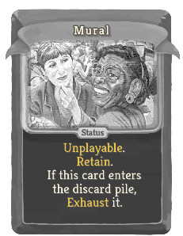 |  | Common | Status |  | Unplayable. Retain. If this card enters the discard pile, Exhaust it. |
| Frightening Beast | 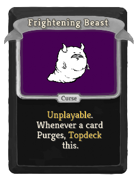 |  | Curse | Curse |  | Unplayable. Whenever a card Purges, move this to the top of your draw pile from anywhere. |
| Morthol Dryax | 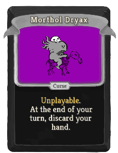 |  | Curse | Curse |  | Unplayable. At the end of your turn, discard your hand. |
| Oglog M'Rubbit | 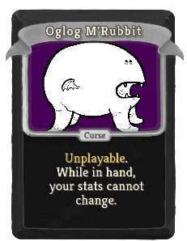 |  | Curse | Curse |  | Unplayable. While in hand, your stats cannot change. |
| Defend | 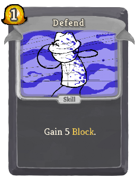 |  | Basic | Skill | 1 | Gain 5(8) Block. |
| Diplomacy | 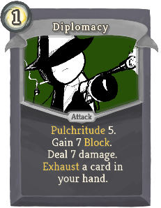 | 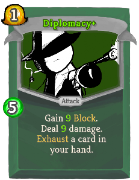 | Basic | Attack | 1 | Pulchritude 5. Gain 7(9) Block. Deal 7(9) damage. Exhaust a card in your hand. |
| Strike | 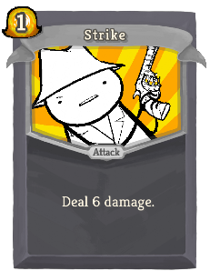 | 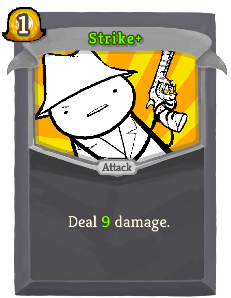 | Basic | Attack | 1 | Deal 6(9) damage. |
| Take Inventory | 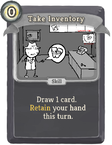 | 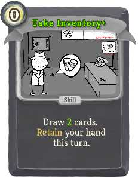 | Basic | Skill | 0 | Draw 1(2) card(s). Retain your hand this turn. |
| Key/Handgun | 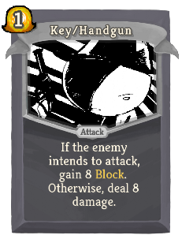 | 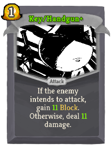 | Special | Attack | 1 | If the enemy intends to attack, gain 8(11) Block. Otherwise, deal 8(11) damage. |
| Moustache Fire | 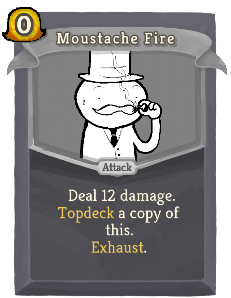 | 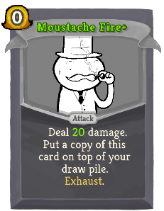 | Special | Attack | 0 | Deal 15(20) damage. Put a copy of this card on top of your draw pile. Exhaust. |
| Belly O' The Whale | 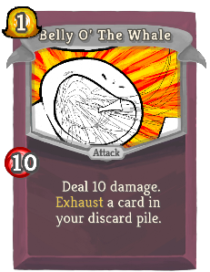 | 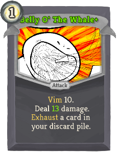 | Common | Attack | 1 | Vim 10. Deal 10(13) damage. Exhaust a card in your discard pile. |
| Ben Stiller Bust | 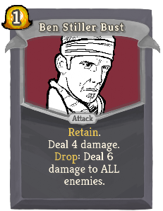 | 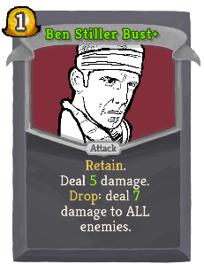 | Common | Attack | 1 | Retain. Deal 4(5) damage. If this card enters your discard or exhaust pile, deal 6(7) damage to ALL enemies. |
| Candy Corn | 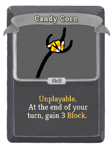 | 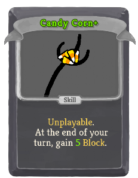 | Common | Skill |  | Unplayable. At the end of your turn, gain 3(5) Block. |
| Charisma Blast | 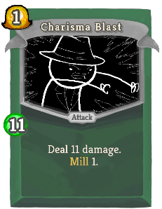 | 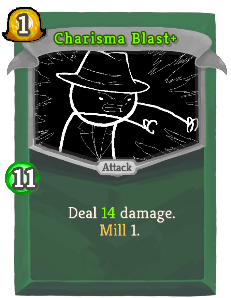 | Common | Attack | 1 | Pulchritude 11. Deal 11(14) damage. Discard the top card of your draw pile. |
| Fortify | 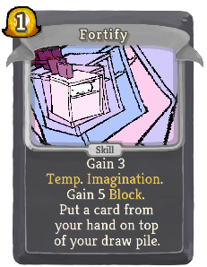 | 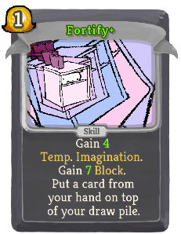 | Common | Skill | 1 | Gain 3(4) Temp._Imagination. Gain 5(7) Block. Put a card from your hand on top of your draw pile. |
| Ignore | 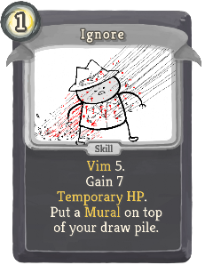 | 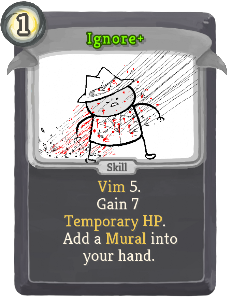 | Common | Skill | 1 | Vim 5. Gain 6(7) Temporary_HP. Put (Add) a Mural on top of (into) your draw pile (hand). |
| Moonshine | 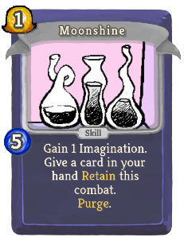 | 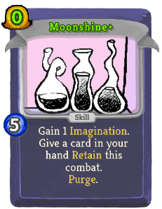 | Common | Skill | 1(0) | Imagination 5. Gain 1 Imagination. Give a card in your hand Retain this combat. Purge. |
| Ogle | 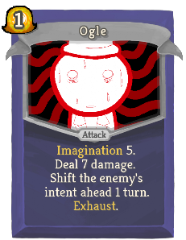 | 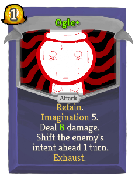 | Common | Attack | 1 | (Retain.)  Imagination 5. Deal 7(8) damage. Shift the enemy's intent ahead 1 turn. Exhaust. |
| Pepperminthryl | 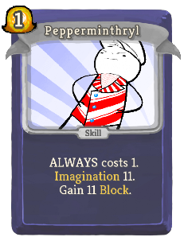 | 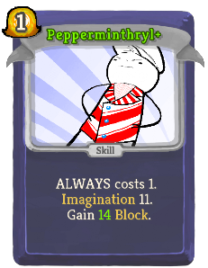 | Common | Skill | 1 | ALWAYS costs 1. Imagination 11. Gain 11(14) Block. |
| Pez Uzi | 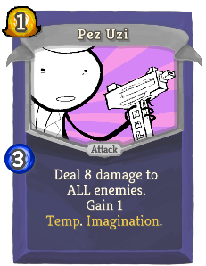 | 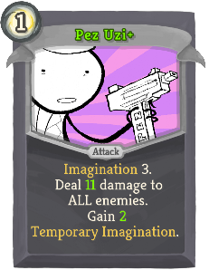 | Common | Attack | 1 | Imagination 3. Deal 8(11) damage to ALL enemies. Gain 1(2) Temp._Imagination. |
| Taze | 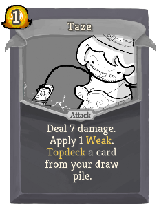 | 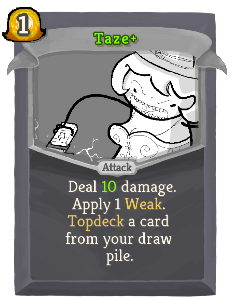 | Common | Attack | 1 | Deal 7(10) damage. Apply 1 Weak. Put a card from your draw pile on top of your draw pile. |
| Think Ahead | 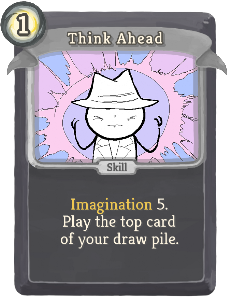 | 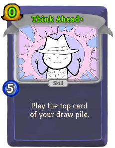 | Common | Skill | 1(0) | Imagination 5. Play the top card of your draw pile. |
| Tootsie Shotgun | 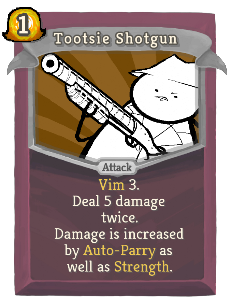 | 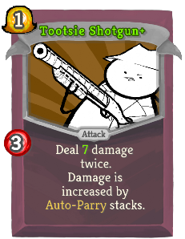 | Common | Attack | 1 | Vim 3. Deal 5(7) damage twice. Damage is increased by Auto-Parry as well as Strength. |
| Truffle Shuffle | 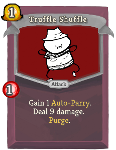 | 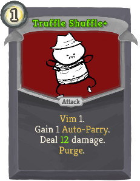 | Common | Attack | 1 | Vim 1. Gain 1 Auto-Parry. Deal 9(12) damage.  Purge. |
| Unscale | 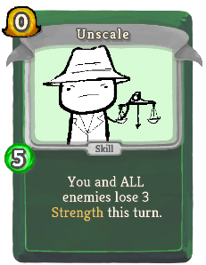 | 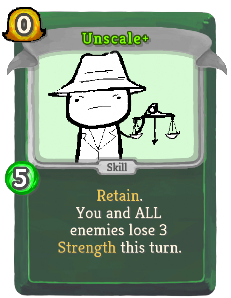 | Common | Skill | 0 | (Retain.)  Pulchritude 5. You and ALL enemies lose 4 Strength this turn. |
| Victory Pose | 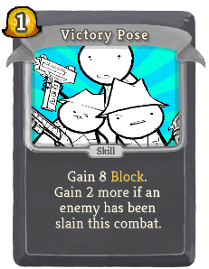 | 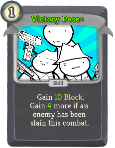 | Common | Skill | 1 | Gain 8(10) Block. Gain 2(4) more if an enemy has been slain this combat. |
| Wilson Bust | 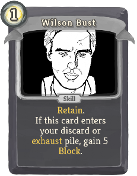 | 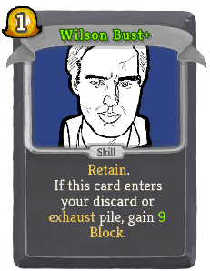 | Common | Skill | 1 | Retain. If this card enters your discard or exhaust pile, gain 6(9) Block. |
| Appropriate | 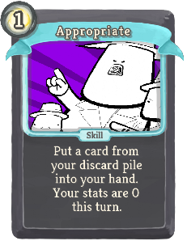 |  | Uncommon | Skill | 1(0) | Put a card from your discard pile into your hand. Your stats are 0 this turn. Exhaust. |
| Bite Hardly |  |  | Uncommon | Attack | 2 | Vim 10. Deal 9(12) damage. Gain 9(12) Temporary_HP. Exhaust. |
| Candy Cane |  |  | Uncommon | Attack | 0 | Imagination 6. Deal 7(10) damage. Gain 2(3) Temp._Imagination. |
| Candy Leather |  |  | Uncommon | Skill | 1 | Imagination 9. Gain 5(8) Block. Return an Imagination card from your discard pile to your hand. Ethereal. |
| Club Club Club |  |  | Uncommon | Attack | 1 | Deal 4(5) damage to ALL enemies 3 times. Discard 1 card. Lose 1 of your highest stat. |
| Deprogram |  |  | Uncommon | Skill | 0 | Look at the top 4 cards of your draw pile. You may discard any of them. Apply 1(2) Vulnerable to ALL enemies. |
| Diamond Armor |  |  | Uncommon | Skill | 1 | Gain 14(17) Block. Lose 1 of your highest stat. |
| Distill |  |  | Uncommon | Skill | 1(0) | Vim 5. Obtain a random potion. Gain 1 Auto-Parry. Purge. |
| Embarrass |  |  | Uncommon | Skill | 1(0) | Vim 5. Apply 3 Weak. Apply 3 Vulnerable. Put a Mural on top of your draw pile. |
| Fair Shake |  |  | Uncommon | Attack | 2 | Pulchritude 14. Gain 10(13) Block. Deal 14(18) damage to ALL enemies. Exhaust a card in your hand. |
| Fool Plate |  |  | Uncommon | Skill | 2(1) | Vim 5. Discard your hand. Gain 2 Temporary_HP for each card discarded. Exhaust. |
| Force Deck |  |  | Uncommon | Power | 1(0) | Imagination 9. At the start of your turn, draw 1 card and put 1 card from your hand on top of your draw pile. |
| Fortune |  |  | Uncommon | Skill | 5 | Imagination 10. Costs 1 less for each Temp._Imagination you have. Gain 8(10) Block. Draw 1(2) cards. |
| Frijolaegis |  |  | Uncommon | Skill | 0 | Vim 1. Whenever you draw this card, add a copy of it into your hand. Gain 3(4) Block. Exhaust. |
| Fudge Deck |  |  | Uncommon | Power | 1(0) | Pulchritude 9. At the start of your turn, draw 1 card and discard 1 card. |
| Hand Cannon |  |  | Uncommon | Attack | 2 | Deal 18(24) damage. Retain your hand this turn. |
| Heart Stab |  |  | Uncommon | Attack | 1 | Deal 10(14) damage. Apply 2 Weak. Apply 2 Vulnerable. Lose 1 of your highest stat. |
| Joust |  |  | Uncommon | Attack | 0 | Can only be played if no other cards in your hand are Attacks. Deal 8(11) damage. Apply 1 Weak. |
| Kingpin Bust |  |  | Uncommon | Skill | 1(0) | Retain. If this card enters your discard or exhaust pile, gain [E] . |
| Leer |  |  | Uncommon | Attack | 1 | Imagination 10. Remove all Block from the enemy (ALL enemies). Deal 3 damage 3 times. Apply 1(2) Vulnerable. |
| Opportunity Cost |  |  | Uncommon | Skill | 0 | Permanently upgrade a card in your hand. Lose 1 of each stat. (not Lose 1 of each stat.) Remove this card from your deck. Purge. |
| Parry |  |  | Uncommon | Power | 1 | Vim 5. Gain 1(2) Artifact. Gain !sleuthSecondMagic! Thorns. Gain 1 Auto-Parry. |
| Retain Return |  |  | Uncommon | Skill | 1(0) | Pulchritude 9. Return all cards with Retain from your discard pile to your hand. At the end of your turn, discard all cards with Retain. |
| Retrieve Arms |  |  | Uncommon | Skill |  | Unplayable. Whenever you draw this card, add a (an upgraded) Key/Handgun into your hand. Ethereal. |
| Snoop Dogg Bust |  |  | Uncommon | Skill | 1 | Retain. If this card enters your discard or exhaust pile, apply 1(2) Weak and 1 Vulnerable to ALL enemies. |
| Spade Dig |  |  | Uncommon | Skill | 1(0) | Put 1 card from your draw pile into your hand. Put a card from your discard pile on top of your draw pile. Lose 1 of your highest stat. |
| Throw Hat |  |  | Uncommon | Skill | X | Pulchritude 5. Gain 6 Block X (X+1) times. Discard the top X (X+1) cards of your draw pile. |
| Tommygun/Keyring |  |  | Uncommon | Attack | 1 | Deal 6(8) damage twice. / Gain 5(6) Block twice. Switches form at the start of your turn. |
| Torso Flail |  |  | Uncommon | Skill | 1(0) | Vim 9. Play a card in your discard pile and Exhaust it. |
| Treaty |  |  | Uncommon | Skill | 0 | Retain. Pulchritude 10. You and the enemy (ALL enemies) cannot gain buffs for 1 turn. |
| Triple Scuffle |  |  | Uncommon | Attack | 1 | Vim 10. Deal 8(10) damage. Draw 2(3) cards. Discard all cards drawn this way with Retain. |
| Truffle Trouble |  |  | Uncommon | Attack | 5(4) | Vim 10. Costs 1 less [E] for each time you play a Vim card this combat. Deal 21(24) damage. |
| Un-De-Escalate |  |  | Uncommon | Skill | 0 | Retain. Pulchritude 10. You and ALL enemies (not and ALL enemies)lose 1 stack of all debuffs. |
| Weigh In |  |  | Uncommon | Skill | 1 | Innate. Apply 2(3) Weak and !sleuthSecondMagic! Vulnerable to ALL enemies. Exhaust. |
| Wizard's Sudoku |  |  | Uncommon | Skill | 1 | Imagination 9. Draw 1 card (and give it Retain this combat). It costs 0 until played. |
| Brass Tacks |  |  | Rare | Attack | 2 | Pulchritude 15. Deal 16(20) damage to ALL enemies. Discard your hand, then draw that many cards. |
| Candid Bullets |  |  | Rare | Power | 1(0) | Imagination 5. Gain 3 Strength. At the end of your turn, lose 1 Imagination. |
| Candy Mech |  |  | Rare | Attack | 2 | Imagination !sleuthSecondMagic!. Gain 16 Block. Deal 16 damage. Lose 3(2) Imagination. |
| Candycorn Vampire |  |  | Rare | Power | 1 | Pulchritude 15. Imagination 15. Gain !sleuthSecondMagic! Dexterity. Gain 3(6) Malleable. |
| Conjure |  |  | Rare | Attack | 1 | Vim 6. Imagination 12. Choose 2(3):   Deal 8 damage. Gain 8 Block. Apply 2 Weak. Apply 2 Vulnerable. |
| Diabeatdown |  |  | Rare | Attack | 2 | Vim 15. Deal 24(30) damage to the enemy with the least HP. If this kills an enemy, repeat it. |
| Gummy Zombie |  |  | Rare | Power | 2(1) | Pulchritude 15. Vim 15. At the end of your turn, gain 1 Temporary_HP for each card in your hand. |
| Hero Bust |  |  | Rare | Skill | 3(2) | Retain. If this card enters your discard or exhaust pile, prevent the next time you would lose HP. |
| Hit the Mattresses |  |  | Rare | Attack | 2 | (Pulchritude 10. Vim 10. Imagination 10.)  Deal damage equal to your combined stats. Exhaust. |
| Leverage Height |  |  | Rare | Attack | 1 | Pulchritude 12. Deal 12(15) damage. Discard 1(2) card(s). Draw 1(2) card(s). |
| Machinegun/Hairpin |  |  | Rare | Attack | 1 | Deal 8(10) damage twice. / Gain 7(9) Block twice. Switches form whenever played. |
| Mob Rule |  |  | Rare | Skill | 2 | Vim 16. ALL enemies become Stunned. Put 4(3) Murals on top of your draw pile. |
| Roll Boxcars |  |  | Rare | Skill | 0 | Add any 1 of the 4 (upgraded) Midnight Cards to your hand. Exhaust. |
| Supermassive |  |  | Rare | Skill | 3(2) | Vim 5. Gain Block equal to your Vim. Reflect damage this turn. Exhaust. |
| The Zillyhammer |  |  | Rare | Attack | 2 | Imagination 20. Deal 30(40) damage to ALL enemies. Lose 5(4) Imagination. |
| Tootsiestein |  |  | Rare | Power | 0 | Vim 15. Imagination 15. Whenever you play an Imagination card, draw 1(2) card(s). |
| Weird Puzzle Shit |  |  | Rare | Skill | 1 | Pulchritude 16. Costs 1 more for every 2 cards in your draw pile. Add a (an upgraded) Moustache_Fire into your hand. |

## Potions

| Image | Name | Rarity | Description |
| ----- | ---- | ------ | ----------- |
|  | Demotion Potion | Uncommon | Enemy cannot buff itself or debuff you. |

## Relics

| Image | Name | Rarity | Color | Description | Flavor |
| ----- | ---- | ------ | ----- | ----------- | ------ |
|  | Typewriter | Starter | Sleuth_gray_color | When a card #yPurges, gain #b1 #yTemp. #yHP and ALL enemies lose #b1 #yStrength this turn. | Type up an UNPLEASANT NOTE to increase the enemy's SICK BURN levels. |
|  | Bowen Stilson Dogg | Common | Sleuth_gray_color | At the start of each combat, discard #b1 card from your draw pile. | The dreaded bust. |
|  | Jester of Encumbrance | Uncommon |  | At the start of each combat, choose a card in your draw pile and give it to an enemy. That card is put into your hand when the enemy is slain. | Exiled from CLOWN TERRITORY for the crime of BEING MISPLACED BY THE CLOWN PONTIFICATE. |
|  | Elf Eggs | Rare |  | Whenever you #ySmith, increase your Max HP by #b3. | You yearn to crack out the succulent yolk. |
|  | HAMPER OF THE JADED FOOL'S ENNUI | Special | Sleuth_gray_color | Start each combat with #b10 #yThorns. | The Clown Pontificate (hereafter: "CP") has granted one (1) boon (hereafter: "the product") in exchange for the services rendered by you to slay the spire. The product may be leased for up to three combat encounters (hereafter: "battles") due to the eventuality in which the merchant (hereafter: "dead-o") is murdered. The product will be returned to CP within 3-4 business days. |
|  | Salted Melon | Special | Sleuth_gray_color | Whenever you enter a Rest Site, increase your Max HP by #b1. | The tastiest QUEST OF SPIRIT is satisfied. |
|  | Tectrixcalibur | Special | Sleuth_gray_color | Start each combat with #b2 #yStrength and #b1 #yDexterity. | Scaling! |
|  | Affinity Crow | Boss |  | Enemies cannot intend to attack for more than #b30 damage. | Heads will roll. |
|  | Megaton Key | Boss |  | Gain [E] at the start of your turn. NL Upon pickup, lose your leftmost #b2 relics. | These brass knuckles are so heavy. |
|  | Call of Fluthlu | Shop | Sleuth_gray_color | At the start of your turn, add a #yDazed into your hand. | Surprisingly surprising. |
|  | Jammed Printer | Shop | Sleuth_gray_color | You draw cards from the #b2nd from top position of your draw pile. | It's stuck! |
|  | Sextant | Shop |  | You can see the contents of #y? rooms. | Useful for sniping. |

| Image | Name |
| ----- | ---- |
|  | the sleuth |

