| Name | Image | Upgraded image | Rarity | Type | Cost | Description |
| ---- | ----- | -------------- | ------ | ---- | ---- | ----------- |
| Defend | 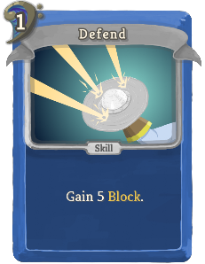 | 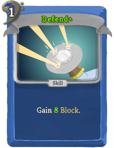 | Basic | Skill | 1 | Gain 5(8) Block. |
| Inspire | 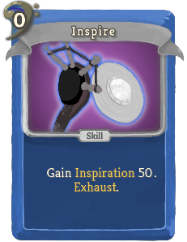 | 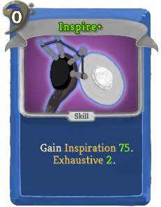 | Basic | Skill | 0 | Gain bard:Inspiration !bard:In!. Exhaust (Exhaustive !stslib:ex!). |
| Riposte | 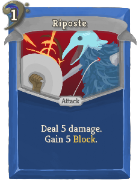 |  | Basic | Attack | 1 | Deal 5(7) damage. Gain 5(7) Block. |
| Strike | 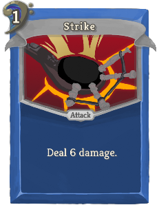 |  | Basic | Attack | 1 | Deal 6(9) damage. |
| Buckler Bash | 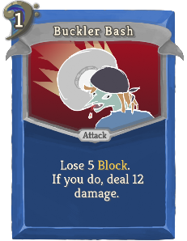 | 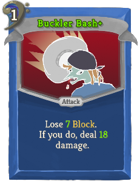 | Common | Attack | 1 | Lose 5(7) Block. If you do, deal 12(18) damage. |
| Cutting Words | 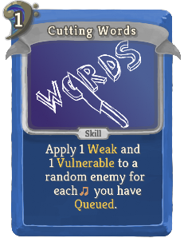 | 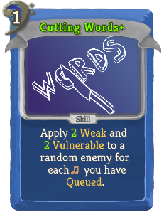 | Common | Skill | 1 | Apply 1(2) Weak and 1(2) Vulnerable to a random enemy for each [DebuffNote] you have bard:Queued. |
| Echo Echo | 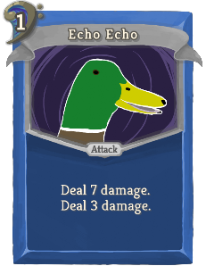 | 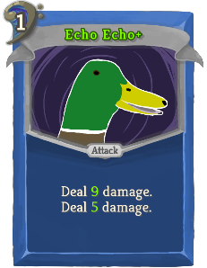 | Common | Attack | 1 | Deal !bard:M2! damage. Deal 3(5) damage. |
| Feast on Fear | 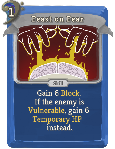 |  | Common | Skill | 1 | Gain 6(8) Block. If the enemy is Vulnerable, gain 6(8) Temporary_HP instead. |
| Fermata | 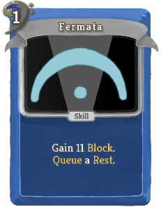 | 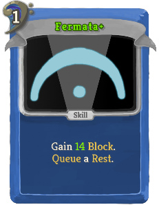 | Common | Skill | 1 | Gain 11(14) Block. bard:Queue a bard:Rest. |
| Gamble | 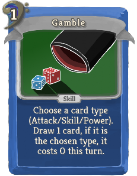 | 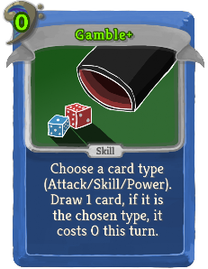 | Common | Skill | 1(0) | Choose a card type (Attack/Skill/Power). Draw 1 card, if it is the chosen type, it costs 0 this turn. |
| Hideous Laughter | 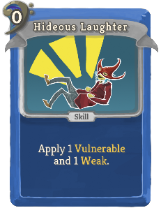 | 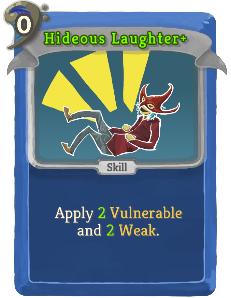 | Common | Skill | 0 | Apply 1(2) Vulnerable and 1(2) Weak. |
| Inspiring Song | 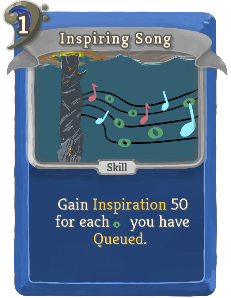 | 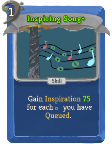 | Common | Skill | 1 | Gain bard:Inspiration !bard:In! for each [BuffNote] you have bard:Queued. |
| Lingering Echo | 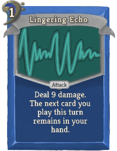 | 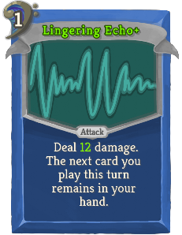 | Common | Attack | 1 | Deal 9(12) damage. The next card you play this turn remains in your hand. |
| Parry | 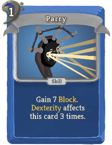 | 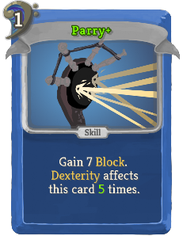 | Common | Skill | 1 | Gain 7 Block. Dexterity affects this card 3(5) times. |
| Phantasmal Force | 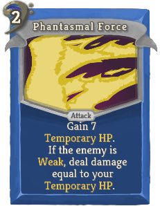 | 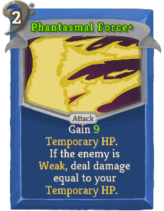 | Common | Attack | 2 | Gain 7(9) Temporary_HP. If the enemy is Weak, deal damage equal to your Temporary_HP. |
| Quick Song | 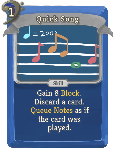 | 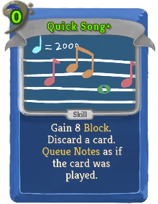 | Common | Skill | 1(0) | Gain 8 Block. Discard a card. bard:Queue bard:Notes as if the card was played. |
| Sift | 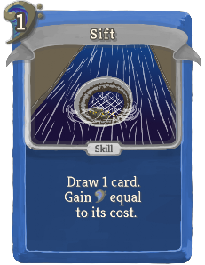 |  | Common | Skill | 1 | Draw !bard:M2! card. Gain [E] equal to its cost.  (Draw -1(1) card.) |
| Song Bolt |  | 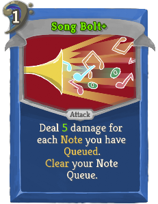 | Common | Attack | 1 | Deal 3(5) damage for each bard:Note you have bard:Queued. Clear your Note Queue. |
| Studied Strike | 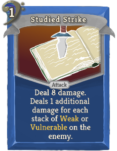 |  | Common | Attack | 1 | Deal 8 damage. Deals 1(2) additional damage for each stack of Weak or Vulnerable on the enemy. |
| Thunderwave | 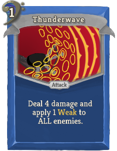 |  | Common | Attack | 1 | Deal 4(7) damage and apply 1 Weak to ALL enemies. |
| Tiny Hut | 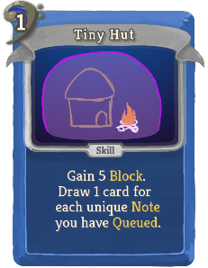 | 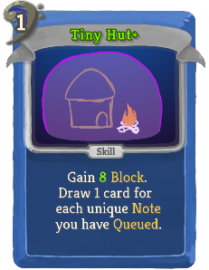 | Common | Skill | 1 | Gain 5(8) Block. Draw 1 card for each unique bard:Note you have bard:Queued. |
| Vicious Mockery | 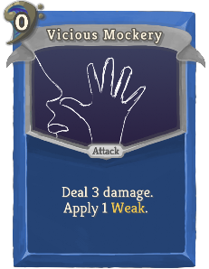 | 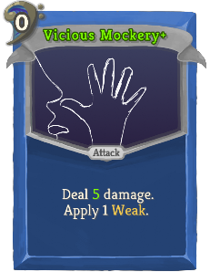 | Common | Attack | 0 | Deal 3(5) damage. Apply 1 Weak. |
| 6/4 Time |  | 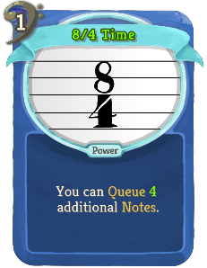 | Uncommon | Power | 1 | You can bard:Queue 2(4) additional bard:Notes. |
| Accelerando | 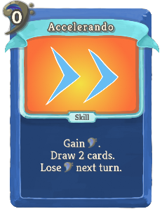 | 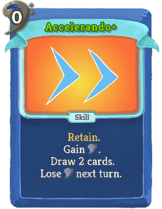 | Uncommon | Skill | 0 | (Retain.)  Gain [E]. Draw 2 cards. Lose [E] next turn. |
| Aphasia | 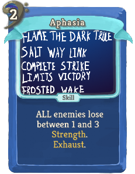 | 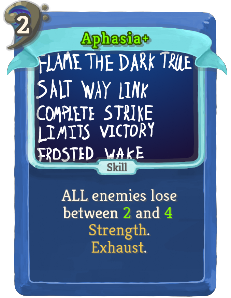 | Uncommon | Skill | 2 | ALL enemies lose between !bard:M2! and 3(4) Strength. Exhaust. |
| Balestra | 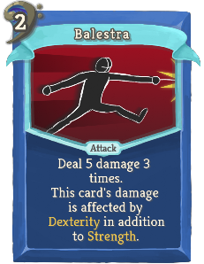 |  | Uncommon | Attack | 2 | Deal 5 damage 3(4) times. This card's damage is affected by Dexterity in addition to Strength. |
| Bestow Curse | 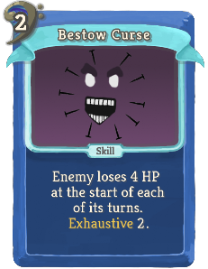 | 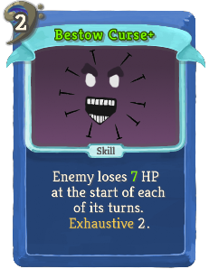 | Uncommon | Skill | 2 | Enemy loses 4(7) HP at the start of each of its turns. Exhaustive !stslib:ex!. |
| Blink | 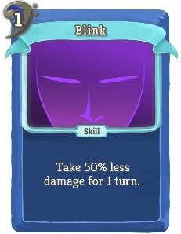 | 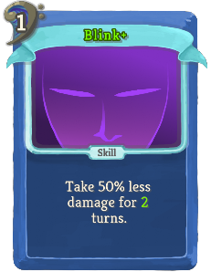 | Uncommon | Skill | 1 | Take 50% less damage for 1(2) turn(s). |
| Demoralize | 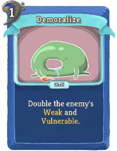 |  | Uncommon | Skill | 1(0) | Double the enemy's Weak and Vulnerable. |
| Dervish Dance |  | 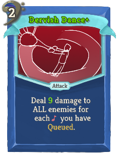 | Uncommon | Attack | 2 | Deal 7(9) damage to ALL enemies for each [AttackNote] you have bard:Queued. |
| Discordant Voice | 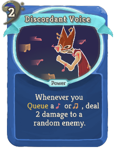 |  | Uncommon | Power | 2(1) | Whenever you bard:Queue a [AttackNote] or [DebuffNote] , deal 2 damage to a random enemy. |
| Doot |  |  | Uncommon | Skill | 0 | Choose a (1(2)) bard:Note(s) to bard:Queue. |
| En Garde |  |  | Uncommon | Attack | 2 | Gain 7 Block. Deal 7 damage. bard:Inspiration affects this card 2(3) times. |
| Faerie Fire |  |  | Uncommon | Skill | 0 | Apply 1(2) Vulnerable to ALL enemies. |
| False Life |  |  | Uncommon | Skill | 2 | Gain 10 Temporary_HP. Gain !bard:M2! additional Temporary_HP for each [BlockNote] you have bard:Queued. |
| First Strike |  |  | Uncommon | Attack | 1 | Deal 8(11) damage. Startup: Deal 8 damage to ALL enemies. |
| Flourish |  |  | Uncommon | Attack | 1 | Choose a bard:Note to bard:Queue. Deal 10(13) damage. |
| Glyph of Warding |  |  | Uncommon | Power | 1 | Whenever you lose Block or Temporary_HP, deal 2(4) damage to ALL enemies. |
| Greater Magic Weapon |  |  | Uncommon | Power | 1 | (Innate.)  The first Attack card you play each turn also applies 1 Vulnerable. |
| Greatness |  |  | Uncommon | Skill | 1 | Gain bard:Inspiration !bard:In!. |
| Guard Point |  |  | Uncommon | Skill | 1 | Gain 7(9) Block. If you have no [BlockNote] bard:Queued, gain 7(9) Block again. |
| Harmonious Voice |  |  | Uncommon | Power | 2(1) | Whenever you bard:Queue a [BlockNote] or [BuffNote] , gain 1 Temporary_HP. |
| Heroism |  |  | Uncommon | Skill | 1 | Gain 5(8) Temporary_HP. Gain bard:Inspiration !bard:In!. |
| Life Drain |  |  | Uncommon | Attack | 1 | Deal 8(12) damage. Gain Temporary_HP for half the unblocked damage dealt. |
| Lingering Performance |  |  | Uncommon | Skill | 1 | All bard:Inspiration you currently have affect 1 additional card. Exhaustive !stslib:ex!. |
| Locate Object |  |  | Uncommon | Skill | 0 | Put 1 card from your draw pile into your hand. bard:Queue a bard:Rest. Exhaust (Exhaustive !stslib:ex!). |
| Mantle of Inspiration |  |  | Uncommon | Power | 1 | Increase all bard:Inspiration you gain from cards by !bard:M2!. |
| Off-Key |  |  | Uncommon | Attack | 1 | Gain 8(11) Block. Deal 8(11) damage. bard:Queue 2 bard:Rests. |
| Prismatic Spray |  |  | Uncommon | Skill | X | Add X random Attacks of any color into your hand. They cost 0 this turn (combat). Exhaust. |
| Rest |  |  | Uncommon | Skill | 0 | Remove all bard:Rests from your Note Queue. Heal 2(3) HP for each bard:Rest removed. Exhaust. |
| Shout |  |  | Uncommon | Attack | 2 | Deal 12(16) damage. Enemy loses 2 Strength. Decrease this card's Strength loss by 1 this combat. |
| Silence |  |  | Uncommon | Skill | 1 | Enemy cannot (buff itself or) debuff you for 3 turns. Exhaust. |
| Solo |  |  | Uncommon | Skill | 1(0) | If your Note Queue contains no bard:Notes, perform any bard:Melody. |
| Thick of the Fight |  |  | Uncommon | Attack | 3 | Deal 12(15) damage to a random enemy for each living enemy. Costs 1 less [E] for each living enemy. |
| Covetous Aura |  |  | Rare | Power | 1(0) | Whenever an enemy gains Strength, you also gain the same Strength. |
| Death Metal |  |  | Rare | Power | 2 | You can no longer bard:Queue bard:Notes. Whenever you would bard:Queue a bard:Note, deal 2(3) damage to ALL enemies instead. |
| Encore |  |  | Rare | Skill | 1 | Your next bard:Melody is (1(2) bard:Melodies are) performed twice. |
| Finger of Death |  |  | Rare | Attack | 1 | Deal damage equal to twice your Temporary_HP (to ALL enemies). |
| Focused |  |  | Rare | Skill | X | Gain bard:Inspiration X00.  (Refund !stslib:refund!.) |
| Haste |  |  | Rare | Skill | 1 | Double your Dexterity. Exhaust (Exhaustive !stslib:ex!). |
| Improv |  |  | Rare | Skill | 0 | This turn, for every 6(5) bard:Notes you bard:Queue, perform any bard:Melody regardless of your Note Queue. At the end of this turn, clear your Note Queue. |
| Invisibility |  |  | Rare | Skill | 2 | Gain !bard:M2! Intangible. Draw 1(2) more card(s) next turn. Exhaust. |
| Magnum Opus |  |  | Rare | Skill | 2(1) | Gain bard:Inspiration !bard:In!. Permanently increase this card's bard:Inspiration by !bard:M2!. Exhaust. |
| Mnemonic Vestments |  |  | Rare | Skill |  | Unplayable. (Ethereal.) Startup: Choose any card in your deck and shuffle a copy of that card into your draw pile. It costs 0 until played. |
| Power Word Stun |  |  | Rare | Skill | 2 | If the enemy has less than !bard:M2! % HP, Stun it for 1 turn. |
| Reverse Gravity |  |  | Rare | Attack | 3 | Deal 15(18) damage and apply 1 Weak to ALL enemies. Next turn, deal !bard:M2! damage and apply 1 Weak to ALL enemies again. |
| Rhapsody |  |  | Rare | Skill | 1 | (Choose a bard:Note to bard:Queue.)  Perform any bard:Melody you have the bard:Notes for, regardless of their order. |
| Shifting |  |  | Rare | Attack | 3 | Deal 12(16) damage or gain 12(16) Block. Deal 12(16) damage or gain 12(16) Block. |
| Sonata |  |  | Rare | Power | 1 | (Innate.)  You can perform every possible bard:Melody in your Note Queue at once. |
| Splendid Form |  |  | Rare | Power | 3 | At the start of your turn, gain bard:Inspiration !bard:M2!. |
| Wish |  |  | Rare | Skill | (0) | Unplayable (Choose any non-rare Bard card). (Permanently replace this card with the chosen card.) Ethereal (Purge). |
