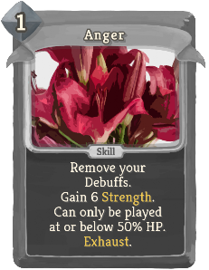
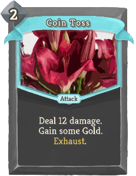
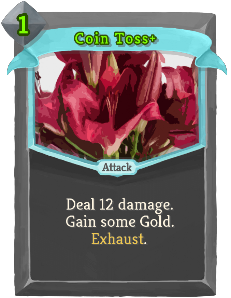
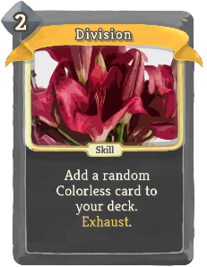
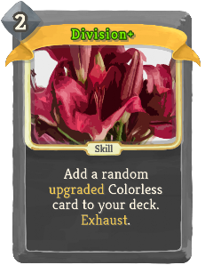
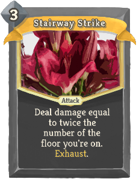

| Name | Image | Upgraded image | Rarity | Type | Cost | Description |
| ---- | ----- | -------------- | ------ | ---- | ---- | ----------- |
| Anger |  |  | Special | Skill | 1 | Remove your Debuffs. Gain 6(12) Strength. Can only be played at or below 50% HP. Exhaust. |
| Defensive Stance |  |  | Special | Power | 3 | Gain 15(20) Block. At the end of your turn, gain 5(7) Block. |
| Execute |  |  | Special | Attack | 3(2) | Deal 10 damage twice. Can only be played at or below 50% HP. |
| Face Slap |  |  | Special | Attack | 2 | Remove all Block from the enemy. Deal 12(14) damage. Apply 2 Vulnerable. |
| Gloat |  |  | Special | Skill | 1 | Gain 2(4) Strength. |
| Heavy Slash |  |  | Special | Attack | 2 | Deal 16(18) damage. |
| Taunt |  |  | Special | Skill | 2(1) | Apply 2 Weak. Apply 2 Vulnerable. |
| Coin Toss |  |  | Uncommon | Attack | 2(1) | Deal 12 damage. Gain some Gold. Exhaust. |
| Plotting |  |  | Uncommon | Skill | 0 | Draw 2(3) additional cards next turn. |
| Antique Fury |  |  | Rare | Attack | 2 | Deal 3 damage for every Relic you have. Exhaust. (not Exhaust.) |
| Division |  |  | Rare | Skill | 2 | Add a random (upgraded) Colorless card to your deck. Exhaust. |
| Full Service |  |  | Rare | Attack | 3 | Deal 5(6) damage. Gain 5(6) Block. Gain 5(6) Gold. Apply !vexMod:SecondMagic! Weak. Apply !vexMod:SecondMagic! Vulnerable. Draw !vexMod:SecondMagic! cards. Heal !vexMod:SecondMagic! HP. Gain 5(6) Block next turn. Gain 1 Energy next turn. Exhaust. |
| Golden Touch |  |  | Rare | Power | 3(2) | Whenever you deal unblocked Attack damage, gain that much gold. Ethereal. |
| Resourcefulness |  |  | Rare | Skill | 0 | (Put one card from your draw pile into your hand.)  Draw 2 cards (1 card). |
| Stairway Strike |  |  | Rare | Attack | 3(2) | Deal damage equal to twice the number of the floor you're on. Exhaust. |
