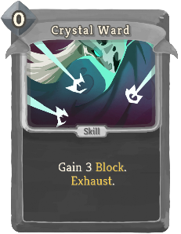
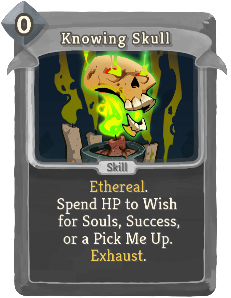
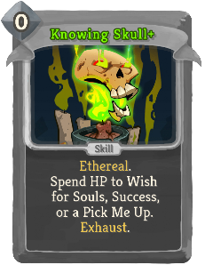
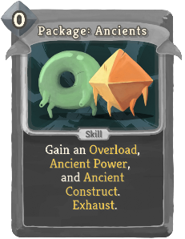
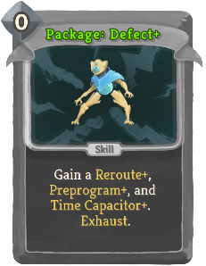
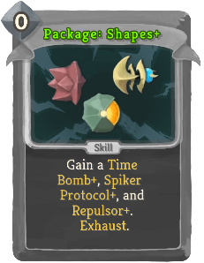
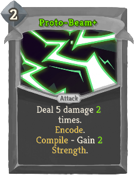
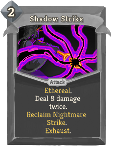

| Name | Image | Upgraded image | Rarity | Type | Cost | Description |
| ---- | ----- | -------------- | ------ | ---- | ---- | ----------- |
| Batch |  |  | Special | Skill | 0 | Create a Function immediately out of the cards in the Sequence. Exhaust. (not Exhaust.) |
| Branch: Attack |  |  | Special | Attack | 1 | Deal 9 (11) damage. bronze:Encode. |
| Branch: Block |  |  | Special | Skill | 1 | Gain 8 (10) Block. bronze:Encode. |
| Byte Shift |  |  | Special | Skill | 0 | (Retain.)  Return all Encoded cards to your hand. They gain Retain. Exhaust. |
| Council's Justice |  |  | Special | Attack | 1 | Deal 6 (10) damage, increased by 3 (4) for each Exhausted Apparition. Exhaust. |
| Crystal Shiv |  |  | Special | Attack | 0 | Deal 4 (6) damage. Exhaust. |
| Crystal Ward |  |  | Special | Skill | 0 | Gain 3 (5) Block. Exhaust. |
| Darkling Duo |  |  | Special | Skill | 1 | slimeboundmod:Split into a slimeboundmod:Darkling_Slime 2 (3) times. Exhaust. |
| Dazing Pulse |  |  | Special | Attack | 1 | Deal 7 (9) damage. Gain 7 (9) Block bronze:Encode. bronze:Compile Error - bronze:Insert 2 Dazed. |
| Debug |  |  | Special | Skill | 0 | Remove all bronze:Compile Error effects from Encoded cards. Exhaust. |
| Decompile |  |  | Special | Skill | 0 | (Retain.)  Exhaust all Encoded cards. Gain [E] and draw a card for each card Exhausted. Exhaust. |
| Explode |  |  | Special | Skill | 1 | Apply 15 (20) hexamod:Soulburn to ALL enemies. bronze:Encode. bronze:Compile Error - bronze:Insert 2 Burn. |
| Finishing Strike |  |  | Special | Attack | 1 | Retain. Deal 6 (9) damage. [fist_icon]   champ:Finisher |
| Knowing Skull |  |  | Special | Skill | 0 | Ethereal. Spend HP to Wish for Souls, Success, or a Pick Me Up. Exhaust. |
| Lick |  |  | Special | Skill | 0 | Apply 4 (6) slimeboundmod:Goop. Exhaust - slimeboundmod:Buried. |
| Minor Beam |  |  | Special | Attack | 0 | Deal 5 (7) damage. bronze:Encode. |
| Orb Slam |  |  | Special | Attack | 0 | Deal 2 (3) damage 2 times. Exhaust. |
| Package: Ancients |  |  | Special | Skill | 0 | Gain an Overload (*Overload+), Ancient Power (*Power+), and Ancient Construct (*Construct+). Exhaust. |
| Package: Bronze |  |  | Special | Skill | 0 | Gain a Giga Beam (*Beam+), Orb Support (*Support+), and Resilient Plate (*Plate+). Exhaust. |
| Package: Defect |  |  | Special | Skill | 0 | Gain a Reroute (*Reroute+), Preprogram (*Preprogram+), and Time Capacitor (*Capacitor+). Exhaust. |
| Package: Orbwalker |  |  | Special | Skill | 0 | Gain an Orbwalk (*Orbwalk+), Walker Claw (*Claw+), and Incinerate (*Incinerate+). Exhaust. |
| Package: Sentry |  |  | Special | Skill | 0 | Gain a Sentry Blast (*Blast+) and two Sentry Waves (*Waves+). Exhaust. |
| Package: Shapes |  |  | Special | Skill | 0 | Gain a Time Bomb (*Bomb+), Spiker Protocol (*Protocol+), and Repulsor (*Repulsor+). Exhaust. |
| Package: Spheric |  |  | Special | Skill | 0 | Gain a Spheric Shield (*Shield+), Harden (*Harden+), and Floating Orbs (*Orbs+). Exhaust. |
| Proto-Beam |  |  | Special | Attack | 2 | Deal 5 damage 1 (2) times. bronze:Encode. bronze:Compile - Gain 1 (2) Strength. |
| Proto-Shield |  |  | Special | Skill | 2 | Gain 10 Block. bronze:Encode. bronze:Compile - Gain 4 (6) Plated Armor and bronze:Insert 2 Dazed. |
| SLIME CRUSH!!! |  |  | Special | Attack | 4 | Ethereal. Deal 35 (40) damage (to ALL enemies). Exhaust. |
| Sentry Wave |  |  | Special | Skill | 0 | Apply 1 Weak. (guardianmod:Brace 2.)  Place a Sentry Blast (*Blast+) into guardianmod:Stasis. Exhaust. |
| Shadow Guise |  |  | Special | Skill | 2 | Ethereal. Gain 7 (9) Block twice. expansioncontent:Reclaim Nightmare Guise. Exhaust. |
| Shadow Strike |  |  | Special | Attack | 2 | Ethereal. Deal 8 (10) damage twice. expansioncontent:Reclaim Nightmare Strike. Exhaust. |
| Spike |  |  | Special | Attack | 0 | Deal 4 (6) damage. bronze:Encode. bronze:Compile - Gain 4 (6) Thorns. |
| Ward |  |  | Special | Skill | 0 | Gain 3 (5) Block. Exhaust. |
