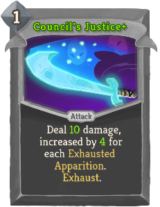
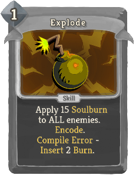
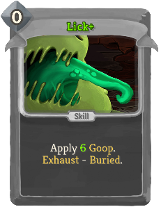
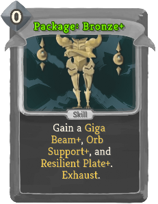
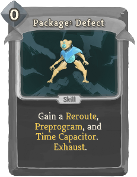
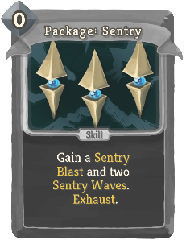
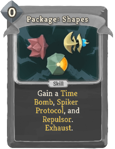
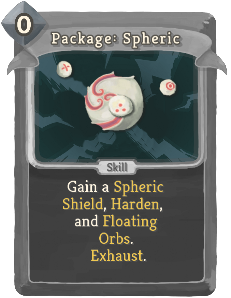

| Name | Image | Upgraded image | Rarity | Type | Cost | Description |
| ---- | ----- | -------------- | ------ | ---- | ---- | ----------- |
| Batch |  |  | Special | Skill | 0 | Create a Function immediately out of the cards in the Sequence. Exhaust. (not Exhaust.) |
| Beta Build |  |  | Special | Skill | 1 | Gain 13 (18) Block. bronze:Insert random Status. bronze:Encode. bronze:Compile - bronze:Insert Full Release. |
| Branch: Attack |  |  | Special | Attack | 1 | Deal 9 (11) damage. bronze:Encode. |
| Branch: Block |  |  | Special | Skill | 1 | Gain 8 (10) Block. bronze:Encode. |
| Byte Shift |  |  | Special | Skill | 0 | (Retain.)  Return all cards in the Sequence to your hand. They gain Retain. Exhaust. |
| Council's Justice |  |  | Special | Attack | 1 | Ethereal. Deal 6 (10) damage. Damage is increased by 3 (4) for each Apparition in your exhaust pile. Exhaust. |
| Dazing Pulse |  |  | Special | Attack | 1 | Deal 5 (7) damage. Gain 5 (7) Block bronze:Encode. bronze:Compile Error - bronze:Insert 2 Dazed. |
| Debug |  |  | Special | Skill | 0 | Remove all bronze:Compile Error effects from the cards in the Sequence. Exhaust. |
| Decompile |  |  | Special | Skill | 0 | (Retain.)  Exhaust all cards in the Sequence. Gain [E] and draw a card for each card Exhausted. Exhaust. |
| Explode |  |  | Special | Skill | 1 | bronze:Insert a Burn. bronze:Encode. bronze:Compile - ALL enemies lose 15 (20) HP. |
| Finishing Strike |  |  | Special | Attack | 1 | Retain. Deal 6 (9) damage. [fist_icon]   champ:Finisher |
| Fragment |  |  | Special | Attack | 1 | Deal 5 (7) damage. Gain 5 (7) Block. bronze:Encode. |
| Full Release |  |  | Special | Skill | 1 (0) | bronze:Encode. bronze:Compile - Function becomes a Power which activates its effects at the start of each turn. |
| Knowing Skull |  |  | Special | Skill | 0 | Ethereal. Spend HP to Wish for Souls, Success, or a Pick Me Up. Exhaust. |
| Lick |  |  | Special | Skill | 0 | Apply 4 (6) slimeboundmod:Goop. Exhaust. |
| Minor Beam |  |  | Special | Attack | 0 | Deal 3 (4) damage. bronze:Encode. |
| Orb Slam |  |  | Special | Attack | 0 | Deal 2 (3) damage 2 times. Exhaust. |
| Package: Ancients |  |  | Special | Skill | 0 | Add an Ancient Attack, Ancient Power, and Ancient Construct to your hand (and Upgrade them). Exhaust. |
| Package: Bronze |  |  | Special | Skill | 0 | Add a Hyper Beam, Orb Beam, and Bronze Armor to your hand (and Upgrade them). Exhaust. |
| Package: Defect |  |  | Special | Skill | 0 | Add a Reroute, Preprogram, and Time Capacitor to your hand (and Upgrade them). Exhaust. |
| Package: Orbwalker |  |  | Special | Skill | 0 | Add an Orbwalk, Walker Claw, and Incinerate to your hand (and Upgrade them). Exhaust. |
| Package: Sentry |  |  | Special | Skill | 0 | Add a Sentry Blast (*Blast+) and two Sentry Waves (*Waves+) to your hand (and Upgrade them). Exhaust. |
| Package: Shapes |  |  | Special | Skill | 0 | Add a Time Bomb, Spiker Protocol, and Repulsor to your hand (and Upgrade them). Exhaust. |
| Package: Spheric |  |  | Special | Skill | 0 | Add a Spheric Shield, Harden, and Floating Orbs to your hand (and Upgrade them). Exhaust. |
| Proto-Beam |  |  | Special | Attack | 2 | Deal 8 damage 2 (3) times. bronze:Encode. bronze:Compile - Gain 2 (3) Strength and lose 1 Dexterity. |
| Proto-Shield |  |  | Special | Skill | 2 | Gain 16 Block. bronze:Encode. bronze:Compile - Gain 4 (6) Plated Armor and bronze:Insert 2 Dazed. |
| SLIME CRUSH!!! |  |  | Special | Attack | 4 | Ethereal. Deal 35 (45) damage. Exhaust. |
| Sentry Wave |  |  | Special | Skill | 0 | Apply 1 Weak. (guardianmod:Brace 2.)  Place a Sentry Blast (*Blast+) into guardianmod:Stasis. Exhaust. |
| Shadow Guise |  |  | Special | Skill | 1 | Gain 14 (18) Block. Exhaust. |
| Shadow Strike |  |  | Special | Attack | 1 | Deal 16 (20) damage. Exhaust. |
| Spike |  |  | Special | Attack | 1 | Deal 3 (4) damage. bronze:Encode. bronze:Compile - Gain 3 (4) Thorns. |
