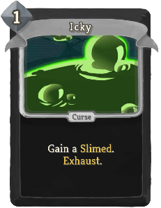

| Name | Image | Upgraded image | Rarity | Type | Cost | Description |
| ---- | ----- | -------------- | ------ | ---- | ---- | ----------- |
| Aged |  |  | Curse | Curse |  | Unplayable. Ethereal. At the end of your turn, add a Void Status to the top of your draw pile. |
| Bewildered |  |  | Curse | Curse | 2 | When you play another card, sneckomod:Muddle your hand, then discard this. Exhaust. |
| Flawed |  |  | Curse | Curse | 1 | Ethereal. At the end of your turn, transform all cards in hand into random Status cards. Exhaust. |
| Haunted |  |  | Curse | Curse |  | Ethereal. Unplayable. When drawn, add Ethereal to all cards in your hand. |
| Icky |  |  | Curse | Curse | 1 | Add a Slimed Status to your hand. Exhaust. |
