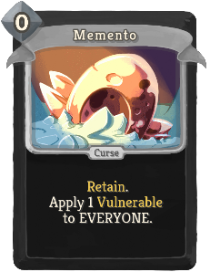
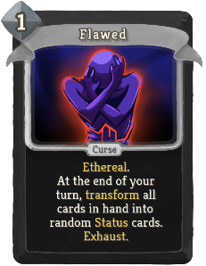

| Name | Image | Upgraded image | Rarity | Type | Cost | Description |
| ---- | ----- | -------------- | ------ | ---- | ---- | ----------- |
| Impending Doom |  |  | Special | Curse |  | Unplayable. hermit:Dead_On: At the end of your turn, deal 13 damage to EVERYONE. |
| Memento |  |  | Special | Curse | 0 | Retain. Apply 1 Vulnerable to EVERYONE. |
| Aged |  |  | Curse | Curse |  | Unplayable. Ethereal. At the end of your turn, add a Void to the top of your draw pile. |
| Bewildered |  |  | Curse | Curse | 2 | When you play another card, sneckomod:Muddle your hand, then discard this. Exhaust. |
| Flawed |  |  | Curse | Curse | 1 | Ethereal. At the end of your turn, transform all cards in hand into random Status cards. Exhaust. |
| Haunted |  |  | Curse | Curse |  | Ethereal. Unplayable. When drawn, add Ethereal to all cards in your hand. |
| Icky |  |  | Curse | Curse | 1 | Gain a Slimed. Exhaust. |
| Scatterbrained |  |  | Curse | Curse |  | Unplayable. When drawn, if it is your turn, fill your hand with gremlin:Echoes of this card. |
