| Name | Image | Upgraded image | Rarity | Type | Cost | Description |
| ---- | ----- | -------------- | ------ | ---- | ---- | ----------- |
| ??? |  |  | Basic | Skill |  | *Unknown (Upgraded) Card. |
| Defend |  |  | Basic | Skill | 1 | Gain 5(8) Block. |
| Snek Bite | 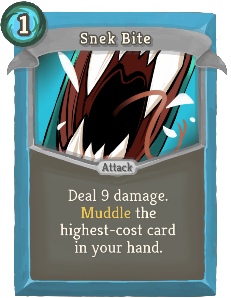 |  | Basic | Attack | 1 | Deal 9(11) damage. sneckomod:Muddle the (1(2)) highest-cost card(s) in your hand. |
| Strike | 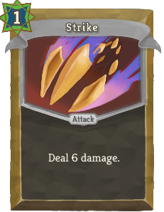 |  | Basic | Attack | 1 | Deal 6(9) damage. |
| Tail Whip |  |  | Basic | Attack | 2 | Deal 10(13) damage. Apply 0(1) - 2 Weak. Apply 0(1) - 2 Vulnerable. |
| ??? |  |  | Common | Skill |  | *Unknown (Upgraded) Character Card. |
| ??? |  |  | Common | Skill |  | *Unknown (Upgraded) Character Card. |
| ??? |  |  | Common | Skill |  | *Unknown (Upgraded) Character Card. |
| ??? |  |  | Common | Attack |  | *Unknown (Upgraded) Common Attack Card. |
| ??? |  |  | Common | Skill |  | *Unknown (Upgraded) Character Card. |
| ??? |  |  | Common | Skill |  | *Unknown (Upgraded) Character Card. |
| ??? |  |  | Common | Skill |  | *Unknown (Upgraded) Block Card. |
| ??? |  |  | Common | Skill |  | *Unknown (Upgraded) Character Card. |
| ??? |  |  | Common | Skill |  | *Unknown (Upgraded) Character Card. |
| ??? |  |  | Common | Skill |  | *Unknown (Upgraded) Character Card. |
| ??? |  |  | Common | Skill |  | *Unknown (Upgraded) Common Skill Card. |
| ??? |  |  | Common | Skill |  | *Unknown (Upgraded) 1 Cost Card. |
| ??? |  |  | Common | Skill |  | *Unknown (Upgraded) Draw Card. |
| ??? |  |  | Common | Skill |  | *Unknown (Upgraded) Character Card. |
| ??? |  |  | Common | Skill |  | *Unknown (Upgraded) Character Card. |
| Dice Block |  |  | Common | Skill | 1 | Gain 1 - 10(14) Block. Maximum Block is increased by 1 for each *Unknown card you started combat with. |
| Dice Crush | 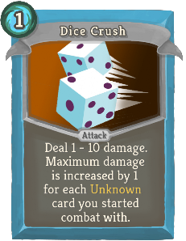 |  | Common | Attack | 1 | Deal 1 - 10(14) damage. Maximum damage is increased by 1 for each *Unknown card you started combat with. |
| Iron Fang | 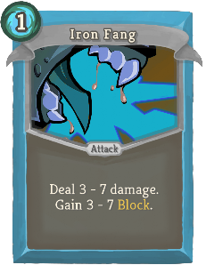 | 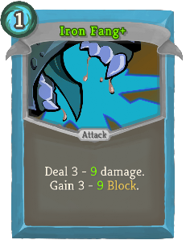 | Common | Attack | 1 | Deal !qqq! - 7(9) damage. Gain 3 - 7(9) Block. |
| Nope | 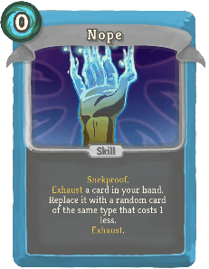 | 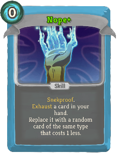 | Common | Skill | 0 | sneckomod:Snekproof. Exhaust a card in your hand. Replace it with a random card of the same type that costs 1 less. Exhaust. (not Exhaust.) |
| Quick Move | 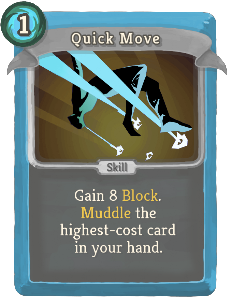 |  | Common | Skill | 1 | Gain 8(10) Block. sneckomod:Muddle the (1(2)) highest-cost card(s) in your hand. |
| Rain of Dice | 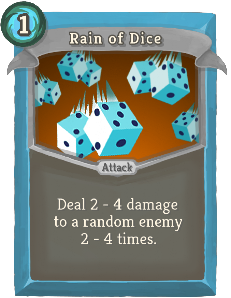 | 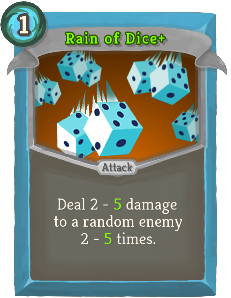 | Common | Attack | 1 | Deal !qqq! - 4(5) damage to a random enemy 2 - 4(5) times. |
| Snake Rake |  |  | Common | Attack | 1 | Deal 9(12) damage. Draw 0(1) - 2 cards. sneckomod:Muddle the highest-cost card in your hand. |
| Soul Draw | 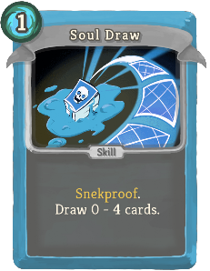 | 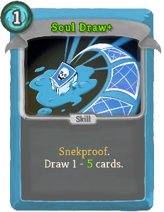 | Common | Skill | 1 | sneckomod:Snekproof. Draw 0 (1) - 4(5) cards. |
| Soul Roll |  | 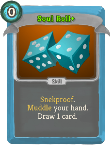 | Common | Skill | 0 | sneckomod:Snekproof. sneckomod:Muddle your hand.  (Draw 1 card.) |
| Wide Sting |  |  | Common | Attack | 2(1) | Deal 7 - 12 damage to ALL enemies. Upgrade all sneckomod:Offclass cards in your hand. |
| ??? |  |  | Uncommon | Skill |  | *Unknown (Upgraded) Weak Card. |
| ??? |  |  | Uncommon | Attack |  | *Unknown (Upgraded) Uncommon Attack Card. |
| ??? |  |  | Uncommon | Skill |  | *Unknown (Upgraded) Uncommon Skill Card. |
| ??? |  |  | Uncommon | Skill |  | *Unknown (Upgraded) Colorless Card. |
| ??? |  |  | Uncommon | Power |  | *Unknown (Upgraded) Uncommon Power Card. |
| ??? |  |  | Uncommon | Skill |  | *Unknown (Upgraded) X Cost Card. |
| ??? |  |  | Uncommon | Skill |  | *Unknown (Upgraded) 2 Cost Card. |
| ??? |  |  | Uncommon | Skill |  | *Unknown (Upgraded) Strength Card. |
| ??? |  |  | Uncommon | Skill |  | *Unknown (Upgraded) 0 Cost Card. |
| ??? |  |  | Uncommon | Attack |  | *Unknown (Upgraded) Strike Card. |
| ??? |  |  | Uncommon | Skill |  | *Unknown (Upgraded) Dexterity Card. |
| ??? |  |  | Uncommon | Skill |  | *Unknown (Upgraded) Vulnerable Card. |
| ??? |  |  | Uncommon | Skill |  | *Unknown (Upgraded) Exhaust Card. |
| Cheap Stock |  | 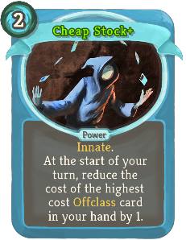 | Uncommon | Power | 2 | (Innate.)  At the start of your turn, reduce the cost of the highest cost sneckomod:Offclass card in your hand by 1. |
| Defensive Flair | 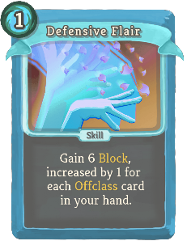 | 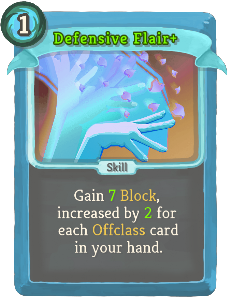 | Uncommon | Skill | 1 | Gain 6(7) Block, increased by 1(2) for each sneckomod:Offclass card in your hand. |
| Dice Boulder | 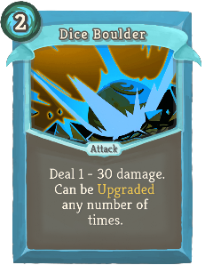 | 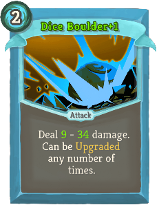 | Uncommon | Attack | 2 | Deal 1(9) - 30(34) damage. Can be Upgraded any number of times. |
| Improvised Attack | 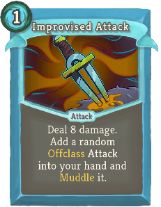 | 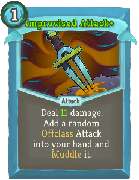 | Uncommon | Attack | 1 | Deal 8(11) damage. Add a random sneckomod:Offclass Attack into your hand and sneckomod:Muddle it. |
| Improvised Guard | 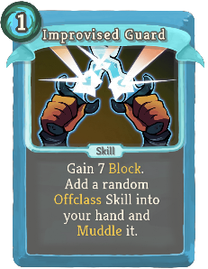 | 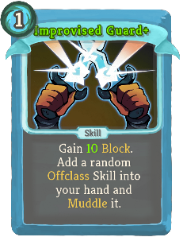 | Uncommon | Skill | 1 | Gain 7(10) Block. Add a random sneckomod:Offclass Skill into your hand and sneckomod:Muddle it. |
| Master Eye |  | 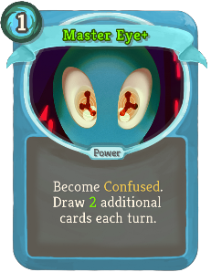 | Uncommon | Power | 1 | Become Confused. Draw 1(2) additional card(s) each turn. |
| Memorize |  | 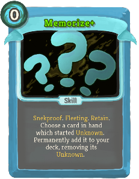 | Uncommon | Skill | 0 | sneckomod:Snekproof. Fleeting. (Retain.) Choose a card in hand which started *Unknown. Permanently add it to your deck, removing its *Unknown. |
| Mix It Up! |  | 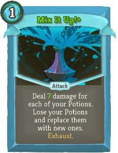 | Uncommon | Attack | 1 | Deal 5(7) damage for each of your Potions. Lose your Potions and replace them with new ones. Exhaust. |
| Rotation | 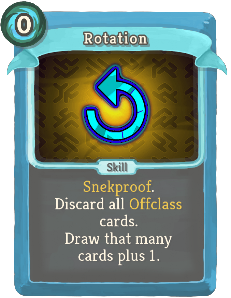 | 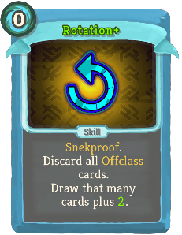 | Uncommon | Skill | 0 | sneckomod:Snekproof. Discard all sneckomod:Offclass cards. Draw that many cards plus 1(2). |
| Serpent Idol | 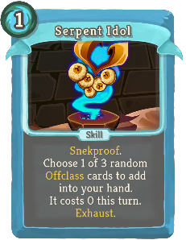 | 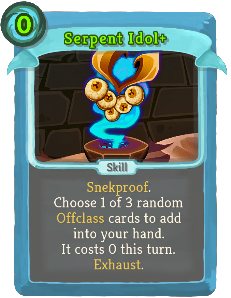 | Uncommon | Skill | 1(0) | sneckomod:Snekproof. Choose 1 of 3 random sneckomod:Offclass cards to add into your hand. It costs 0 this turn. Exhaust. |
| Shift | 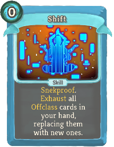 | 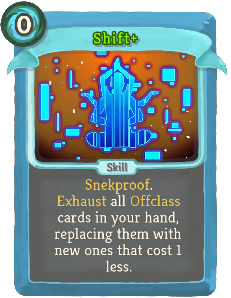 | Uncommon | Skill | 0 | sneckomod:Snekproof. Exhaust all sneckomod:Offclass cards in your hand, replacing them with new ones (that cost 1 less). |
| Slither Strike |  | 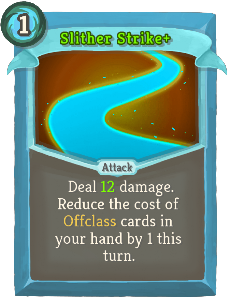 | Uncommon | Attack | 1 | Deal 9(12) damage. Reduce the cost of sneckomod:Offclass cards in your hand by 1 this turn. |
| Snake Sap |  |  | Uncommon | Attack | 1 | sneckomod:Snekproof. Deal !qqq! - 3(4) damage. Gain 1 - 3(4) [E] . Exhaust. |
| Snek Beam | 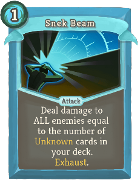 |  | Uncommon | Attack | 1 | Deal damage to ALL enemies equal to the number of Unknown cards in your deck. Exhaust. (not Exhaust.) |
| Soul Cleanse | 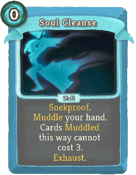 | 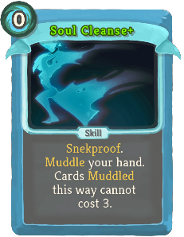 | Uncommon | Skill | 0 | sneckomod:Snekproof. sneckomod:Muddle your hand. Cards sneckomod:Muddled this way cannot cost 3. Exhaust. (not Exhaust.) |
| Trash to Treasure | 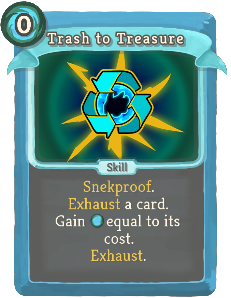 | 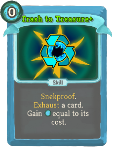 | Uncommon | Skill | 0 | sneckomod:Snekproof. Exhaust a card. Gain [E] equal to its cost. Exhaust. (not Exhaust.) |
| Unending Supply | 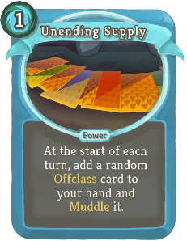 | 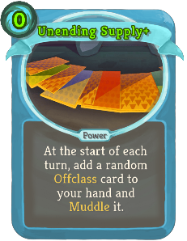 | Uncommon | Power | 1(0) | At the start of each turn, add a random sneckomod:Offclass card to your hand and sneckomod:Muddle it. |
| ??? |  |  | Rare | Attack |  | *Unknown (Upgraded) Rare Attack Card. |
| ??? |  |  | Rare | Skill |  | *Unknown (Upgraded) 3 Cost Card. |
| ??? |  |  | Rare | Skill |  | *Unknown (Upgraded) Boss card. |
| ??? |  |  | Rare | Skill |  | *Unknown (Upgraded) Rare Skill Card. |
| ??? |  |  | Rare | Power |  | *Unknown (Upgraded) Rare Power Card. |
| Cheat | 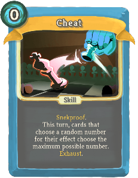 | 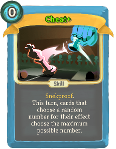 | Rare | Skill | 0 | sneckomod:Snekproof. This turn, cards that choose a random number for their effect choose the maximum possible number. Exhaust. (not Exhaust.) |
| Danger Noodle | 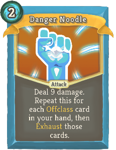 | 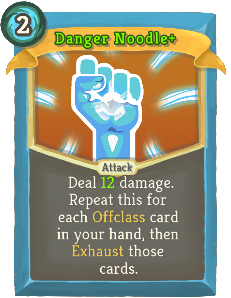 | Rare | Attack | 2 | Deal 9(12) damage. Repeat this for each sneckomod:Offclass card in your hand, then Exhaust those cards. |
| Exotic Form | 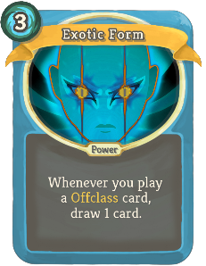 | 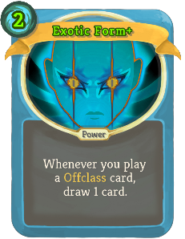 | Rare | Power | 3(2) | Whenever you play a sneckomod:Offclass card, draw 1 card. |
| Glittering Gambit |  |  | Rare | Skill | 0 | sneckomod:Snekproof. Gain -10(0) - 30 *Gold. Exhaust. |
| More Power! | 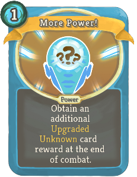 | 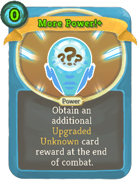 | Rare | Power | 1(0) | Obtain an additional Upgraded *Unknown card reward at the end of combat. |
| Mud Shield | 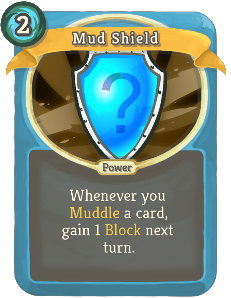 | 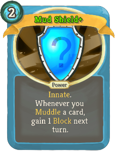 | Rare | Power | 2 | (Innate.)  Whenever you sneckomod:Muddle a card, gain 1 Block next turn. |
| Restock | 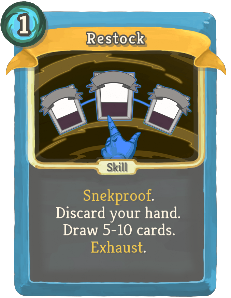 |  | Rare | Skill | 1(0) | sneckomod:Snekproof. Discard your hand. Draw 5-10 cards. Exhaust. |
| Soul Exchange |  |  | Rare | Skill | 0 | sneckomod:Snekproof. Draw 1 (2) card(s), then Exhaust 1 card. Exhaust your hand, replacing them with random cards of the Exhausted card's class. |
| Transmogrify |  |  | Rare | Skill | 1(0) | Lose a random Relic. Choose to gain it back, or obtain a random Relic at the same rarity at the end of combat. Exhaust. |
| Unlimited Rolls |  |  | Rare | Power | 1 | (Innate.)  At the start of your turn, add a *Soul *Roll to your hand. It gains Ethereal and Exhaust. |
