| Name | Image | Upgraded image | Rarity | Type | Cost | Description |
| ---- | ----- | -------------- | ------ | ---- | ---- | ----------- |
| Defend | 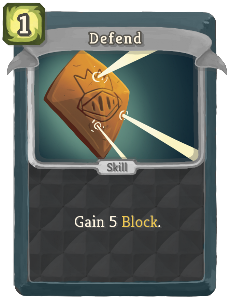 |  | Basic | Skill | 1 | Gain 5 (8) Block. |
| Execute | 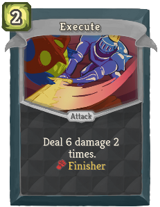 |  | Basic | Attack | 2 | Deal 6 (8) damage 2 times. champ:Fatigue 10. [fist_icon]   champ:Finisher |
| Strike | 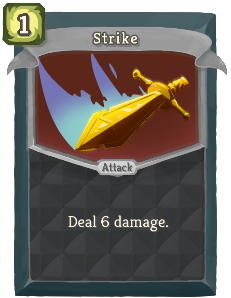 |  | Basic | Attack | 1 | Deal 6 (9) damage. |
| Taunt |  |  | Basic | Skill | 1 | [crown_icon] champ:Technique Apply 1 Weak to ALL enemies. Enter (Choose) a random (not random)Stance (to Enter). |
| Adrenal Armor |  | 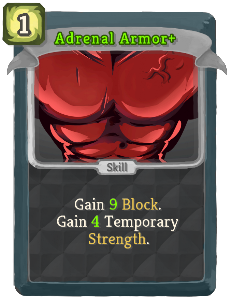 | Common | Skill | 1 | [crown_icon]   champ:Technique Gain 5 (7) Block. Berserker champ:Combo: Play this twice. |
| Backstep |  |  | Common | Skill | 1 (0) | Enter champ:Defensive. Gain 6 Block. Berserker champ:Combo: Gain Block equal to your champ:Fatigue. |
| Berserker's Shout |  | 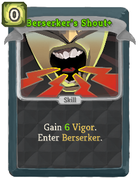 | Common | Skill | 1 | [crown_icon] champ:Technique Enter champ:Berserker. champ:Fatigue 5.  (Draw a card.) |
| Bring It On |  | 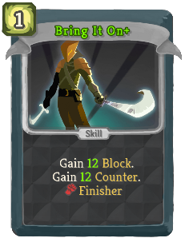 | Common | Skill | 1 | Requires Defensive or Berserker. Gain 10 (13) Block. Gain 10 (13) champ:Counter. [fist_icon]   champ:Finisher |
| Chain Lash |  | 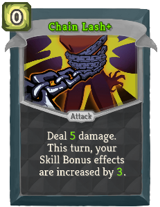 | Common | Skill | 1 | [crown_icon]   champ:Technique Repeat this effect 2 (3) times. |
| Circumvent | 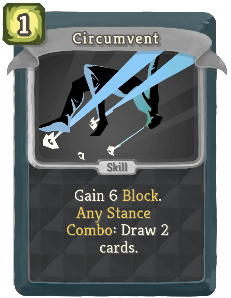 |  | Common | Skill | 1 | Gain (!M! champ:Counter. Gain) 6 Block. Defensive champ:Combo: Gain Block equal to your champ:Counter. |
| Crownarang |  | 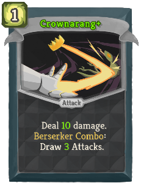 | Common | Attack | 1 | Deal 7 (10) damage. If this doesn't cost 0, return it to your hand next turn. It costs 0 until played. |
| Defensive Shout | 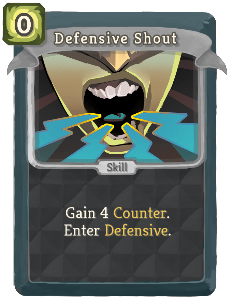 |  | Common | Skill | 1 | [crown_icon] champ:Technique Enter champ:Defensive. Gain 5 champ:Counter.  (Draw a card.) |
| En Garde |  |  | Common | Skill | 1 | [crown_icon]   champ:Technique Gain 8 (11) Block. If your Block is broken this turn, gain 8 (11) Block next turn. |
| Fan of Knives | 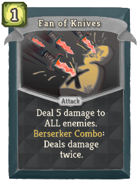 |  | Common | Attack | 1 | Deal 5 damage to ALL enemies. Berserker champ:Combo: Deals damage twice (three times). Enter champ:Berserker. |
| Flash Strike |  |  | Common | Attack | 1 | Deal 6 (8) damage. Defensive champ:Combo: Gain 6 (8) champ:Counter and 6 (8) Block. Enter champ:Defensive. |
| Flurry of Strikes |  |  | Common | Attack | 1 | Deal 4 damage (. Deal 4 damage) for each card containing "Strike" in your hand. [fist_icon] champ:Finisher |
| Gut Punch |  |  | Common | Attack | 1 | Enter champ:Berserker. Deal 5 (8) damage. Defensive champ:Combo: Gain [E] and 5 (8) Block. |
| Perfected Strike |  |  | Common | Attack | 2 | Deal 14 damage. Deals 2 (3) additional damage for ALL your cards containing "Strike". [fist_icon]   champ:Finisher |
| Piledriver | 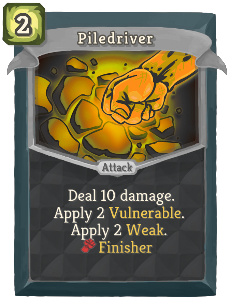 |  | Common | Attack | 2 | Deal 14 (18) damage. Berserker champ:Combo: Apply 2 Vulnerable. Defensive champ:Combo: Apply 2 Weak. |
| Precise Thrust |  |  | Common | Attack | 1 | Deal 7 (9) damage. Berserker champ:Combo: Deal 7 (9) damage. Defensive champ:Combo: Gain 7 (9) Block. |
| Shatter |  |  | Common | Attack | 1 | Deal 8 (10) damage. Berserker champ:Combo: Remove the enemy's Block (and Artifact) before dealing damage. |
| Stance Dance |  |  | Common | Skill | 0 | Choose a Stance to Enter. If you were already in that Stance, add (Add) a champ:Combo of that Stance into your hand. |
| Tornado Punch |  |  | Common | Attack | 2 | Deal 10 (12) damage to ALL enemies. Defensive champ:Combo: Gain 5 (7) champ:Counter and 5 (7) Block for each enemy hit. |
| Arena Preparation | 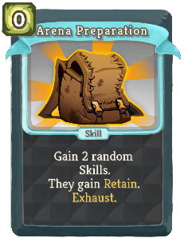 |  | Uncommon | Skill | 0 | [crown_icon]   champ:Technique Add 2 (3) random champ:Techniques into your hand. They gain Retain. Exhaust. |
| Battle Plan |  | 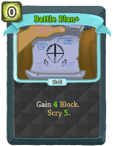 | Uncommon | Skill | 0 | [crown_icon] champ:Technique Draw a card.  (Gain !B! Block.) |
| Berserker Style | 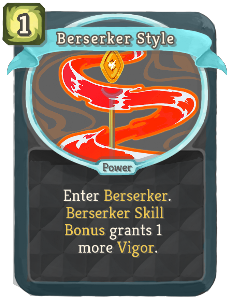 |  | Uncommon | Power | 1 | (Innate.)  Enter champ:Berserker. champ:Berserker champ:Techniques grant 2 more champ:Fatigue. |
| Crooked Strike | 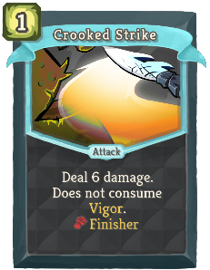 |  | Uncommon | Attack | 1 | Deal 9 (12) damage. Hits three times if Fatigue is 20 or higher. [fist_icon]   champ:Finisher |
| Death Blow | 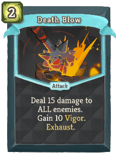 |  | Uncommon | Attack | 2 | Deal 10 damage to ALL enemies. champ:Fatigue 10 (15). [fist_icon]   champ:Finisher |
| Defensive Style | 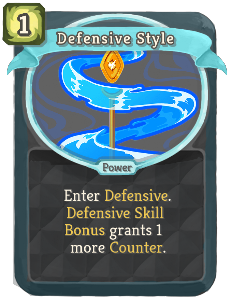 |  | Uncommon | Power | 1 | (Innate.)  Enter champ:Defensive. champ:Defensive Techniques grant 2 more champ:Counter. |
| Duel |  |  | Uncommon | Attack | 2 | [crown_icon]   champ:Technique Gain 7 (10) Block. Deal 7 (10) damage. If there's only one enemy, play this twice. |
| Encircle |  | 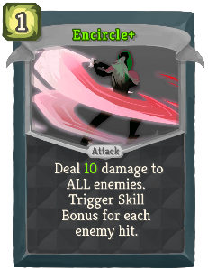 | Uncommon | Attack | 1 | Deal 3 (5) damage to a random enemy 2 times. Berserker champ:Combo: Play this twice.  |
| Endless Rage |  |  | Uncommon | Power | 2 (1) | Whenever you lose HP on your turn, gain 1 temporary Strength. |
| Endure | 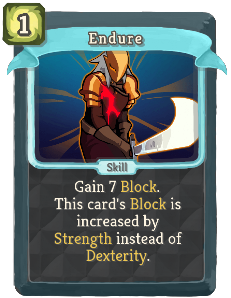 |  | Uncommon | Skill | 1 | [crown_icon] champ:Technique Gain 7 (10) Block. This card's Block is increased by Strength instead of Dexterity (not instead of Dexterity). |
| Enraged Bash |  | 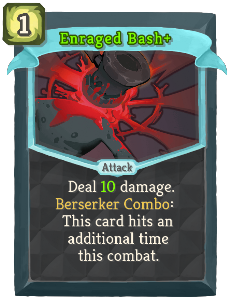 | Uncommon | Attack | 1 | Deal 5 damage (!M! times). champ:Fatigue 5. Berserker champ:Combo: This card hits an additional time this combat. |
| Face Slap |  | 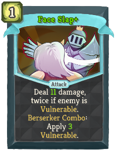 | Uncommon | Attack | 1 | Enter champ:Berserker. Deal 9 (11) damage, twice if enemy is Vulnerable. Berserker champ:Combo: Apply 2 (3) Vulnerable. |
| False Counter |  |  | Uncommon | Skill | 1 | Requires champ:Defensive. (Gain !M! champ:Counter.)  The next time champ:Counter activates, lose only half. [fist_icon] champ:Finisher |
| Fancy Footwork |  |  | Uncommon | Skill | 0 | Requires Defensive or Berserker. Enter the Stance you aren't in. Draw 1 (2) card(s). |
| Finish Him |  |  | Uncommon | Attack | 1 (0) | Requires champ:Berserker. Deal damage equal to your champ:Fatigue. [fist_icon]   champ:Finisher |
| Focus: Berserker |  |  | Uncommon | Skill | 0 | [crown_icon]   champ:Technique Enter champ:Berserker. If you end this turn with at least 20 champ:Fatigue, deal 10 (15) damage to ALL enemies. |
| Focus: Defensive |  |  | Uncommon | Skill | 0 | [crown_icon]   champ:Technique Enter champ:Defensive. If you end this turn with at least 20 champ:Counter, gain 10 (15) Block. |
| Good Clean Fight |  |  | Uncommon | Power | 1 | If you start your turn in no Stance, gain 2 (3) temporary Strength and Dexterity. |
| Iron Fortress | 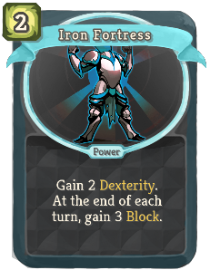 |  | Uncommon | Power | 1 | Whenever you enter a Stance, gain 2 (3) Block and 2 (3) champ:Counter. |
| Lariat |  |  | Uncommon | Skill | X | [crown_icon] champ:Technique Perform X times: (times, then gain [E] :) Gain 5 Block. Trigger champ:Technique. |
| Moment of Truth |  |  | Uncommon | Skill | 0 | Retain. (Draw 1 card.)  [fist_icon] champ:Finisher |
| Parry |  |  | Uncommon | Skill | 2 | Gain 10 (16) Counter. If your Counter is used this turn, add Riposte to your hand. |
| Preemptive Strike |  | 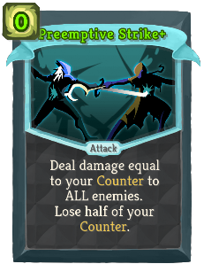 | Uncommon | Attack | 1 (0) | Requires Defensive. Deal damage equal to your champ:Counter to ALL enemies. Lose half of your champ:Counter. |
| Rapid Strikes | 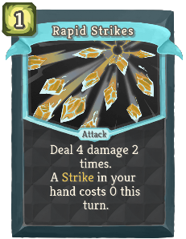 |  | Uncommon | Attack | 1 | Deal 3 damage 2 (3) times. Deal 3 damage an additional time for each champ:Technique Bonus triggered this turn. |
| Reckless Leap |  |  | Uncommon | Attack | 2 | Requires champ:Berserker. Deal 18 (20) damage. champ:Fatigue 15 (20). |
| Refreshment |  |  | Uncommon | Skill | 1 | *Berserker champ:Combo: Gain [E] [E] ([E]), then Exhaust this. Defensive champ:Combo: Draw 3 (4) cards. |
| Rising Strike | 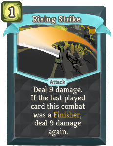 |  | Uncommon | Attack | 1 | [crown_icon]   champ:Technique Deal 7 (10) damage. Play this twice if the last played card was a champ:Technique. |
| Set A Trap |  |  | Uncommon | Skill | 1 | (Gain 6 champ:Counter.)  Defensive champ:Combo: Gain 6 champ:Counter for each Attack in your hand. Enter champ:Defensive. |
| Shield Wall |  |  | Uncommon | Power | 2 | Gain 2 Dexterity. At the end of each turn, gain 6 (9) champ:Counter. |
| Sigil of Victory | 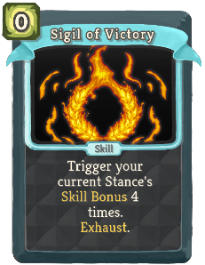 |  | Uncommon | Skill | 0 | [crown_icon]   champ:Technique Repeat this effect 2 (4) times. Exhaust. |
| Skillful Dodge |  |  | Uncommon | Skill | 1 | Gain 4 Block. Gain 4 champ:Counter. Defensive champ:Combo: Increase this card's Block and champ:Counter by 2 (4) this combat. |
| Vicious Mockery |  |  | Uncommon | Skill | 0 | *Berserker champ:Combo: Gain 3 (5) temporary Strength. Defensive champ:Combo: Gain 3 (5) temporary  Dexterity. |
| Cheap Shot |  |  | Rare | Attack | 2 (1) | Deal 5 damage. If the enemy is a Boss, deal damage two more times. If not, stun it. Exhaust. |
| Clobber |  | 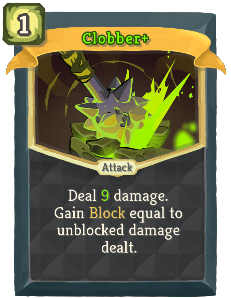 | Rare | Attack | 1 | Deal 10 (13) damage. Berserker champ:Combo: Gain [E] . Defensive champ:Combo: Gain Block equal to unblocked damage dealt. |
| Dancing Master |  |  | Rare | Power | 1 | The third time you enter a Stance each turn, gain [E] ([E]) and draw 2 cards. |
| Devastate |  |  | Rare | Attack | 5 | Deal 24 (32) damage. Costs 1 less [E] for each Finisher played this combat. [fist_icon]   champ:Finisher |
| Enchant Crown |  |  | Rare | Skill | 1 (0) | Choose a card in hand. It costs 0 this combat. Exhaust. |
| Enchant Shield |  |  | Rare | Skill | 1 (0) | Choose a card in hand. Increase its Block by 5 for this combat. Exhaust. |
| Enchant Sword | 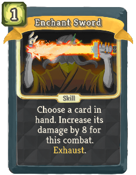 |  | Rare | Skill | 1 (0) | Choose a card in hand. Increase its damage by 5 for this combat. Exhaust. |
| Gladiator Form |  |  | Rare | Power | 3 (2) | Whenever you use a champ:Technique Bonus, draw a card. Whenever you use a champ:Finisher Bonus, gain [E] next turn. |
| Hold Firm |  | 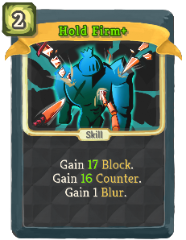 | Rare | Skill | 2 | Gain 15 (20) Block. Gain 10 (15) champ:Counter. Gain 1 bronze:Blur. |
| Ignore Pain |  | 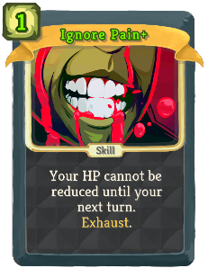 | Rare | Skill | 3 (2) | Your HP cannot be reduced until your next turn. Exhaust. |
| Improvising | 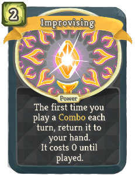 |  | Rare | Power | 2 (1) | The first time you use a champ:Combo each turn, return it to your hand. It costs 0 until played. |
| Last Stand |  |  | Rare | Power | 1 (0) | Can only be played if you're under 50% HP. Remove all debuffs. Gain 6 Strength. [fist_icon]   champ:Finisher |
| Masterful Slash | 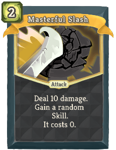 |  | Rare | Attack | 2 | Deal 10 damage. Deals 1 (2) additional damage for ALL your Upgraded cards. |
| Murder Strike |  |  | Rare | Attack | 8 (6) | Retain. Deal 15 (21) damage. When you use a champ:Technique, this card costs 1 less and deals 3 more damage. Exhaust. |
| Shield Throw |  | 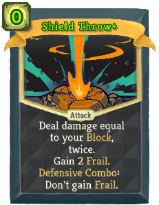 | Rare | Attack | 1 | Gain 9 (13) Block. Deal damage equal to your Block. Unless Defensive champ:Combo: You can't gain Block next turn. |
| Steel Edge | 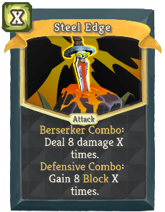 |  | Rare | Attack | X | *Berserker champ:Combo: Deal 9 (12) damage X times. Defensive champ:Combo: Gain 9 (12) Block X times. |
| Strike of Genius | 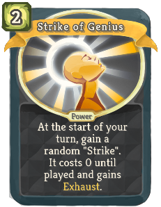 |  | Rare | Power | 2 | At the start of your turn, add a random (Upgraded) card containing "Strike" into (to) your hand. It costs 0 until played and gains Exhaust. |
| Sword Throw |  |  | Rare | Attack | 1 | Deal 8 damage 2 (3) times. Unless Berserker champ:Combo: You can't attack next turn. |
| Triple Strike | 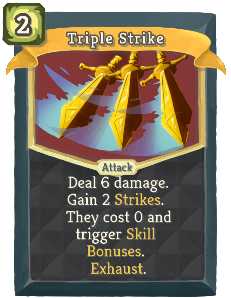 |  | Rare | Attack | 2 | [crown_icon] champ:Technique Deal 6 (9) damage. Add 2 (Upgraded) Strikes into your hand. They cost 0 and have champ:Technique. Exhaust. |
| Ultimate Stance | 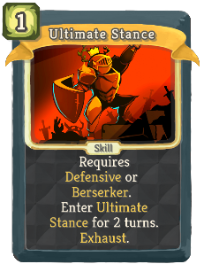 |  | Rare | Skill | 1 | [crown_icon] champ:Technique Requires Defensive or Berserker. Enter champ:Ultimate Stance for 1 (!M!) turn(s). |
