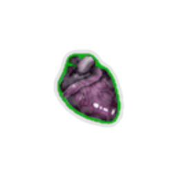
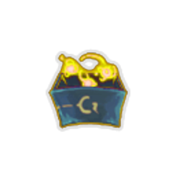

| Image | Name | Rarity | Color | Description | Flavor |
| ----- | ---- | ------ | ----- | ----------- | ------ |
|  | Bronze Core | Starter | The_bronze_automaton | The first time you #yCompile a #yFunction each combat, gain [E] . | Replace once every 50,000 years. |
|  | Bronze Gear | Starter | Guardian | The first time you enter #yguardianmod:Defensive_Mode each combat, gain an additional #b10 #yBlock. NL Guardian starts the run with a random common #yGem. | Protection where you need it most. |
|  | Champion's Crown | Starter | The_champ_gray | At the start of combat, enter #bDefensive or #rBerserker Stance. | A WINNER IS YOU! |
|  | Heart of Goo | Starter | Slimebound | Whenever you #yslimeboundmod:Consume, heal #b2 HP, up to #b8 each combat. | I feel so funky. |
|  | Mob Leader's Staff | Starter | Gremlin | At the start of each combat, gain [E] , draw #b1 card, and #ySwap to the next Gremlin. | Among gremlin mobs, the one with the best horn maintains complete command over the troupe, until another one manages to steal it. |
|  | Old Locket | Starter | Hermit_yellow | At the start of each combat, gain a #yMemento. | There's a faded picture inside. |
|  | Snecko Soul | Starter | Snecko_cyan | First time you play an #ysneckomod:Offclass in a combat, gain [E] and draw a card. | 0...3...2...2...1 |
|  | Spirit Brand | Starter | Hexa_ghost_purple | The first time you #yIgnite a Ghostflame each turn, gain #b4 #yBlock. | A bound protector. |
|  | Arumba's Pocket Sentry | Common |  | At the start of each turn, alternates between: NL Deal #b7 damage to a random enemy. NL Apply #b1 #yWeak to ALL enemies. | Sentry Mode active. Target acquired. No hard feelings. |
|  | Baalor's Lordly Plate | Common | Guardian | Whenever you #yguardianmod:Brace, #yBrace 1 more. | One can never have enough armor. |
|  | Blank Card | Common |  | At the start of each combat, play a copy of a random card from your deck. | Card Mimic. |
|  | Brass Tacks | Common |  | Start each combat with #b2 #yMetallicize. | The luster on these tacks never seems to fade. |
|  | Bronze Idol | Common |  | #yStatus cards may now be played for useful effects. | An ancient, weaponised antivirus - who knows who made it, and why? |
|  | Defensive Thesis | Common | The_champ_gray | Defensive Stance's #yFinisher #yBonus grants #b5 more #yBlock. | Pro tip: Don't get hit. |
|  | Dolphin's Style Guide | Common | The_champ_gray | If you end your turn while in no #yStance, draw #b1 additional card next turn. | Author: Renowned explorer and pugilist Dolphin K. Mist. |
|  | Fragmentation Grenade | Common | Gremlin | Damage dealt to random enemies is increased by #b3. | Nobody dares to ask where the Gremlin got it from. |
|  | Goop Dweller | Common | Slimebound | At the start of combat, #yslimeboundmod:Split into a #yslimeboundmod:Bruiser #ySlime. | He followed me home. Can I keep it? |
|  | Loaded Die | Common | Snecko_cyan | Cards that choose random numbers have +1 minimum. | Cheese-stuffed. |
|  | Pick of Rhapsody | Common | Guardian | You can now #gMine for #b2 #yguardianmod:Gems at Rest Sites (up to #b3 times). | With as many gemstones that litter the Spire, it is hard to imagine anyone so unlucky to have needed this Pick to aid them. |
|  | Protective Goggles | Common | The_bronze_automaton | If you end your turn with no cards in the #ySequence, gain #b4 #yBlock. | Look closely. |
|  | Rod of Bolstering Flame | Common |  | The first time you play a #yPower card each combat, gain #b6 #yBlock and #b1 #yStrength. | Fire shields! Fire strengthens. |
|  | Rye Stalk | Common | Hermit_yellow | #yhermit:Bruise is no longer reduced on hit. | Still in mint condition, despite being chewed on for so long. |
|  | Seal of Approval | Common | Snecko_cyan | Upon pickup, choose #b1 of #b3 #yUnidentified #yCharacter cards to add to your deck. All future #yUnidentified #yCharacter cards found will be of this character. | I'm The Ironclad and this is my favorite Relic in the Spire. -Merchant Advertising Pamphlet |
|  | Silver Bullet | Common | The_bronze_automaton | Start each combat with a #yPiercing #yShot in the #ySequence. | Spirewolves are long gone. |
|  | Sneaky Teakwood Match | Common | Hexa_ghost_purple | At the start of each combat, #yhexamod:Ignite the current Ghostflame and #yhexamod:Advance. | Lights on any surface! |
|  | Supply Scroll | Common |  | At the start of your 3rd turn, gain a #ySupply #yScroll. | A surprisingly detailed inventory of the mob's various bits and bobbles. |
|  | Wizard Hat | Common | Gremlin | Whenever you consume #yWiz, remove a debuff at random. | The accompanying robes have long since been stolen. |
|  | Broken Tooth | Uncommon |  | Whenever you beat an Elite encounter, gain #b1 #yStrength at the start of each combat for the rest of the Act. | Appears too large to have come from a human jaw... |
|  | Cable Spool | Uncommon | The_bronze_automaton | Add a copy of the first card you play with #yEncode each combat to the #ySequence. | Tangled... |
|  | Deca's Washers | Uncommon |  | At the start of each combat, draw #b3 additional cards and add a #yDazed into your draw pile. | It is unclear why Deca collects these. |
|  | Gelatinous Cube | Uncommon |  | Whenever you draw a #yStatus card, draw #b1 card. | Hey, it stuck to your body. |
|  | Impeccable Pecs | Uncommon |  | Whenever you gain #yStrength, gain an equal amount of #yTemporary_HP. NL Start each combat with #b1 #yStrength. | Glorious. |
|  | Jar of TOBSCo | Uncommon | Hexa_ghost_purple | Start each combat with #b1 #yhexamod:Intensity. | A little extra heat makes everything better. |
|  | Jeremiah's Banner | Uncommon | Slimebound | At the start of combat, #yslimeboundmod:Split into a #yslimeboundmod:Leeching #ySlime and gain #b1 Slime slot. | You and ooze army. |
|  | Magic Mallet | Uncommon | Gremlin | Whenever you apply #yWeak, gain #b1 #yWiz, up to #b3 times per turn. | Stubs toes twice as hard. |
|  | Pilot's Codex | Uncommon | Guardian | If you end your turn with no cards in #yguardianmod:Stasis, choose #b1 of #b3 cards to place into #yguardianmod:Stasis. | Designs and diagrams of the Spire's earliest manually-driven prototypes, by Master Pilot David. |
|  | Red Candle | Uncommon |  | Whenever an #yAttack deals unblocked damage, apply #b2 #yhexamod:Soulburn. | Fire BURNS... |
|  | Ring of the Snek | Uncommon | Snecko_cyan | At the start of combat, apply #b0-2 #yWeak and #yVulnerable to ALL enemies. | Illegible, unreadable, due by Thursday. |
|  | Slime Soup | Uncommon |  | When you enter a Rest Site, begin the next combat with a #yPrepare card that costs #b0. | Tastes awful, but incredibly healthy. |
|  | Spectre's Hand | Uncommon | The_champ_gray | Whenever you Enter a Stance, gain a basic #yStrike or #yDefend. It costs #b0 and has #yExhaust. | Some victories stay with you. |
|  | Spyglass | Uncommon | Hermit_yellow | If you end your turn #yhermit:Concentrated, gain an additional [E] next turn . | Property of Kestin Highfin. |
|  | Straight Razor | Uncommon | Hermit_yellow | Whenever you remove a card from your deck, heal #b15 HP. | For a cleaner shave... |
|  | Super Snecko Eye | Uncommon |  | Replaces #ySnecko #yEye. At the start of your turn, draw #b2 additional cards. Start each combat #yConfused. The first time you draw a card that costs #b3 each combat, reduce its cost to #b0. | 0121012 |
|  | Wizard Staff | Uncommon | Gremlin | #yWiz deals #b7 additional damage. | The pride and joy of every Gremlin Wizard, this staff is a frequent target of theft by rival mobs. |
|  | Wound Poker | Uncommon | Gremlin | At the end of each turn, deal #b6 damage to each #yWeakened enemy. | Does it hurt when I do this?. |
|  | Black Powder | Rare | Hermit_yellow | At the end of your turn, deal #b2 damage to ALL enemies for each #yhermit:Dead_On effect triggered. | Handle with care. |
|  | Charred Glove | Rare | Hermit_yellow | Whenever you draw a #rCurse, your next attack deals #b4 more damage. | Parts of the glove still glow with otherworldly cinders. |
|  | Deflecting Bracers | Rare |  | At the start of your turn, gain #ychamp:Counter equal to half the amount of expired #yBlock. | If you thought blocking was good then... |
|  | Dueling Glove | Rare |  | After using a single-target #yAttack, if the target has no #yVulnerable, apply #b1 #yVulnerable. | Count from ten... |
|  | Gemstone Gun | Rare |  | Upon pickup, choose #b3 #yguardianmod:Gems. At the start of each combat, gain a card with #yRetain, #yExhaust, and each chosen #yGem socketed. | Bang! Bang! Bang! Hey, I matched three! |
|  | Gladiators Manual | Rare | The_champ_gray | Whenever you play a #yCombo, a #yFinisher, and enter a #yStance in the same turn, gain #b1 #yStrength and #yDexterity. | Try everything - something will stick. |
|  | Gremlin Bomb | Rare | Gremlin | Whenever a Gremlin dies, deal #b30 damage to ALL enemies. | Gremlins have an uncanny knack for finding dangerous things. Sometimes, they even survive looting them. |
|  | Gremlin Gravestone | Rare | Gremlin | Dead Gremlins can be Resurrected at Rest Sites as a Free Action. | Where do gremlins go when they die? Not bloody far enough. |
|  | Horseshoe | Rare |  | Whenever you gain #yWeak, #yFrail or #yVulnerable, gain #b1 less. | Lucky charm. Somebody is gonna be missing this. |
|  | Mallet | Rare | The_bronze_automaton | At the start of each combat, add #b2 copies of #yFine #yTuning+ to your hand. | That's it! I'm gettin me mallet! |
|  | Prickly Shields | Rare |  | Whenever you gain #yBlock, deal #b2 damage to a random enemy. | Gremlins use whatever scraps they can find as weapons or armor. Some serve as both. |
|  | Red Scarf | Rare | Hermit_yellow | Whenever you apply a debuff to an enemy, gain #b2 #yBlock. | It's warm and fuzzy. |
|  | Sack of Gems | Rare | Guardian | Upon pickup, add #b5 random #yguardianmod:Gems to your deck. | Ooh... shiny! |
|  | Signature Finisher | Rare | The_champ_gray | Upon pickup, choose a #yFinisher. This #yFinisher costs #b0, can be used without a #yStance, and never causes your #yStance to be exited. | And now, it's time for my ULTIMATE MOVE! |
|  | Six-Point Brand | Rare |  | Whenever you play #b6 cards, deal #b6 damage to a random enemy. | Fire, fire, fire, fire, fire, FIRE! |
|  | Slimed Tail | Rare | Slimebound | When you fall below #b50% of your Maximum HP, #yslimeboundmod:Split into a #yslimeboundmod:Guerilla #ySlime, and the next time you take damage, your leading slime is #yslimeboundmod:Absorbed instead. (works once per combat). | A fake tail to trick enemies during combat, completely covered in slime. |
|  | Slimy Skull | Rare | Slimebound | Whenever you apply #yslimeboundmod:Goop, apply an additional #b1 #yslimeboundmod:Goop. | A Snecko skull in absolutely awful condition. Unclean and slimy, dirt and grime stick to it like glue. |
|  | Snake-Charmer's Flute | Rare | Snecko_cyan | #ysneckomod:Muddled cards can't cost #b3. | Sssssss... |
|  | Soul of Chaos | Rare | Hexa_ghost_purple | The fourth Ghostflame becomes a #yMayhem #yGhostflame. NL #yMayhem #yGhostflame activates when you end your turn on it. NL #yIgnition: Play the top card of your draw pile. | Mayhem, made manifest. |
|  | Stone of Nomakk | Rare | Slimebound | At the start of combat, #ySplit into a #yslimeboundmod:Mire #ySlime and gain #b1 #yslimeboundmod:Potency. | When presented to one of your Goop Gang, it seems to make the blob dance. |
|  | Thermal Stone | Rare | Hexa_ghost_purple | If #yhexamod:Soulburn detonates, heal #b4 HP at the end of combat. | A fire would liven this thing up! |
|  | Timepiece | Rare | The_bronze_automaton | All #yFunctions you #yCompile gain #yRetain. | From his collection of identical clocks. |
|  | Unidentified Egg | Rare | Snecko_cyan | #yIdentifying becomes a free action. NL #yUnidentified cards in card rewards are #yUpgraded. | What will hatch? Pay $1000 to see. |
|  | Bandit Contract | Special |  | At the start of the #b3rd boss combat, Red Mask Bandits will assist you. | An agreement from the Bandit trio - partially in exchange for a trinket, but mostly in exchange for their lives. |
|  | Bandit Contract+ | Special |  | At the start of the #b3rd boss combat, Red Mask Bandits will assist you. | An agreement from the Bandit trio - partially in exchange for a trinket, but mostly in exchange for their lives. |
|  | Black Knight's Helm | Special | The_champ_gray | The first time you enter each Stance each combat: NL #bDefensive: Gain #b2 Dexterity and lose #b1 Strength. NL #rBerserker: Gain #b2 Strength and lose #b1 Dexterity. | Only a flesh wound. |
|  | Bottled Code | Special | The_bronze_automaton | Upon pickup, choose a card with #yEncode. Start each combat with this card in the #ySequence. | Actually, I have code for that exact thing... |
|  | Broken Wing Statue | Special |  | The cultists that worship the Awakened One will be interested in this. | A broken hunk of a once-magnificent statue. |
|  | Coat of Many Faces | Special |  | Upon pickup, gain Cultist Headpiece, Face Of Cleric, N'loth's Hungry Face, Gremlin Visage, and Ssserpent Head. | It was Steve, and Bill, and Ian, and Fred, and John... |
|  | Emerald Heart Blessing | Special |  | Start each combat with #b1 #yDexterity. | The heart is everything. |
|  | Extra Cursed Bell | Special |  | Upon pickup, obtain #b2 of a unique #rCurse and #b3 relics. | You think you hear it echoing, but can never confirm it. |
|  | Extra Cursed Key | Special |  | Gain [E] at the start of your turn. NL Whenever you open a non-Boss chest, obtain #b2 #rCurses. | Locked away for good reason. |
|  | Greed Ooze | Special | Slimebound | At the start of combat, spawn #yGreed #yOoze (can be revived if #yAbsorbed). NL At Rest Sites, #yGreed #yOoze will take #b50 of your souls, increasing its damage by #b1. | A friend found in the Spire who devours souls. |
|  | Gremlin Sack | Special |  | Upon pickup, add #b6 cards to your deck from the Match Game. | The Gremlin and his bodyguard were no match for you. |
|  | Inner Strength | Special | The_champ_gray | Start each combat with #b1 #yStrength. | It's about the gigantic sword in your heart. |
|  | Knowing Skull | Special |  | At the start of each combat, you may wish for Souls, Success, or a Pick me Up. | Put me down! |
|  | Mystical Octahedron | Special | Snecko_cyan | Upon pickup, choose a card that selects a random number for its effects. This card always selects its maximum possible number. | It appears weighted toward one side. |
|  | Neow's Blessing | Special |  | Upon pickup, increase your Maximum HP by #b100. NL Increase your Maximum HP by #b100 at the start of each Act. NL Lose all your Potion slots. NL Draw #b1 less card and lose [E] at the start of your turn. | Ease your rage. Be as tough and unyielding as the Spire itself. |
|  | New Challenger | Special |  | Start each combat in a random Champ #yStance. | Can you take the crown? |
|  | Paradox Artifact | Special |  | At the start of each turn, add a random card with #yEncode to your hand and give it #yEthereal. | You've never seen a coding frenzy like this before. |
|  | Quantum Chamber | Special | Guardian | Upon pickup, choose a card. Start each combat with this card removed from your deck. At the start of your #b4th turn, return it and #b2 copies of it to your hand. | You get the chicken by hatching the egg, not by smashing it. |
|  | Ruby Heart Blessing | Special |  | Start each combat with #b1 #yStrength. | The heart is strong. |
|  | Sapphire Heart Blessing | Special |  | Upon pickup, raise your Max HP by #b10. | The heart is pleased. |
|  | Scrap Ooze | Special | Slimebound | At the start of combat, spawn #yScrap #yOoze (can be revived if #yAbsorbed). NL At Rest Sites, you can donate a card to the #yScrap #yOoze, modifying its damage: NL #b+1 damage for #gUncommons NL #b+2 damage for #yRares NL #b-1 damage for Commons NL #b-2 damage for #rCurses |  |
|  | Sharpened Fragment | Special |  | At the start of each turn, gain a #yCrystal #yShiv. | Once a broken statue - now a makeshift weapon. |
|  | Teleport Stone | Special |  | You may skip any number of rooms the next time you move, but cannot move into a Boss Room. | Never leave home without it. |
|  | The Broken Seal | Special | Hexa_ghost_purple | Upon pickup, raise your Max HP by #b10, then heal all of your HP. Start each combat with #b2 #yStrength, #b2 #yDexterity, and #b2 #yhexamod:Intensity. You can not receive #pThe #pBroken #pSeal again. | Unlimited, unrestrained, unquenchable power. |
|  | The Heart's Malice | Special |  | Enemies in your first #b3 combats will flee in terror. | The malice of corruption bestowed by the Heart. |
|  | Wheel of Change | Special |  | At each Rest Site, you may spin the wheel once. Choosing to collect its reward uses up this relic. | No one gets two spins, he says. |
|  | Young Snecko | Special |  | Deals #b5 damage to a random enemy at the start of your turn. | Bewilderingly adorable. |
|  | Black Heart of Goo | Boss | Slimebound | Replaces [#40c840ff]Heart[] [#40c840ff]of[] [#40c840ff]Goo[][#40c840ff].[] NL Whenever you #yslimeboundmod:Consume, heal #b3 HP, up to #b15 each combat. | The Secret of the Ooze. |
|  | Clasped Locket | Boss | Hermit_yellow | Replaces #yOld #yLocket. At the start of each combat, gain [E] for each #rCurse in your deck. Upon pickup, obtain #b2 #rInjuries. | It won't open anymore. |
|  | Dented Plate | Boss | Hermit_yellow | While your HP is at or below #b50%, gain [E] and draw #b1 card at the start of your turn. | Several bullets are still lodged inside. |
|  | Electromagnetic Coil | Boss | The_bronze_automaton | #yFunctions are now made up of #b4 cards. | An inefficient but entertaining power source. |
|  | Gremlin Leader's Voucher | Boss | Gremlin | Gain [E] at the start of your turn. NL Upon pickup, #rpermanently #rlose #ra #rGremlin.Gain [E] at the start of your turn. NL Upon pickup, #rpermanently #rlose #ra #rGremlin. | IOU 1 Gremlin |
|  | Guardian Gear | Boss | Guardian | Replaces #rBronze #rGear. NL Begin each combat in #yguardianmod:Defensive_Mode, which persists for #b3 turns. | Replace every 3,000 floors. |
|  | Idol of Retromation | Boss |  | At the start of your turn, reduce the cost of the most expensive card in your hand by #b1 for this turn. | Often called the Idol of Reto for short. |
|  | Lucky Horseshoe | Boss | Snecko_cyan | Upon pickup, choose #b1 of #b3 #yUnidentified #yCharacter cards. Add #b5 copies of it to your deck. All combats drop an additional card reward of the chosen character's cards. | Make your own luck. |
|  | Makeshift Battery | Boss |  | Gain [E] and add a random #yStatus card into your discard pile at the start of your turn. | It's an 8.9 volt. |
|  | Mark of the Ether | Boss | Hexa_ghost_purple | Replaces [#723e6dff]Spirit[] [#723e6dff]Brand[][#723e6dff].[] NL The first time you #yIgnite a Ghostflame each turn, gain [E] . | Let’s see if we can do... better. |
|  | Mob Leader's Crown | Boss | Gremlin | Replaces #rMob #rLeader's #rStaff. NL The first time you shuffle your draw pile each turn, gain [E] , draw #b1 card, and #ySwap to the next Gremlin. | The fancier the symbol of office, the more likely it is to be stolen. |
|  | Platinum Core | Boss | The_bronze_automaton | Replaces [#d6ca9eff]Bronze[] [#d6ca9eff]Core[][#d6ca9eff].[] NL The first #b3 #yFunctions you create each combat cost #b0 until played. | Changelog: Improved user experience. |
|  | Power Armor | Boss | The_champ_gray | Gain [E] at the start of your turn. NL Your maximum #yVigor and #ychamp:Counter is #b10. | Bought used. |
|  | Short Stature | Boss | Gremlin | The first time a Gremlin would die each combat, heal it to #b75% of your Max HP instead. | It is easy to get away with mischief if you are literally beneath their notice. |
|  | Shotglass | Boss | Hermit_yellow | First #b2 times you use a potion each combat, gain a random potion. You can only use #b2 potions each combat. | Any liquid placed inside changes into something else. |
|  | Super Snecko Soul | Boss | Snecko_cyan | Replaces [#407b93ff]Snecko[] [#407b93ff]Soul[][#407b93ff].[] NL First time you play an #ysneckomod:Offclass in a turn, gain [E] . | 3120231321230320 |
|  | Tarr Blob | Boss | Slimebound | Gain [E] at the start of your turn. At the start of combat, lose #b1 Slime slot. | The bad kind of Slime. |
|  | Tiny Bowler Hat | Boss |  | At the start of combat, add a #yStudy #ythe #ySpire card to your hand. It costs 0. | Whosoever controls the hat, controls the Spire. |
|  | Victorious Crown | Boss | The_champ_gray | Replaces #rChampion's #rCrown. NL Start each combat in #ychamp:Ultimate #yStance, which lasts for #b2 turns. | Conglaturation!! You are the greatest winner. |
|  | Wander Bots | Boss | Guardian | On pickup, lose #b2 Stasis slots. NL Gain [E] at the start of your turn. | These drones find the most wonderful salvage, but require processing power to maintain. |
|  | Xanatos' Icy Charm | Boss | Hexa_ghost_purple | Gain [E] at the start of your turn. #yhexamod:Soulburn takes #b4 turns to activate. | I feel... cold. |
|  | Barbell | Shop |  | Whenever you enter a Rest Site, if you have at least #b10 non-Upgraded cards in your deck, #yUpgrade one at random. | 1000 reps? Psh. I can do 1001. |
|  | Berserker's Guide | Shop | The_champ_gray | At the start of your turn, gain #b3 #yVigor. | The text is illegible. |
|  | Bottled Anomaly | Shop |  | Upon pickup, choose a card. At the start of each combat, remove it from your draw pile. At the start of turn #b3, add it into your hand. It costs #b0. | Swirling and swirling and finally breaking. |
|  | Bottled Black Hole | Shop | Guardian | Upon pickup, choose a card. Start each combat with this card in #yguardianmod:Stasis. | Somewhere, something incredible is waiting to be known. |
|  | Cryo Chamber | Shop | Guardian | Gain #b1 Stasis slot. Whenever a card enters #yguardianmod:Stasis, #yUpgrade it. | Things always seem better coming out than they did going in. |
|  | Donu's Washers | Shop |  | At the start of combat, gain [E] [E] and add #b1 #yVoid into your draw pile. | It is rather clear why Donu collects these. |
|  | Olexa's Shield | Shop | Hexa_ghost_purple | Swap the positions of the #yBolstering #yGhostflame and the first #ySearing #yGhostflame. | Protection on-demand. |
|  | Pet Ghost | Shop | Hermit_yellow | First time you would die each combat, survive with #b1 HP instead. | Poor guy. |
|  | Protective Gear | Shop | Slimebound | Reduce the damage you take from #yslimeboundmod:Tackles by #b3. | The best defense is a good offense. |
|  | Rare Booster Box | Shop | Snecko_cyan | Upon pickup, obtain a #yUnidentified #yRare card of each card type. | Mint condition. |
|  | Recycler | Shop | Hexa_ghost_purple | The first time an non-Status and non-Curse #yEthereal card is #yExhausted each combat, add a copy to your hand that costs #b0 until played. | One day, it shall be recycled too. |
|  | Sleeved Ace | Shop | Snecko_cyan | At the start of each combat, gain a #yPure #yLuck with #yRetain. | We're all aces. |
|  | Stolen Merchandise | Shop | Gremlin | Whenever you #ySwap, gain an #yEcho of a random Colorless card. NL At the start of combat, the Merchant gains #b2 Strength. | "Blasted, thieving Gremlins!". |
|  | Tag Teamwork | Shop | Gremlin | Whenever you draw #yTag #yTeam, draw another card. NL Upon pickup, add two copies of #yTag #yTeam to your deck. | Teamwork makes the dream work. |
