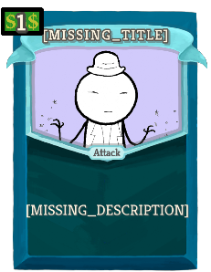
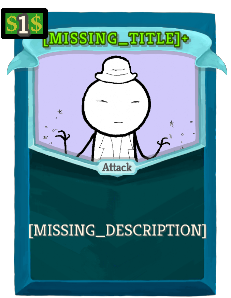

## Cards

| Name | Image | Upgraded image | Rarity | Type | Cost | Description |
| ---- | ----- | -------------- | ------ | ---- | ---- | ----------- |
| Ink Spray |  |  | Basic | Skill | 1(0) | octomod:Choose 2: Apply 1 Weak. Apply 1 Vulnerable. |
| Octo Boost |  |  | Basic | Skill | 1(0) | The next octomod:Choose card you play has 1 additional choice. |
| Strike/Defend |  |  | Basic | Attack | 1 | octomod:Choose 1: Gain 5(8) Block. Deal 6(9) damage. |
| Forethink |  |  | Common | Skill | 1 | octomod:Choose 2: Gain 4(6) Block. Gain 4(6) Block next turn. |
| Punch |  |  | Common | Attack | 1 | octomod:Choose 1: Deal 10(14) damage. |
| Self Interest |  |  | Common | Skill | 1 | octomod:Choose 2: Gain 3(4) Block. Upgrade a random (not random)card in your hand. |
| Strangle |  |  | Common | Skill | 1 | octomod:Choose 1(2): Gain 6(4) Block. Apply !octoMagic! Constricted. |
| Twin Sting |  |  | Common | Attack | 1 | octomod:Choose 1: Deal 8(10) damage and apply 1 Weak. Gain 6(8) Block and apply 1 Vulnerable. |
| Writhing Wrath |  |  | Common | Attack | 1 | octomod:Choose 2: Deal 5 damage. Deal !octoMagic! damage to ALL enemies. |
| Adaptoform |  |  | Uncommon | Power | X | octomod:Choose X+0(1): Gain 1 Strength. Gain 1 Dexterity. |
| Blast Smash |  |  | Uncommon | Attack | 1 | octomod:Choose 2(3): Deal 4 damage. Lose 2 HP and deal !octoMagic! damage. |
| Bulky Move |  |  | Uncommon | Skill | 1 | Exhaust. octomod:Choose 4(5): Apply 2 Constricted. Gain 2 Temporary HP. |
| Deep Thought |  |  | Uncommon | Skill | 2 | octomod:Choose 2(3): Gain [E] . Draw 1 card. Next turn, gain [E] . Next turn, draw 1 additional card. |
| Influx |  |  | Uncommon | Skill | 1 | The next octomod:Choose card you play has 2 additional choices. Exhaust. (Exhaustive !stslib:ex!) |
| Lash |  |  | Uncommon | Attack | 2 | octomod:Choose 3(4): Gain 5 Block. Deal 5 damage. |
| Octo Slam |  |  | Uncommon | Attack | 3 | octomod:Choose 2(3): Deal !octoMagic! damage. Deal 5 damage and gain [E] . |
| Tangle |  |  | Uncommon | Attack | 2 | octomod:Choose 2: Deal 10(12) damage. Apply !octoMagic! Constricted. |
| [MISSING_TITLE] |  |  | Uncommon | Attack | 1 | [MISSING_DESCRIPTION] |
| Ensnare |  |  | Rare | Skill | 3(2) | Exhaust. octomod:Choose 1: Double the enemy's Constricted. |
| Expansion |  |  | Rare | Attack | 2(1) | Ethereal. Exhaust. octomod:Choose 1: Gain 12 Block and deal 12 damage. Heal 5 HP. Gain 10 Gold. Obtain a random potion. |
| Extra Arm |  |  | Rare | Power | 1(2) | octomod:Choose 1(2): At the start of your turn, draw 1 additional card. The first octomod:Choose card you play each turn has 1 additional choice. |
| Indecisiveness |  |  | Rare | Skill | 1(0) | Next time you octomod:Choose this turn, trigger the effects of ALL options. Exhaust. |
| Kraken Form |  |  | Rare | Power | 3(0) | All octomod:Choose cards have 1 additional choice. |

## Potions

| Image | Name | Rarity | Description |
| ----- | ---- | ------ | ----------- |

## Relics

| Image | Name | Rarity | Color | Description | Flavor |
| ----- | ---- | ------ | ----- | ----------- | ------ |
|  | Ink Bottle | Starter | Octo_gray_color | The first #yoctomod:Choose card you play each combat has #b1 additional choice. | bloorp bloorp |
|  | Inkjector | Boss | Octo_gray_color | The first #yoctomod:Choose card you play each turn has #b1 additional choice. | bloorp. bloorp bloorp. |

| Image | Name |
| ----- | ---- |
|  | the Octopus |

