| Name | Image | Upgraded image | Rarity | Type | Cost | Description |
| ---- | ----- | -------------- | ------ | ---- | ---- | ----------- |
| Mural |  |  | Curse | Curse |  | Unplayable. If this card enters the discard pile, Exhaust it. Retain. |
| Defend |  |  | Basic | Skill | 1 | Gain 5(8) Block. |
| Diplomacy |  |  | Basic | Attack | 1 | Pulchritude 8. Gain 7(9) Block. Deal 7(9) damage. Exhaust a card in your hand. |
| Strike |  |  | Basic | Attack | 1 | Deal 6(9) damage. |
| Take Inventory |  |  | Basic | Skill | 0 | Draw 1(2) card(s). Retain your hand this turn. |
| Jigsaw |  |  | Special | Attack | 0 | Deal 10(15) damage. Put a copy of this card on top of your draw pile. Exhaust. |
| Key/Handgun |  |  | Special | Attack | 1 | If the enemy intends to attack, gain 8(11) Block. Otherwise, deal 8(11) damage. |
| Belly O' The Whale |  |  | Common | Attack | 1 | Vim 10. Deal 8(11) damage. Exhaust a card in your discard pile. |
| Bowen Stilson Dogg | 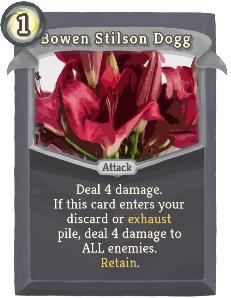 | 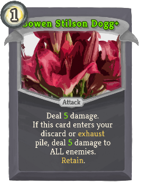 | Common | Attack | 1 | Deal 4(5) damage. If this card enters your discard or exhaust pile, deal 4(5) damage to ALL enemies. Retain. |
| Candy Corn |  |  | Common | Skill |  | Unplayable. At the end of your turn, gain 3(5) Block. |
| Charisma Blast |  |  | Common | Attack | 1 | Pulchritude 11. Deal 11(14) damage. Put the top card of your draw pile into your discard pile. |
| Disconcerting Ogle |  |  | Common | Attack | 1 | Imagination 5. Deal 6 damage. Shift the enemy's intent ahead 1 turn. (Retain.)  Exhaust. |
| Flask of Whiskey |  |  | Common | Skill | 1(0) | Imagination 5. Gain 1 Imagination. Give a card in your hand Retain for the rest of combat. Purge. |
| Flesh Mural |  |  | Common | Skill | 1 | Vim 5. Gain 5(8) Temporary HP. Shuffle a Mural into your draw pile. |
| Fortify |  |  | Common | Skill | 1 | Gain 3(4) Temporary Imagination. Gain 5(7) Block. Put a card from your hand on top of your draw pile. |
| Pepperminthryl |  |  | Common | Skill | 1 | Imagination 11. Gain 12(15) Block. Lose 1 Imagination. |
| Shuffle Strike | 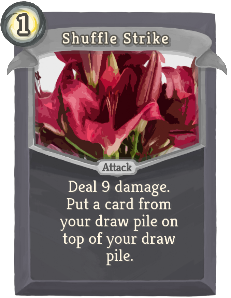 | 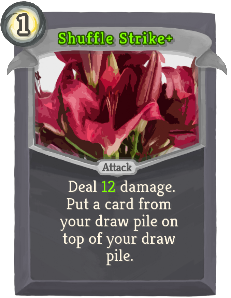 | Common | Attack | 1 | Deal 9(12) damage. Put a card from your draw pile on top of your draw pile. |
| Silly Spray |  |  | Common | Attack | 1 | Imagination 3. Deal 7(9) damage to ALL enemies. Gain 1(2) Temporary Imagination. |
| Think Ahead |  |  | Common | Skill | 1(0) | Imagination 5. Play the top card of your draw pile. You don't need to meet the requirement of an Imagination card. |
| Truffle Shuffle |  |  | Common | Attack | 1 | Deal 8(11) damage. Gain 2 Auto-Parry. Purge. |
| Unscale |  |  | Common | Skill | 0 | Pulchritude 5. You and ALL enemies lose 4 Strength this turn.  (Retain.) |
| Victory Pose |  |  | Common | Skill | 1 | Gain 8(11) Block. Gain 2(4) more if an enemy has been slain this combat. |
| Zoolander Bust |  |  | Common | Skill | 1 | If this card enters your discard or exhaust pile, gain 5(8) Block. Retain. |
| Aggrieve | 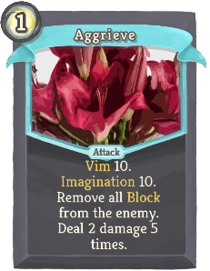 | 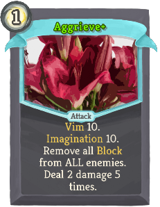 | Uncommon | Attack | 1 | Vim 10. Imagination 10. Remove all Block from the enemy (ALL enemies). Deal 2 damage 5 times. |
| Bite Hardly |  |  | Uncommon | Attack | 2 | Vim 10. Deal 8(10) damage. Gain Temporary HP equal to unblocked damage dealt. |
| Club Club Club |  |  | Uncommon | Attack | 1 | Deal 4(5) damage to ALL enemies 3 times. Discard 1 card. Lose 1 of your highest stat. |
| Conjure |  |  | Uncommon | Skill | 1(0) | Imagination 6. Add any Pulchritude or Vim card to your hand. It gains Purge. Purge. |
| Cruet of Brandy |  |  | Uncommon | Skill | 1(0) | Imagination 5. Discard your hand. Gain 1 Temporary Imagination for each card discarded. Put a card from your discard pile into your hand. |
| Dashy Dodge | 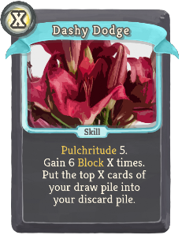 |  | Uncommon | Skill | X | Pulchritude 5. Gain 6 Block X (X+1) times. Put the top X (X+1) cards of your draw pile into your discard pile. |
| Diamond Armor |  |  | Uncommon | Skill | 1 | Gain 13(16) Block. Lose 1 of your highest stat. |
| Disregard Rules |  |  | Uncommon | Power | 1 | Whenever you draw a Curse card, draw 1(2) card(s). |
| Distill |  |  | Uncommon | Skill | 1(0) | Vim 5. Lose 3 HP. Obtain a random potion. Purge. |
| Double Dip |  |  | Uncommon | Skill | 2(1) | Imagination 9. Play the top card of your draw pile twice. Purge it. |
| Drop Off |  |  | Uncommon | Skill | 1 | Vim 5. Discard your hand. Gain 2 Temporary HP for each card discarded. Exhaust. (not Exhaust.) |
| Duplicate |  |  | Uncommon | Skill | 1(0) | Imagination 6. The next Pulchritude or Vim card you play adds a copy of itself to your hand. Purge. |
| Embarrass |  |  | Uncommon | Skill | 1 | Vim 5. Apply 2(3) Weak. Apply 2(3) Vulnerable. Put a Mural on top of your draw pile. |
| Fair Shake |  |  | Uncommon | Attack | 2 | Pulchritude 14. Gain 10(12) Block. Deal 10(12) damage to ALL enemies. Exhaust a random (not random)card in your hand. |
| Force Deck |  |  | Uncommon | Power | 1(0) | Imagination 9. At the start of your turn, draw 1 card and put 1 card from your hand on top of your draw pile. |
| Fudge Deck |  |  | Uncommon | Power | 1(0) | Pulchritude 9. At the start of your turn, draw 1 card and discard 1 card. |
| Hard Candy |  |  | Uncommon | Skill | 1 | Imagination 9. Gain 5(8) Block. Return an Imagination card from your discard pile to your hand. Ethereal. |
| Heart Stab |  |  | Uncommon | Attack | 1 | Deal 8(10) damage. Apply 2(3) Weak. Apply 2(3) Vulnerable. Lose 1 of your highest stat. |
| Keyring/Tommygun |  |  | Uncommon | Attack | 1 | Gain 12(15) Block / Deal 4(5) damage 3 times. Switches form at the start of your turn. |
| Lollipop Whop |  |  | Uncommon | Attack | 1(0) | Imagination 11. Deal 14 damage. Lose 1 Imagination. |
| Opportunity Cost |  |  | Uncommon | Skill | 1 | Permanently upgrade a card in your hand. Lose 1 of each stat. (not Lose 1 of each stat.) Remove this card from your deck. Purge. |
| Parry |  |  | Uncommon | Skill | 1 | Vim 5. Gain 1(2) Artifact. Gain 1 Auto-Parry. Purge. |
| Reprogram |  |  | Uncommon | Skill | 0 | Look at the top 4(6) cards of your draw pile. You may discard any of them. |
| Retain Return |  |  | Uncommon | Skill | 1(0) | Pulchritude 9. Return all cards with Retain from your discard pile to your hand. At the end of your turn, discard all cards with Retain. |
| Retrieve Arms |  |  | Uncommon | Skill | 1 | Add a (an upgraded) Key/Handgun into your hand. Put a (an upgraded) Key/Handgun on top of your draw pile. Exhaust. |
| Snoop Dogg Bust |  |  | Uncommon | Skill | 1 | If this card enters your discard or exhaust pile, apply 1(2) Weak and 1(2) Vulnerable ALL enemies. Retain. |
| Spade Dig |  |  | Uncommon | Skill | 1(0) | Put 1 card from your draw pile into your hand. Put a card from your discard pile on top of your draw pile. Lose 1 of your highest stat. |
| Torso Flail |  |  | Uncommon | Skill | 1(0) | Vim 9. Play a card in your discard pile. Purge it. |
| Treaty |  |  | Uncommon | Skill | 0 | Pulchritude 10. You and the enemy (ALL enemies) cannot gain buffs for 1 turn. Retain. |
| Triple Scuffle |  |  | Uncommon | Attack | 1 | Vim 10. Deal 6(8) damage. Draw 3(4) cards. Discard all cards drawn this way with Retain. |
| Un-De-Escalate |  |  | Uncommon | Skill | 0 | Pulchritude 10. You and ALL enemies lose 1 stack of all debuffs.  (Retain.) |
| Brass Tacks |  |  | Rare | Attack | 2 | Pulchritude 15. Deal 14(17) damage to ALL enemies. Discard your hand, then draw that many cards. |
| Burn Fat |  |  | Rare | Skill | X | Lose X Vim. Gain 4(5) Temporary HP for each Vim lost. |
| Candid Bullets |  |  | Rare | Power | 2(1) | Imagination 5. Gain 4 Strength. Whenever you play an Attack, lose 1 Imagination. Lose 1 Strength if you cannot pay. |
| Candy Corn Vampire | 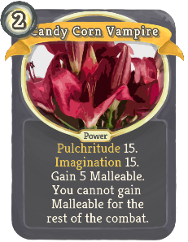 | 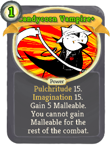 | Rare | Power | 2(1) | Pulchritude 15. Imagination 15. Gain 5 Malleable. You cannot gain Malleable for the rest of the combat. |
| Candy Mech |  |  | Rare | Attack | 2 | Imagination 15. Gain 16(18) Block. Deal 16(18) damage. Lose 3(2) Imagination. |
| Ceasefire |  |  | Rare | Power | 2 | Pulchritude 15. You and ALL enemies gain 2 Intangible. You cannot gain Intangible for the rest of the combat.  (Retain.) |
| Double Take |  |  | Rare | Power | 2(1) | Imagination 13. The first non-Purge card you play each turn puts a copy of itself on top of your draw pile. |
| Gummy Worm Zombie | 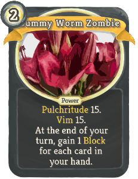 | 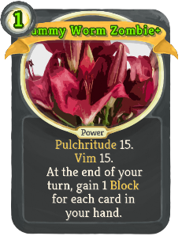 | Rare | Power | 2(1) | Pulchritude 15. Vim 15. At the end of your turn, gain 1 Block for each card in your hand. |
| Hairpin/Machinegun |  |  | Rare | Attack | 1 | Gain 15(18) Block / Deal 5(6) damage 3 times. Switches form whenever played. |
| Roll Boxcars |  |  | Rare | Skill | 1(0) | Add any 1 of the 4 Midnight Cards to your hand. Exhaust. |
| Successful Parry |  |  | Rare | Skill | 3(2) | You cannot have Block this turn. Gain Temporary HP equal to your Vim. Gain 1 Auto-Parry. Purge. |
| The Zillyhammer |  |  | Rare | Attack | 2 | Imagination 20. Deal 25(33) damage to ALL enemies. Lose 5 Imagination. |
| Weird Puzzle Shit |  |  | Rare | Skill | 1 | Pulchritude 16. Costs 1 more for every 2 cards in your draw pile. Add a (an upgraded) Jigsaw into your hand. |
