| Name | Image | Upgraded image | Rarity | Type | Cost | Description |
| ---- | ----- | -------------- | ------ | ---- | ---- | ----------- |
| Cutlass | 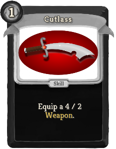 | 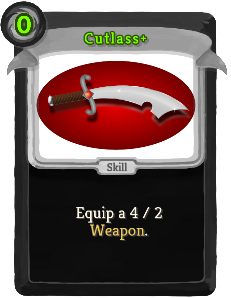 | Basic | Skill | 1(0) | Equip a 4 / 2 Weapon. |
| Defend | 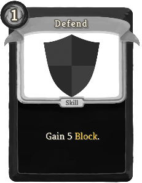 | 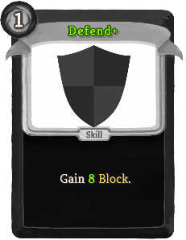 | Basic | Skill | 1 | Gain 5(8) Block. |
| Intimidating Strike | 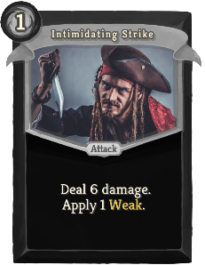 |  | Basic | Attack | 1 | Deal 6(9) damage. Apply 1(2) Weak. |
| Strike | 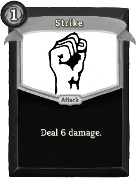 | 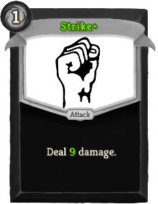 | Basic | Attack | 1 | Deal 6(9) damage. |
| Beat Up |  | 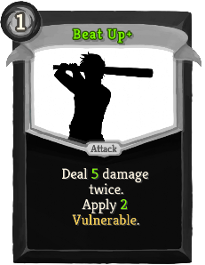 | Common | Attack | 1 | Deal 4(5) damage twice. Apply 1(2) Vulnerable. |
| Blind Attacks | 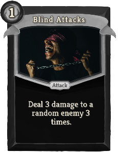 | 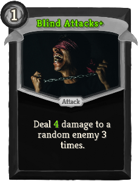 | Common | Attack | 1 | Deal 3(4) damage to a random enemy 3 times. |
| Cloak and Cannonball | 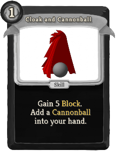 |  | Common | Skill | 1 | Gain 5(7) Block. Add a (an upgraded) Cannonball into your hand. |
| Dagger | 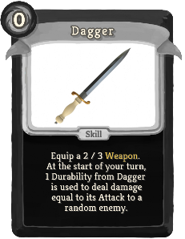 | 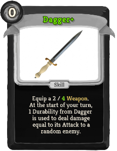 | Common | Skill | 0 | Equip a 2 / 3(4) Weapon. At the start of your turn, 1 Durability from Dagger is used to deal damage equal to its Attack to a random enemy. |
| Fencing | 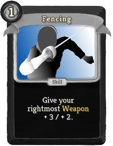 | 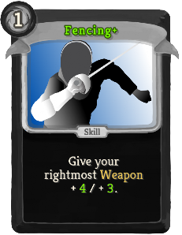 | Common | Skill | 1 | Give your rightmost Weapon + !blackbeard:M+1! / + 2(3). |
| Fiery Defense | 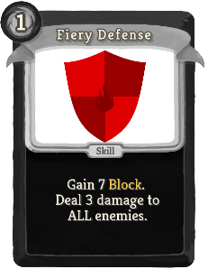 |  | Common | Skill | 1 | Gain 7(9) Block. Deal 3 damage to ALL enemies (twice). |
| Golden Defense | 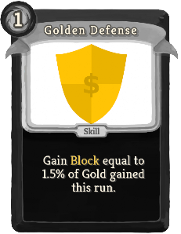 | 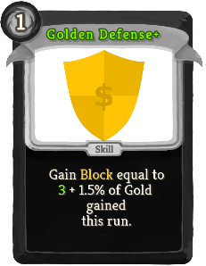 | Common | Skill | 1 | Gain Block equal to (0(3) +) 1.5% of Gold gained this run. |
| Golden Strike | 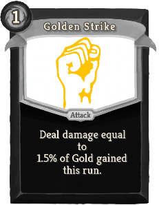 | 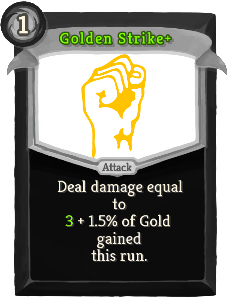 | Common | Attack | 1 | Deal damage equal to (0(3) +) 1.5% of Gold gained this run. |
| Pirate's Will | 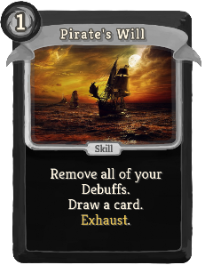 |  | Common | Skill | 1(0) | Remove all of your Debuffs. Draw a card. Exhaust. |
| Rearming Strike | 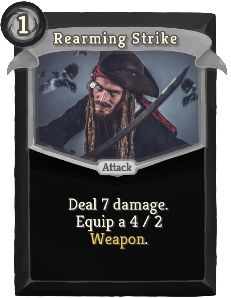 | 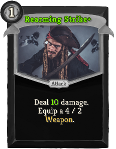 | Common | Attack | 1 | Deal 7(10) damage. Equip a 4 / 2 Weapon. |
| Sharpening | 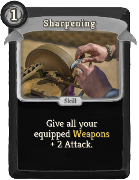 | 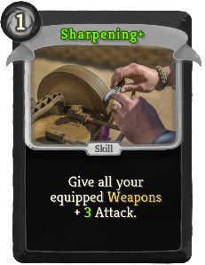 | Common | Skill | 1 | Give all your equipped Weapons + 2(3) Attack. |
| Shrapnel | 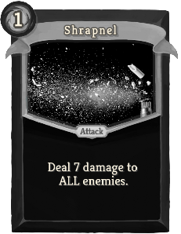 | 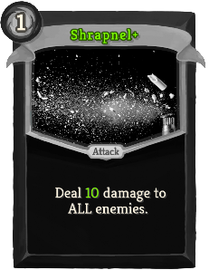 | Common | Attack | 1 | Deal 7(10) damage to ALL enemies. |
| Spear | 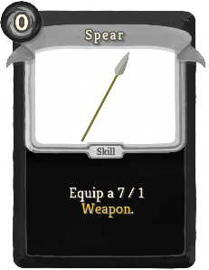 | 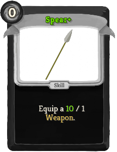 | Common | Skill | 0 | Equip a 7(10) / 1 Weapon. |
| Sword |  |  | Common | Skill | 1 | Choose 1 of 3 Swords. Equip a 3 / 3(4) Weapon with an additional effect. |
| Sword Dance | 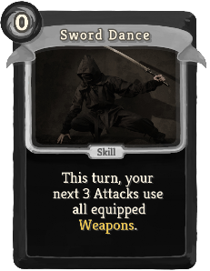 | 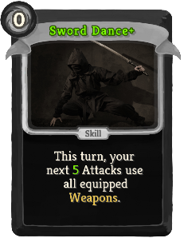 | Common | Skill | 0 | This turn, your next 3(5) Attacks use all equipped Weapons. |
| Tactical Retreat | 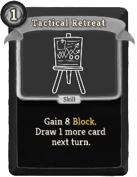 | 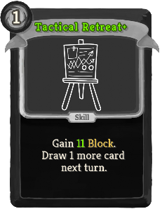 | Common | Skill | 1 | Gain 8(11) Block. Draw 1 more card next turn. |
| Toast | 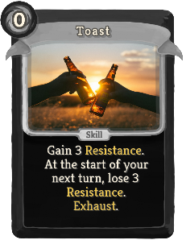 |  | Common | Skill | 0 | Gain 3(4) Resistance. At the start of your next turn, lose 3(4) Resistance. Exhaust. |
| Wise Defense | 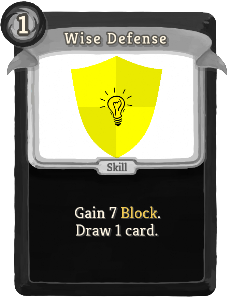 | 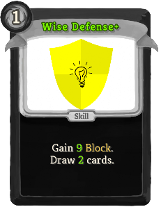 | Common | Skill | 1 | Gain 7(9) Block. Draw 1(2) card(s). |
| Agile Strike | 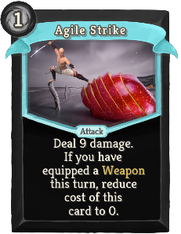 | 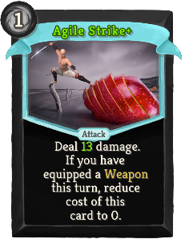 | Uncommon | Attack | 1 | Deal 9(13) damage. If you have equipped a Weapon this turn, reduce cost of this card to 0. |
| Anchor | 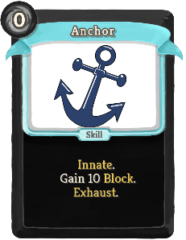 | 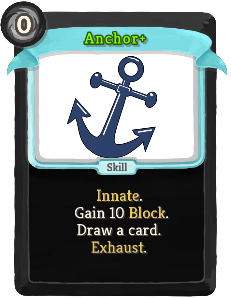 | Uncommon | Skill | 0 | Innate. Gain 10 Block. (Draw a card.)  Exhaust. |
| Armor Up | 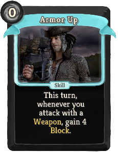 | 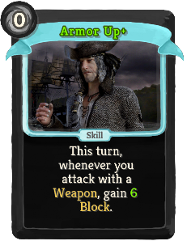 | Uncommon | Skill | 0 | This turn, whenever you attack with a Weapon, gain 4(6) Block. |
| Bandana | 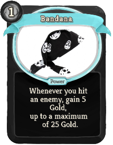 | 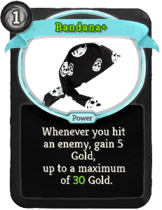 | Uncommon | Power | 1 | Whenever you hit an enemy, gain 5 Gold, up to a maximum of 25(30) Gold. |
| Boarding | 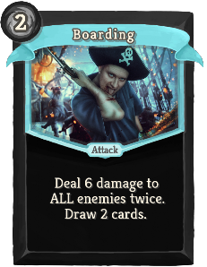 | 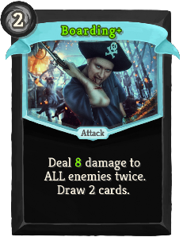 | Uncommon | Attack | 2 | Deal 6(8) damage to ALL enemies twice. Draw 2 cards. |
| Brown Pants | 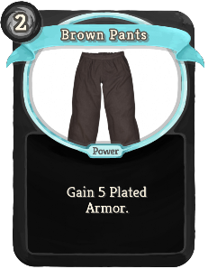 | 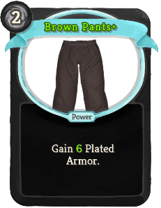 | Uncommon | Power | 2 | Gain 5(6) Plated Armor. |
| Buried Treasure | 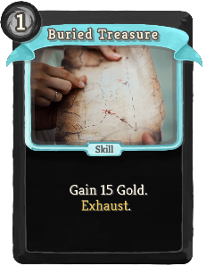 | 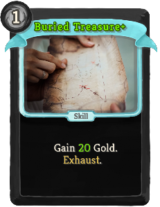 | Uncommon | Skill | 1 | Gain 15(20) Gold. Exhaust. |
| Cannon Barrage |  |  | Uncommon | Skill | X | Add X (X+1) Cannonballs into your hand. |
| Cannonball Supply |  |  | Uncommon | Skill | 2 | Add 3 Cannonballs into your hand. Exhaust. (not Exhaust.) |
| Captain's Cabin |  |  | Uncommon | Skill | 2 | Gain 12 Block. Add 1(2) Cannonball(s) into your hand. |
| Cat O' Nine Tails |  |  | Uncommon | Skill | 1 | Equip a 4(6) / 3 Weapon. After you attack with this Weapon, give it + 2 Attack. |
| Chaotic Defense |  |  | Uncommon | Skill | 1 | Gain 7(9) Block. Add 1(2) random card(s) into your hand. |
| Dangerous Blow |  |  | Uncommon | Attack | 1 | Deal 18(22) damage. At the end of your next turn, you take 4 damage. |
| Delayed Pain |  |  | Uncommon | Skill | 1 | Gain 14(18) Block. At the end of your next turn, you take 4 damage. |
| Double Bottom |  |  | Uncommon | Skill | 2 | Gain 10(13) Block. Next turn, gain 10(13) Block. |
| Double Cannonball |  |  | Uncommon | Attack | 1 | Deal 6(8) damage. Add a (an upgraded) Cannonball into your hand. Exhaust. |
| Eyepatch |  |  | Uncommon | Power | 0 | (Innate.)  Gain 3 Weak. At the start of your turn, draw 1 additional card. |
| Fishing Nets |  |  | Uncommon | Skill | 1 | Gain 5(7) blackbeard:Rusty Thorns. |
| Ghost in the Rum |  |  | Uncommon | Skill | 1 | Gain 1 Intangible. Lose 2(1) Resistance. Exhaust. |
| Golden Cannonball |  |  | Uncommon | Attack | 0 | Deal damage equal to (0(4) +) 2% of Gold gained this run. Exhaust. |
| Infinite Barrage |  |  | Uncommon | Power | 2 | (Innate.)  At the start of your turn, add a Cannonball into your hand. |
| Jolly Roger |  |  | Uncommon | Skill | 1 | Apply 3(5) Weak to ALL enemies. Exhaust. |
| Pirate Earring |  |  | Uncommon | Power | 0 | Gain 1(2) Artifact. |
| Powder Keg |  |  | Uncommon | Skill | 1 | Equip a 0 / 1 Weapon. When it is destroyed, deal 15(20) damage to ALL enemies. |
| Provisioning |  |  | Uncommon | Skill | 2(1) | Obtain a random potion. Next turn, obtain a random potion. Exhaust. |
| Recklessness |  |  | Uncommon | Skill | 0 | Gain [E] [E] ([E]). At the start of your next turn, lose [E] [E]. |
| Remove Scurvy |  |  | Uncommon | Skill | 1 | Heal 5(8) HP. Remove all of your Debuffs. Exhaust. |
| Revenge |  |  | Uncommon | Attack | 2 | Deal 0 - 50(60) damage to ALL enemies, based on how many % of HP you are missing. |
| Rum |  |  | Uncommon | Power | 1 | Gain 1(2) Resistance. |
| Scrap |  |  | Uncommon | Skill | 0 | Destroy your rightmost Weapon to gain (NL) [E] [E] ([E]). |
| Smithing Hammer |  |  | Uncommon | Skill | 1 | Equip a 2 / 4(6) Weapon. After you attack with this Weapon and passively at the start of your turn using 1 Durability, upgrade a random card in your hand for the rest of the combat. Exhaust. |
| Terror of the Seas |  |  | Uncommon | Skill | 1 | Apply 3(5) Vulnerable to ALL enemies. Exhaust. |
| Upgrade |  |  | Uncommon | Skill | 1 | Give all your equipped Weapons + 1(2) / + 1(2). |
| Vengeful Spirit |  |  | Uncommon | Skill | 1 | Gain 1 Intangible. At the start of the turn on which you are no longer Intangible, you take 12(8) damage. Exhaust. |
| Weapon Proficiency |  |  | Uncommon | Power | 1(0) | Your attacks use an additional Weapon. |
| Wooden Leg |  |  | Uncommon | Power | 1 | Lose 2 Dexterity. Gain 4(5) Strength. |
| Boost Morale |  |  | Rare | Skill | 0 | Draw 2(3) cards. Gain [E] ([E]). Exhaust. |
| Bounty Hunter |  |  | Rare | Attack | 1 | Deal 16(20) damage. If this kills a non-minion enemy, gain 16(20) Gold. Exhaust. |
| Captain's Hat |  |  | Rare | Power | 2 | Gain !blackbeard:M+1! Strength. Gain 1(2) Resistance. |
| Final Barrage |  |  | Rare | Attack | 0 | Deal damage equal to 4(6) times the amount of Cannonballs played this combat. (Every type of Cannonball counts.) |
| Golden Guillotine |  |  | Rare | Attack | 3 | Deal damage equal to 4% (5%) of Gold gained this run. |
| Golden Rain |  |  | Rare | Attack | 2 | Deal damage equal to 2.5% (3%) of Gold gained this run to ALL enemies. |
| Halberd |  |  | Rare | Skill | 2 | Equip a 6(9) / 4 Weapon. Whenever you attack with this Weapon, apply 3 blackbeard:Bleed to a target per hit. |
| Humongous Cannonball |  |  | Rare | Attack | 3 | Deal 36(48) damage. Exhaust. |
| Intoxication |  |  | Rare | Power | 1 | Gain 4(5) Resistance. At the start of your turn, lose 1 Resistance. |
| Lifeboat |  |  | Rare | Skill | 2 | Gain 24(30) Block. |
| Mega Upgrade |  |  | Rare | Skill | 2 | Give all your equipped Weapons + 3(5) / + 3(5). |
| Murder |  |  | Rare | Attack | 4 | Ethereal. Grave. Deal 500(1000) damage     to a Normal enemy. (Cannot be used on Elite or Boss). |
| Parrot |  |  | Rare | Power | 3 | Ethereal. (not Ethereal.) The last card played each turn is played an additional time. This power does not stack. |
| Pirate Strength |  |  | Rare | Power | 3 | Gain 6(9) Strength. |
| Reaper's Scythe |  |  | Rare | Skill | 2 | Equip a 8(11) / 3 Weapon. Whenever you attack with this Weapon, apply 1 blackbeard:Reaper's Mark to a target per hit. |
| Salvager |  |  | Rare | Power | 1 | Whenever a Weapon is destroyed, gain [E] ([E]). |
| The Drunken Sailor |  |  | Rare | Power | 1(0) | Whenever you use a potion, use it an additional time. |
| Undead Form |  |  | Rare | Power | 3 | Gain 2(3) Intangible. At the start of the turn on which you are no longer Intangible, you take 30 damage. |
| Weapon Mastery |  |  | Rare | Power | 1 | Whenever you equip a Weapon, draw 1(2) card(s). |
