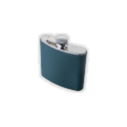
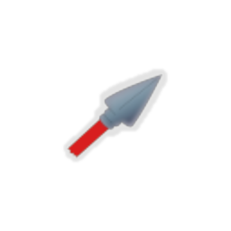
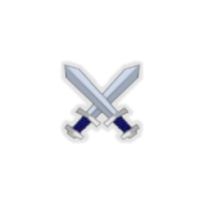
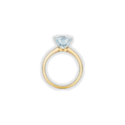
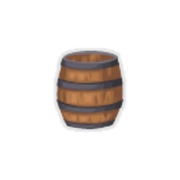
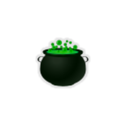
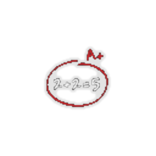
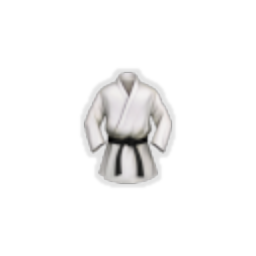

| Image | Name | Rarity | Color | Description | Flavor |
| ----- | ---- | ------ | ----- | ----------- | ------ |
|  | Load the Cannons | Starter | Blackbeard_black | At the start of each combat, and then every #b4 turns, add a #yCannonball into your hand. | Ready... Aim... Fire!!! |
|  | Cannonballs of Steel | Common | Blackbeard_black | Your #yCannonballs deal #b2 more damage. (Works with every type of #yCannonball [REMOVE_SPACE].) | Much stronger than regular cannonballs. |
|  | Hip Flask | Common | Blackbeard_black | At the start of each combat, gain #b1 #yResistance. | Very handy. |
|  | Spearhead | Common | Blackbeard_black | When a #yWeapon has #b1 Durability, it deals #b3 more damage. | The durability of your Weapon ends... and so does the life of your enemy. |
|  | Treasure Chest | Common | Blackbeard_black | Gain #b15 #yGold after every battle. | This treasure chest contains untold riches. |
|  | White Pearl | Common | Blackbeard_black | Whenever you equip a #yWeapon, give it #b+1 Attack. | Both beautiful and powerful. |
|  | Crossed Swords | Uncommon | Blackbeard_black | Your attacks use an additional #yWeapon. | Perfect for dual wielding. |
|  | Golden Ring | Uncommon | Blackbeard_black | At the start of each combat, gain #b1 #yArtifact. | Suitable for every pirate. |
|  | Penknife | Uncommon | Blackbeard_black | Every #b8th Attack that uses at least one #yWeapon deals double damage. | If you have it in your pocket, don't forget to use it. |
|  | Powder Can | Uncommon | Blackbeard_black | At the start of each combat, equip a 0 / #b1 #yWeapon. When it is destroyed, deal #b8 damage to ALL enemies. | Just like a Powder Keg, but smaller. |
|  | Magical Cauldron | Rare | Blackbeard_black | At the start of each combat, obtain a random potion. | Fully automatic. |
|  | Poor Math Skills | Rare | Blackbeard_black | You think that you have gained #b500 more #yGold this run than you actually did. (It matters for cards that scale with #yGold gained this run.) | Sometimes failing a math class is a good thing. |
|  | Load the Golden Cannons | Boss | Blackbeard_black | Replaces #yLoad #ythe #yCannons. At the start of each combat, and then every #b4 turns, add a #yblackbeard:Golden Cannonball into your hand. | Is it even worth to shoot all these golden cannonballs?!? |
|  | Sober-minded | Boss | Blackbeard_black | Gain [E] at the start of your turn. At the start of each combat, and then every #b4 turns, lose #b1 #yResistance. | Being sober is not a natural state for The Blackbeard. |
|  | Blood Orange | Shop | Blackbeard_black | Whenever you play #b6 cards in the same turn, remove all of your Debuffs. | This citrus seems to have an interesting power. |
|  | Karate Gi | Shop | Blackbeard_black | Your #yWeapons have infinite Durability. After you attack with a #yWeapon, it goes to the last position. | When you wear it, you instantly learn new styles of combat. |
