## Cards

| Name | Image | Upgraded image | Rarity | Type | Cost | Description |
| ---- | ----- | -------------- | ------ | ---- | ---- | ----------- |
| Defend | 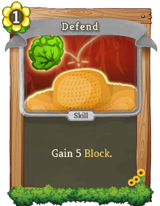 | 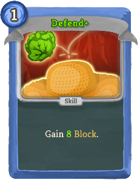 | Basic | Skill | 1 | Gain 5(8) Block. |
| Haymaker | 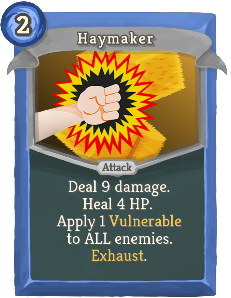 |  | Basic | Attack | 2 | Deal 9(13) damage. Heal 4(6) HP. Apply 1 Vulnerable to ALL enemies. Exhaust. |
| Reap and Sow | 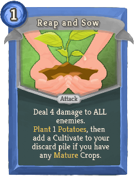 |  | Basic | Attack | 1 | Deal 4(6) damage to ALL enemies. Plant 1(2) Potatoes, then add a Cultivate to your discard pile if you have any Mature Crops. |
| Strike | 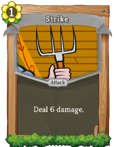 | 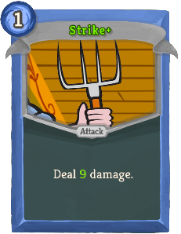 | Basic | Attack | 1 | Deal 6(9) damage. |
| Aerate | 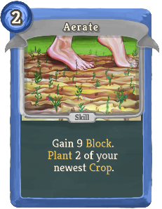 | 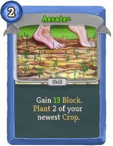 | Common | Skill | 2 | Gain 9(13) Block. Plant 2 of your newest Crop. |
| Bumper Crop | 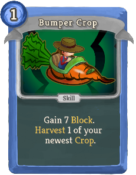 |  | Common | Skill | 1 | Gain 7(10) Block. Harvest 1 of your newest Crop. |
| Close Scrape | 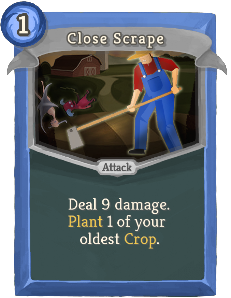 | 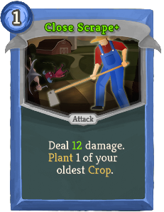 | Common | Attack | 1 | Deal 9(12) damage. Plant 1 of your oldest Crop. |
| Culling Strike | 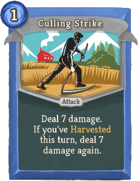 | 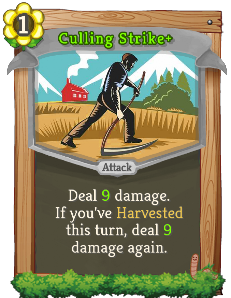 | Common | Attack | 1 | Deal 7(9) damage. If you've Harvested this turn, deal 7(9) damage again. |
| Double Barrel | 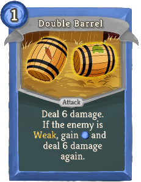 |  | Common | Attack | 1 | Deal 6(9) damage. If the enemy is Weak, gain [E] and deal 6(9) damage again. |
| Ferment | 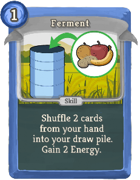 | 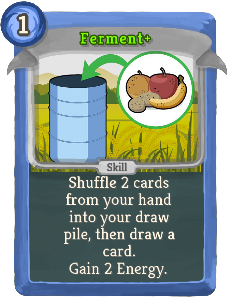 | Common | Skill | 1 | Shuffle 2 cards from your hand into your draw pile (, then draw a card). Gain [E] [E]. |
| Fertilaser | 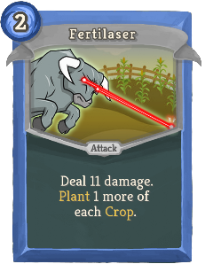 | 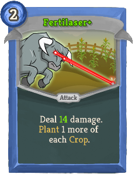 | Common | Attack | 2 | Deal 11(14) damage. Plant 1 more of each Crop. |
| Onion Bloom | 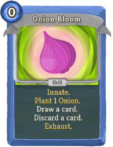 | 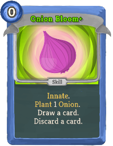 | Common | Skill | 0 | Innate. Plant 1 Onion. Draw a card. Discard a card. Exhaust. (not Exhaust.) |
| Onions | 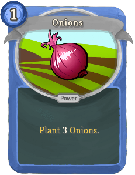 | 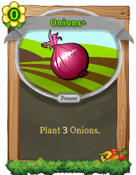 | Common | Power | 1(0) | Plant 3 Onions. |
| Pest Management | 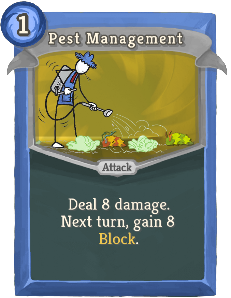 | 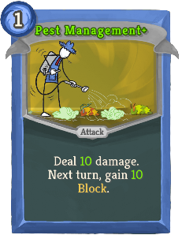 | Common | Attack | 1 | Deal 8(10) damage. Next turn, gain 8(10) Block. |
| Potatoes | 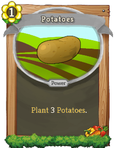 | 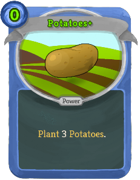 | Common | Power | 1(0) | Plant 3 Potatoes. |
| Pruning | 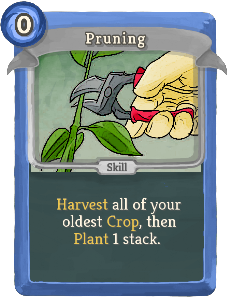 | 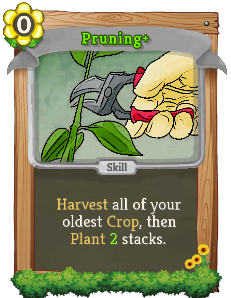 | Common | Skill | 0 | Harvest all of your oldest Crop, then Plant 1(2) stack(s). |
| Rototilling | 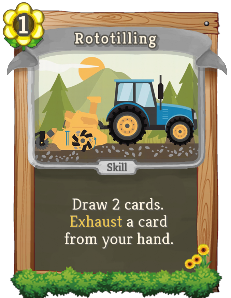 | 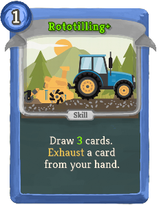 | Common | Skill | 1 | Draw 2(3) cards. Exhaust a card from your hand. |
| Salad Shooter | 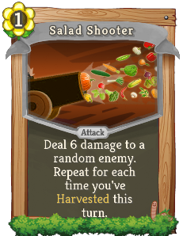 | 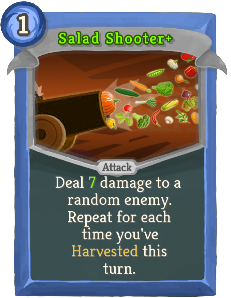 | Common | Attack | 1 | Deal 6(7) damage to a random enemy. Repeat for each time you've Harvested this turn. |
| Seed Coat | 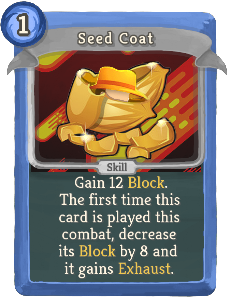 | 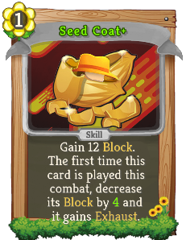 | Common | Skill | 1 | Gain 12 Block. The first time this card is played this combat, decrease its Block by 8(4) and it gains Exhaust. |
| Slash And Burn | 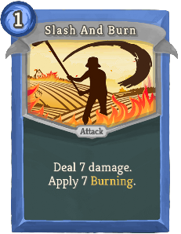 | 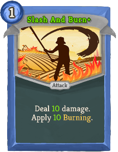 | Common | Attack | 1 | Deal 7(10) damage. Apply 7(10) Burning. |
| Spice Up | 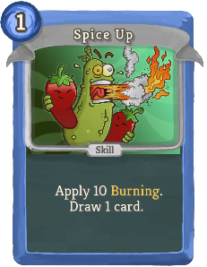 |  | Common | Skill | 1 | Apply 10(12) Burning. Draw 1 (2) card(s). |
| Squash | 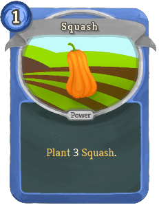 | 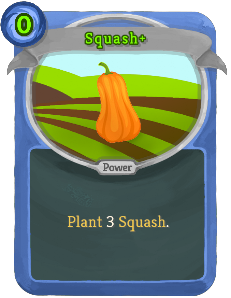 | Common | Power | 1(0) | Plant 3 Squash. |
| Swelter |  |  | Common | Skill | 0 | Apply 1 (2) Weak and 4(6) Burning. Gain 4(6) Block. |
| Toughen Up | 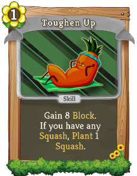 | 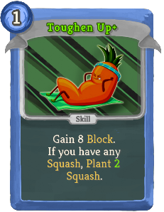 | Common | Skill | 1 | Gain 8 Block. If you have any Squash, Plant 1(2) Squash. |
| Artichokes | 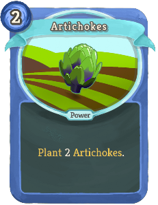 | 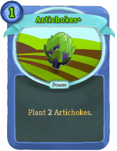 | Uncommon | Power | 2(1) | Plant 2 Artichokes. |
| Controlled Burn | 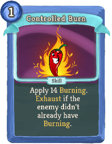 | 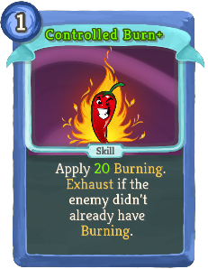 | Uncommon | Skill | 1 | Apply 14(20) Burning. Exhaust if the enemy didn't already have Burning. |
| Corn | 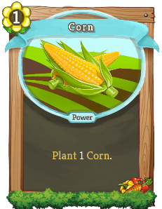 | 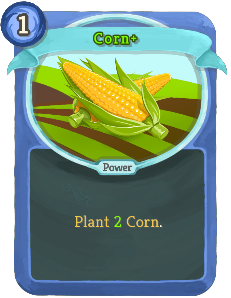 | Uncommon | Power | 1 | Plant 1(2) Corn. |
| Crop Rotation | 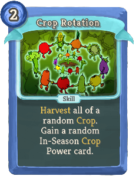 |  | Uncommon | Skill | 2(1) | Harvest all of a random Crop. Gain a random In-Season Crop Power card. |
| Dig In | 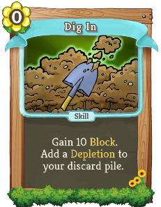 | 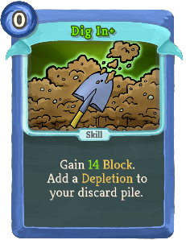 | Uncommon | Skill | 0 | Gain 10(14) Block. Add a Depletion to your discard pile. |
| Germinate |  |  | Uncommon | Skill | 1 | If your newest Crop is Mature, gain 14(18) Block. Otherwise, Plant 2 of that Crop. |
| Go to Market |  |  | Uncommon | Skill | 1(0) | Draw a card for each different type of Crop you have. |
| Innovate |  |  | Uncommon | Skill | 1 | Add a random card with Harvest to your hand. It costs 0 this turn (combat). |
| Keen Edge |  |  | Uncommon | Attack | 1 | Ethereal. (not Ethereal.) Deal 9 damage. Increase this card's damage by 9 and its cost by 1 this combat. |
| Mulch |  |  | Uncommon | Skill | 1(0) | Exhaust a card, then gain an effect based on its type: NL Attack: Gain 6 Block. Skill: Apply 4 Burning to ALL. All Others: Draw 2 cards. |
| Polyculture |  |  | Uncommon | Skill | 1 | Shuffle 2(3) random Crop Power cards into your draw pile. Exhaust. |
| Rake |  |  | Uncommon | Attack | 1 | Deal 7(8) damage. Apply 1(2) Weak. |
| Root Down |  |  | Uncommon | Attack | 0 | (Innate.)  Deal 6 damage. If Turnips are Mature, Harvest all Turnips. Otherwise, Plant 1 Turnips. |
| Soil Sample |  |  | Uncommon | Skill | 1 | Shuffle up to 3 cards from your discard pile into your draw pile, then draw (Draw) a card. It costs 0 this turn. Exhaust. (not Exhaust.) |
| Stock the Cellar |  |  | Uncommon | Skill | 1 | Ethereal. Gain 6(8) Block. Each time this card is shuffled into your draw pile, increase its Block by 2(3) for this combat. |
| Sunchoke |  |  | Uncommon | Attack | 1 | Deal 7(9) damage to ALL enemies. Each Weak enemy that takes damage also gains 7(9) Burning. |
| Sunflowers |  |  | Uncommon | Power | 1 | Plant 1(2) Sunflower(s). |
| Sunseed |  |  | Uncommon | Attack | 0 | (Innate.) When drawn, copy this card if your discard is empty. Deal 3 damage and gain [E]. Exhaust. |
| Thresh |  |  | Uncommon | Attack | 3 | Deal 22(28) damage. Costs [E] less for each time you Harvest this turn. |
| Turnips |  |  | Uncommon | Power | 1 | Plant 2(3) Turnips. |
| Vine Ripen |  |  | Uncommon | Skill | 2(1) | Plant 2 Squash. If Squash is Mature, Block is not removed at the start of your next turn. |
| Asparagus |  |  | Rare | Power | 1 | Plant 1(2) Asparagus. |
| Barnstorm |  |  | Rare | Attack | 3 | Deal 5 damage to a random enemy (ALL enemies) for each Crop stack you have. Mature Crops deal double damage. Exhaust. |
| Biorefinement |  |  | Rare | Power | 2(1) | The first time each turn that you play a card with Harvest, reduce the cost of a random card in your hand by 1 this combat. |
| Birdfeeder |  |  | Rare | Power | 1 | The next 3(5) times you play a Power card this combat, heal 4 HP. |
| Buzz Bomb |  |  | Rare | Attack | 2 | Deal 12 damage to a random enemy 2(3) times. Plant 1 Sunflower for each enemy killed this way. |
| Chilis |  |  | Rare | Power | 1(0) | Plant 3 Chilis. |
| Crack of Dawn |  |  | Rare | Power | 2(1) | In 2 turns, deal 16 damage to ALL enemies, Plant 3 Corn, and gain [E] [E] [E] . |
| Crop Diversity |  |  | Rare | Skill | 1 | Add 1 of 2(3) random Crop Power cards to your hand. It costs 0 this turn. Exhaust. |
| Desperate Plunge |  |  | Rare | Skill | 3 | Costs [E] less for each Power card played this turn. Gain 30(40) Block. Next turn, lose [E]. |
| Double Digging |  |  | Rare | Skill | 1 | This turn, the next (1(2)) card(s) you play that costs (cost) 1 or less is (are) played twice. |
| Erosion Control |  |  | Rare | Skill | 3 | Harvest all crops. Gain 1(2) Intangible. Exhaust. |
| Fan the Flames |  |  | Rare | Skill | 1 | Apply 10 Burning (to ALL enemies), then double the (each) enemy's Burning. Exhaust. |
| Fecundity |  |  | Rare | Power | 3(2) | Gain 1 Abundance. |
| Flash Pasteurize |  |  | Rare | Attack | 0 | Deal 7 damage to ALL characters. Remove all of your Debuffs. (Gain 7 Block.)  Exhaust. |
| Hit the Sack |  |  | Rare | Attack | X | Deal 7 damage X (X+1) times. Plant X (X+1) Potatoes. |
| Land Grant |  |  | Rare | Power | 1 | Gain 1(2) Plot(s). |
| Mushrooms |  |  | Rare | Power | 2(1) | Plant 2 Mushrooms. |
| Photosynthesis |  |  | Rare | Power | 1(0) | At the end of your turn, spend all your unused Energy and Plant that many random In-Season Crops. |
| Research Grant |  |  | Rare | Skill | 1 | Gain 16(20) Block. Add 2(3) copies of Soil Sample to your discard pile. Exhaust. |
| Resistant Strain |  |  | Rare | Power | 1 | Whenever you apply a debuff to an enemy, gain 4(5) Block. |
| Salt the Earth |  |  | Rare | Attack | 2 | Deal 24(32) damage to ALL enemies. Add 2 Depletions to your hand. |
| Spinach |  |  | Rare | Power | 2(1) | Plant 2 Spinach. |
| Strawberries |  |  | Rare | Power | 1 | Plant 2(3) Strawberries. |
| Surplus |  |  | Rare | Skill | 1 | Add 2(3) random Common Crop Power cards to your hand. Exhaust. |
| Take Heart |  |  | Rare | Skill | 3(2) | Gain 16 Block. Heal 5 HP. Plant 2 Artichokes. Do this again if your HP is at 50% or less. Exhaust. |
| Volatile Fumes |  |  | Rare | Power | 0 | Whenever you attack an enemy with Weak, apply 4(6) Burning. |

## Potions

| Image | Name | Rarity | Description |
| ----- | ---- | ------ | ----------- |
|  | Abundance Potion | Uncommon | Gain 1 Abundance. |
|  | Kindling Potion | Uncommon | Apply 15 Burning to ALL enemies. |

## Relics

| Image | Name | Rarity | Color | Description | Flavor |
| ----- | ---- | ------ | ----- | ----------- | ------ |
|  | Night Soil | Starter | The_simpleton_blue | Whenever you shuffle your deck, for each of your #yCrops that isn't #rMature, #yPlant #b1 more. | It grows on you. |
|  | Spud of the Innocent | Starter | The_simpleton_blue | At the start of each combat, #yPlant #b2 #yPotatoes. | Salvation for the thin-skinned. |
|  | Trusty Sickle | Starter | The_simpleton_blue | Whenever you #yPlant a #yCrop, if you then have more stacks than its #rMaturity level, #gHarvest all excess stacks. | Its purpose is clear-cut. |
|  | Weed Puller | Common | The_simpleton_blue | At the start of each combat, choose up to #b2 cards from your hand to exhaust, then draw that many. | Suitable for plant matter ONLY. |
|  | Cash Crop | Uncommon | The_simpleton_blue | Whenever you Harvest a #yCrop for the fist time each combat, gain #b5 Gold. | Cold, but not hard. |
|  | Gas Can | Uncommon | The_simpleton_blue | Whenever you apply #yBurning, apply half that amount to each other enemy. | What can expand to fill any container? |
|  | Hot Potato | Uncommon | The_simpleton_blue | Harvesting #yPotatoes now yields #yFlaming #ySpuds, which also apply #yBurning damage. | There's no topping this one. |
|  | Pickling Jar | Uncommon | The_simpleton_blue | Upon pickup, choose a card. Every #b3 times you shuffle your draw pile, add a copy of that card to your hand. It costs 0 that turn. | Sour, salty, and full of dark magic. |
|  | Planter Box | Uncommon | The_simpleton_blue | Start each combat with #b1 additional #yPlot. | Imported soil tends to produce a less twisted harvest. |
|  | Horn Of Plenty | Rare | The_simpleton_blue | At the start of each combat, gain #b1 #yAbundance. | More than adequate. |
|  | Gourd Charm | Boss | The_simpleton_blue | Replaces #gSpud #gof #gthe #gInnocent. At the start of each combat, #yPlant #b2 #ySquash. | Crafted specifically for adventurers who prefer Hard Mode. |
|  | Onion Belt | Boss | The_simpleton_blue | Replaces #gSpud #gof #gthe #gInnocent. At the start of each combat, #yPlant #b2 #yOnions. | Once wielded by the Elders, now largely out of style. |
|  | Spud of the Martyr | Boss | The_simpleton_blue | Replaces #gSpud #gof #gthe #gInnocent. Whenever you take attack damage, and at the start of each combat, #yPlant #b2 #yPotatoes. | Roasted for a good cause. |

| Image | Name |
| ----- | ---- |
|  | The Hayseed |

