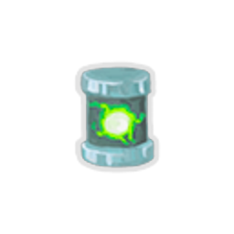
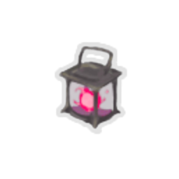

| Image | Name | Rarity | Color | Description | Flavor |
| ----- | ---- | ------ | ----- | ----------- | ------ |
|  | Broken Ruby | Starter | Runesmith_beige | At the start of each combat, gain #b2 #yrunesmith:Ignis. NL At the start of your turn, #yEnhance a random card in your hand. | A crystal that resembles a red gem. Although it is broken, faint energy still remains. |
|  | AutoHammer | Common |  | Every time you play #b3 #ySkills in #b1 turn, #yrunesmith:Enhance a random card in your hand. | An automatic hammer which never stops hammering. |
|  | Emergency Provisions | Common | Runesmith_beige | Every time you play a Craft card, gain #b1 random #yrunesmith:Element. | A self-contained, individual field ration in lightweight packaging. |
|  | Minicore | Common | Runesmith_beige | Gain 1 #yrunesmith:Potency at the start of the combat. | This peculiar orb was once used as an energy storage. |
|  | Nanobots | Uncommon |  | At the start of combat, #yrunesmith:Enhance all cards in your hand. | "These tiny machines have wondrous properties." -Ranwid |
|  | Locket | Rare | Runesmith_beige | One time each combat, if your health drops below #b15%, add Last Stand to the top of your draw pile. | An image of unknown yet familiar figure resides within. |
|  | Core Crystal | Boss | Runesmith_beige | Replaces #rBroken #rRuby. All #yrunesmith:Element gains are increased by #b50%. Raises maximum #yrunesmith:Elements to #b20. |  |
|  | Pocket Reactor | Boss | Runesmith_beige | #yrunesmith:Elements are no longer needed for crafting. All cards lose #b2 #yrunesmith:Potency.  |  |
|  | Uranium Anvil | Boss |  | Gain [E] at the start of your turn. #yrunesmith:Downgrade a random card in your draw pile, hand, or discard pile each turn. | This block of metal holds massive amount of energy but weakens anyone who come near it. |
