| Name | Image | Upgraded image | Rarity | Type | Cost | Description |
| ---- | ----- | -------------- | ------ | ---- | ---- | ----------- |
| Credit Card | 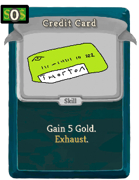 | 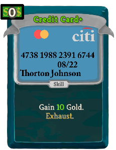 | Basic | Skill | 0 | Gain 5(10) Gold. Exhaust. |
| Defend | 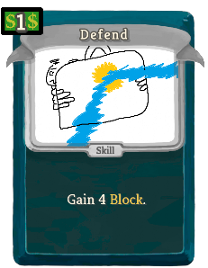 | 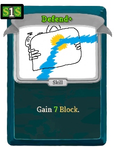 | Basic | Skill | 1 | Gain 4(7) Block. |
| Heckle |  | 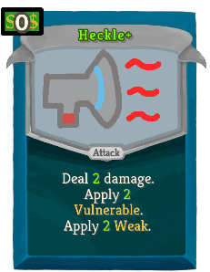 | Basic | Attack | 0 | Deal 1(2) damage. Apply 1(2) Vulnerable. Apply 1(2) Weak. |
| Strike | 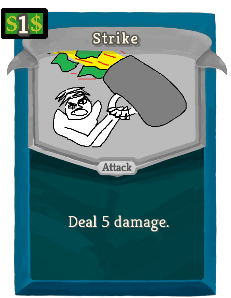 | 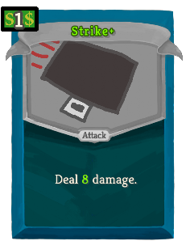 | Basic | Attack | 1 | Deal 5(8) damage. |
| Anger Moment | 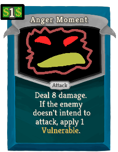 | 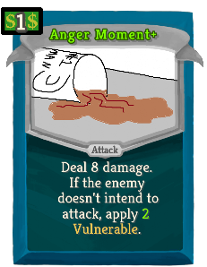 | Common | Attack | 1 | Deal 8 damage. If the enemy doesn't intend to attack, apply 1(2) Vulnerable. |
| Book Bash | 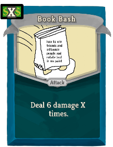 |  | Common | Attack | X | Deal 6(8) damage X times. |
| Business Card | 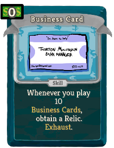 | 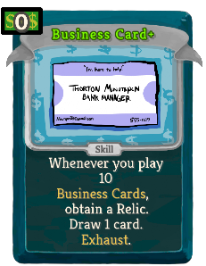 | Common | Skill | 0 | Whenever you play 10 thethorton:Business_Cards, obtain a Relic. (Draw 1 card.)  Exhaust. |
| Cash Bash | 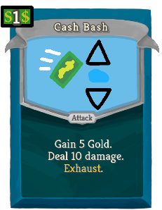 | 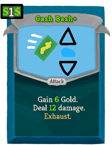 | Common | Attack | 1 | Gain 5(6) Gold. Deal 10(12) damage. Exhaust. |
| Cash Buffer | 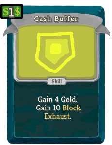 | 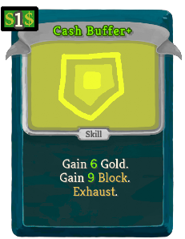 | Common | Skill | 1 | Gain 4(6) Gold. Gain 10(12) Block. Exhaust. |
| Distance | 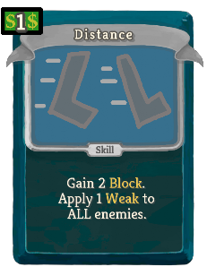 | 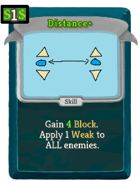 | Common | Skill | 1 | Gain 2(4) Block. Apply 1 Weak to ALL enemies. |
| Down Payment | 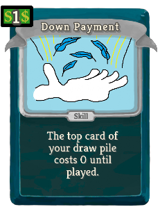 | 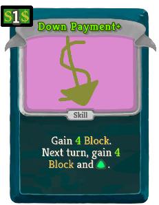 | Common | Skill | 1 | Gain 3(4) Block. Next turn, gain 3(4) Block and [E] . |
| Elbow Nudge | 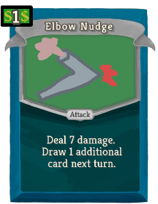 | 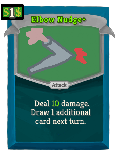 | Common | Attack | 1 | Deal 4(6) damage twice. Draw 1 additional card next turn. |
| Fearful Run |  | 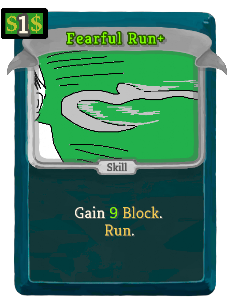 | Common | Skill | 1 | Gain 6(9) Block. thethorton:Run. |
| Hit Ahead |  | 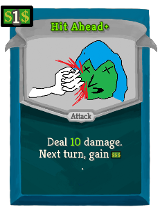 | Common | Attack | 1 | Deal 7(10) damage. Next turn, gain [E] . |
| Long Term Payoff | 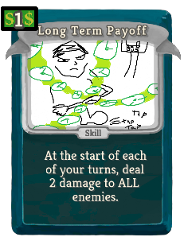 |  | Common | Skill | 1 | At the start of each of your turns, deal 2(3) damage to ALL enemies. |
| Pocket Change | 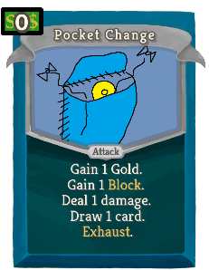 | 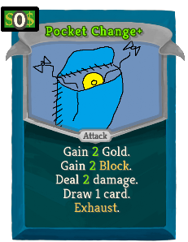 | Common | Attack | 0 | Gain 1(2) Gold. Gain 1(2) Block. Deal 1(2) damage. Draw 1 card. Exhaust. |
| Running Kick | 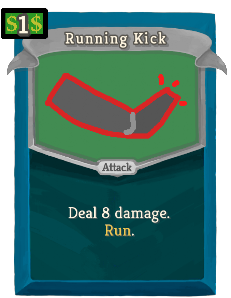 |  | Common | Attack | 1 | Deal 8(11) damage. thethorton:Run. |
| Shout and Run | 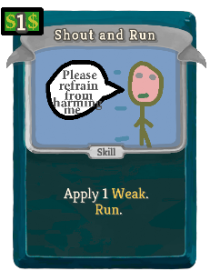 |  | Common | Skill | 1 | Apply 1(2) Weak. thethorton:Run. |
| Stumbling Slap | 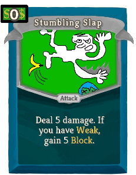 | 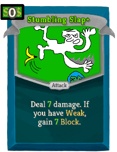 | Common | Attack | 0 | Deal 5(7) damage. If you have Weak, gain 5(7) Block. |
| Take Accounts | 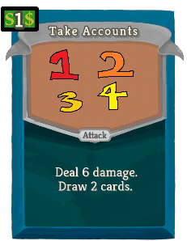 | 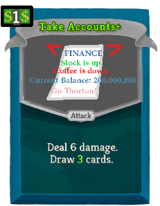 | Common | Attack | 1 | Deal 6 damage. Draw 2(3) cards. |
| Triple Bap | 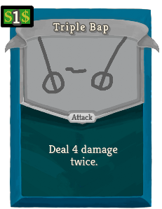 | 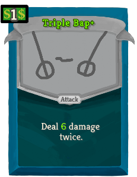 | Common | Attack | 1 | Deal 3(4) damage 3 times. |
| Wailing Run |  | 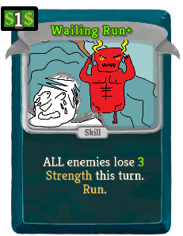 | Common | Skill | 1 | ALL enemies lose 2(3) Strength this turn. thethorton:Run. |
| Whirling Briefcase | 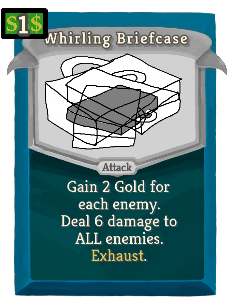 | 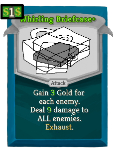 | Common | Attack | 1 | Gain 2(3) Gold for each enemy. Deal 6(9) damage to ALL enemies. Exhaust. |
| Battle Trash |  | 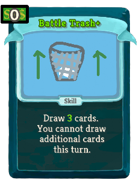 | Uncommon | Skill | 0 | Draw 2(3) cards. You cannot draw additional cards this turn. |
| Boardroom Blast | 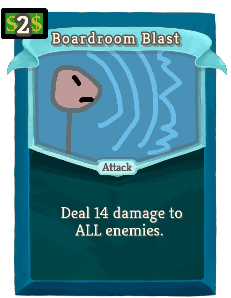 | 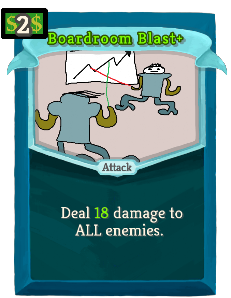 | Uncommon | Attack | 2 | Deal 14(18) damage to ALL enemies. |
| Business Bash | 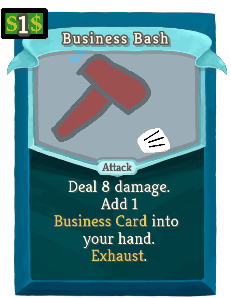 | 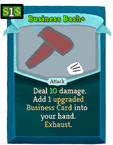 | Uncommon | Attack | 1 | Deal 9(11) damage. Add a (an upgraded) thethorton:Business_Card into your hand. Exhaust. |
| Business Boom | 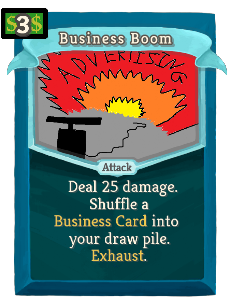 |  | Uncommon | Attack | 3 | Deal 28(37) damage. Shuffle a (an upgraded) thethorton:Business_Card into your draw pile. Exhaust. |
| Business Burst | 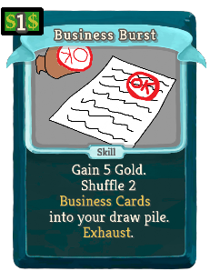 | 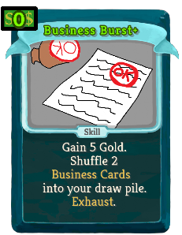 | Uncommon | Skill | 1(0) | Gain 5 Gold. Shuffle 2 thethorton:Business_Cards into your draw pile. Exhaust. |
| Call In | 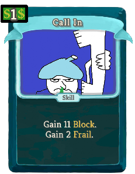 | 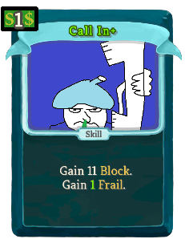 | Uncommon | Skill | 1 | Gain 11 Block. Gain 2(1) Frail. |
| Chart Project | 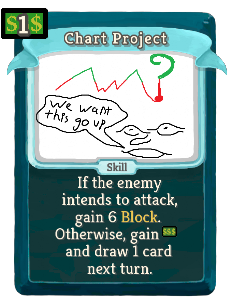 | 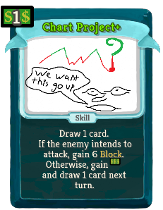 | Uncommon | Skill | 1(0) | If the enemy intends to attack, gain 7 Block. Otherwise, gain [E] and draw 1 card next turn. |
| Coin Clash |  |  | Uncommon | Attack | 2 | Gain 10(12) Gold. Deal 20(24) damage. Exhaust. |
| Coin Shield |  |  | Uncommon | Skill | 2 | Gain 8(10) Gold. Gain 16(20) Block. Exhaust. |
| Crash |  |  | Uncommon | Attack | 2 | Deal 8(10) damage. Gain 8(10) Block. thethorton:Run. |
| Desperate Run |  |  | Uncommon | Skill | 1 | Draw 2(3) cards. thethorton:Run. |
| Dock Pay |  |  | Uncommon | Attack | 1 | Deal 7(9) damage. Enemy loses 1(2) Strength this turn. |
| Feel No Brain |  |  | Uncommon | Power | 1 | (Innate.)  Whenever a card is Exhausted, gain 2 Block. |
| Focus Strength |  |  | Uncommon | Skill | 1(0) | Gain 1 Strength. End the turn. |
| Hedge Fund |  |  | Uncommon | Attack | 1 | Deal 12(15) damage. Next turn, draw 1 less card. |
| Hindsight |  |  | Uncommon | Skill | 1 | Next turn, gain 3(5) Block. Put a card from your discard pile into your hand. |
| Investment |  |  | Uncommon | Skill | 2(1) | Gain 5 Gold. Whenever you play 3 thethorton:Investments, obtain a Relic. Exhaust. |
| Last Ditch Effort |  |  | Uncommon | Attack | 2 | Deal 12(15) damage. If you have less than 50% HP, deal 12(15) damage. If you have less than 25% HP, deal 12(15) damage. |
| Long Day's Work |  |  | Uncommon | Attack | 1 | Deal 7(10) damage. Draw 1 card. Exhaust a card in your hand. |
| Lunch Break |  |  | Uncommon | Skill | 1(0) | Heal 3 HP. Add a thethorton:Business_Card into your hand. Exhaust. |
| Perplexing Power |  |  | Uncommon | Power | 1 | (Innate.)  Gain 3 of either Malleable, Artifact, Thorns or Plated Armor randomly. |
| Plan Ahead |  |  | Uncommon | Skill | 2 | Gain 1 Strength (and [E]) at the start of the next combat. Exhaust. |
| Promotion |  |  | Uncommon | Power | 1(0) | Gain 1 Strength. Gain 1 Dexterity. |
| ROI |  |  | Uncommon | Skill | 2(1) | Ethereal. Gain 15 Gold. Exhaust. |
| Rebalance |  |  | Uncommon | Skill | 2(1) | Gain 1 Strength. ALL enemies lose 1 Strength. Exhaustive !stslib:ex!. |
| Rich Run |  |  | Uncommon | Skill | 1(0) | Gain 10 Gold. thethorton:Run. Exhaust. |
| Run Run |  |  | Uncommon | Skill | 1(0) | thethorton:Run. thethorton:Run. |
| Running Feint |  |  | Uncommon | Skill | 1 | Apply 2(3) Vulnerable. thethorton:Run. |
| Seeing Double |  |  | Uncommon | Skill | 2(1) | Ethereal. Choose a card in your hand. Put 2 copies of that card on top of your draw pile. Exhaust. |
| Snow Day |  |  | Uncommon | Skill | 1 | Channel 1 Frost. thethorton:Run. Exhaust (Exhaustive !stslib:ex!). |
| Stamp Smack |  |  | Uncommon | Attack | 1 | Deal 7(9) damage to a random enemy. Deal 7(9) damage to a random enemy at the start of the next combat. Exhaust. |
| Thick Skin |  |  | Uncommon | Power | 1(0) | Whenever you lose non-Temporary HP, gain 2 Temporary_HP. |
| Toxic Greed |  |  | Uncommon | Skill | 2 | Apply 3 Poison to a random enemy. Repeat this process for every 100 Gold you have. Exhaust (Exhaustive !stslib:ex!). |
| Administrative Actions |  |  | Rare | Skill | 3(2) | Choose any Thorton card and put it on top of your draw pile. Exhaust. |
| Big Break |  |  | Rare | Power | 1 | (Innate.)  Gain 3 Strength. |
| Blood Debt |  |  | Rare | Attack | 1(0) | Deal 4 damage. Heal HP equal to unblocked damage. Exhaust. |
| Boss Rush |  |  | Rare | Skill | 2(1) | Enemy becomes a random Boss. |
| Call Of Commerce |  |  | Rare | Skill | 3(2) | Ethereal. Gain 15 Gold. The next ? room you enter contains a shop. Exhaust. |
| Cardboard Box |  |  | Rare | Power | 2(1) | Gain 1 Intangible. |
| Compound Interest |  |  | Rare | Skill | 2(1) | Exhaust. Choose 1: Double this card's Gold permanently. Gain 1 Gold and remove this card from your deck permanently. |
| Coward Form |  |  | Rare | Power | 3 | Starts combat in your discard pile. (not Starts combat in your discard pile.) At the start of your turn, thethorton:Run. |
| Crashing Stocks |  |  | Rare | Attack | 3(2) | If you have at least 100 Gold, lose 100 Gold and deal 50 damage to ALL enemies. |
| Demotion |  |  | Rare | Skill | 3(2) | ALL enemies cannot buff themselves or debuff you. Exhaust. |
| Dodge & Roll & Run |  |  | Rare | Skill | 2 | Gain 9(11) Block. Next turn, gain 9(11) Block. thethorton:Run. |
| Escape! |  |  | Rare | Skill | 3 | 33% chance to escape a non-boss combat. Receive no rewards. (not Receive no rewards.)NL Exhaustive !stslib:ex!. |
| Fair Trade |  |  | Rare | Skill | 1(0) | Exhaust a card in your hand. Put a card from your exhaust pile into your hand. Exhaust. |
| Fatigue |  |  | Rare | Skill | 2(1) | Apply Weak equal to your held Gold. |
| Fish |  |  | Rare | Skill | (4) | Unplayable unless you've thethorton:Gathered 6 different thethorton:Pyro_Buddies this combat (Ethereal). thethorton:Ingest 2 thethorton:Sync_Boons and gain 2 thethorton:Boost_Points (Cost cannot be modified).  (Obtain a Relic. Exhaust.) |
| Fortune |  |  | Rare | Skill | X | Gain X0 Gold. (Gain [E].)  Exhaust. |
| Hexaghostify |  |  | Rare | Skill | 3 | Enemy becomes a (ALL enemies become) Hexaghost(s). Exhaust. |
| Penny Toss |  |  | Rare | Attack | 1(0) | Gain 9 Gold. Gain 9 Block. Deal 9 damage. Exhaustive !stslib:ex!. |
| Portfolio |  |  | Rare | Skill | 2 | Gain 5(10) Gold. Shuffle 2 (upgraded) thethorton:Business_Cards and 1 (upgraded) thethorton:Investment into your draw pile. Exhaust. |
| Scaling Is Win |  |  | Rare | Power | 2(1) | At the start of your turn, gain 1 Strength and draw 1 additional card. |
| Sell Short |  |  | Rare | Skill | 3(2) | Ethereal. Add a copy of a card in your hand to your deck permanently. Exhaust. |
| Shifting Octopus |  |  | Rare | Attack | 1 | Do 2(3) things. Exhaust. |
| Summon Profits |  |  | Rare | Skill | 0 | Add a random card from any color into your hand. Draw 1 card. (They cost 0 until played.)  Exhaust. |
| Temporal Blast |  |  | Rare | Skill | 1(0) | Ethereal. Play a copy of the next card you play this turn at the start of the next combat. Exhaust. |
| You're Fired |  |  | Rare | Attack | 2 | Deal 20(26) damage. Remove all of your debuffs. |
