## Cards

| Name | Image | Upgraded image | Rarity | Type | Cost | Description |
| ---- | ----- | -------------- | ------ | ---- | ---- | ----------- |
| Clever Clash | 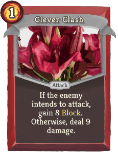 | 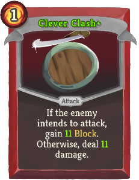 | Common | Attack | 1 | If the enemy intends to attack, gain 8(11) Block. Otherwise, deal 9(11) damage. |
| Training Strike | 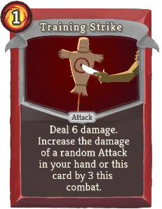 | 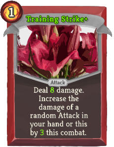 | Common | Attack | 1 | Deal 6(8) damage. Increase the damage of a random Attack in your hand or this card by 3(4) this combat. |
| Blood Guard | 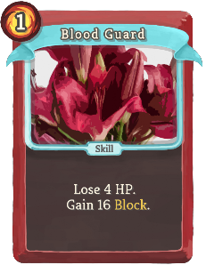 | 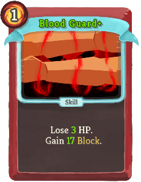 | Uncommon | Skill | 1 | Lose 4(3) HP. Gain 15(17) Block. |
| Blood to Gold | 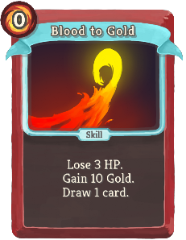 | 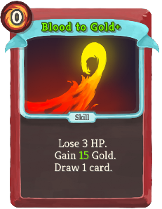 | Uncommon | Skill | 0 | Lose 3 HP. Gain 10(15) Gold. Draw 1 card. |
| Crumbling Crash | 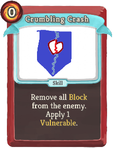 | 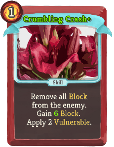 | Uncommon | Skill | 0 | Remove all Block from the enemy. Apply 1(2) Vulnerable. |
| Cursed Strike | 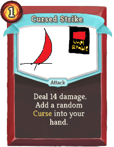 | 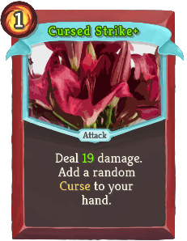 | Uncommon | Attack | 1 | Deal 14(20) damage. Add a random Curse into your hand. |
| Ground Pound | 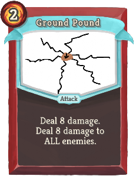 | 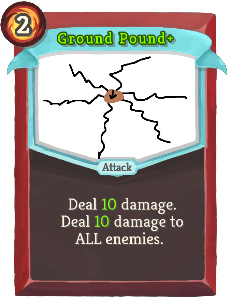 | Uncommon | Attack | 2 | Deal 8(10) damage. Deal 8(10) damage to ALL enemies. |
| Hatred | 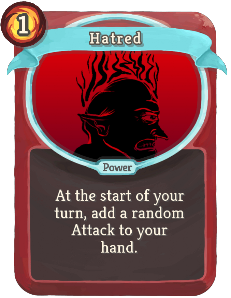 | 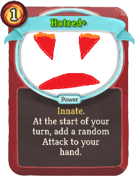 | Uncommon | Power | 1 | (Innate.)  At the start of your turn, add a random Attack to your hand. |
| Battle Stance | 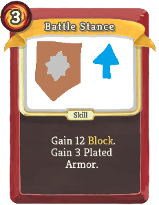 | 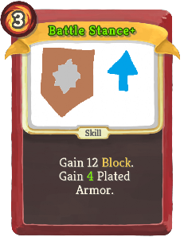 | Rare | Skill | 3 | Gain 12 Block. Gain 3(4) Plated Armor. |
| Curse Blast | 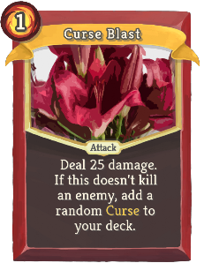 | 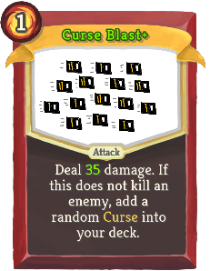 | Rare | Attack | 1 | Deal 25(35) damage. If this does not kill an enemy, add a random Curse into your deck. |
| Devastation | 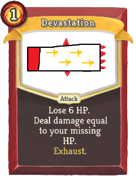 |  | Rare | Attack | 1 | Lose 6(3) HP. Deal damage equal to your missing HP. Exhaust. |
| Elimination | 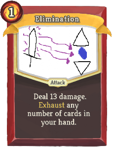 | 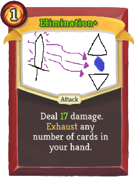 | Rare | Attack | 1 | Deal 13(17) damage. Exhaust any number of cards in your hand. |
| Insult | 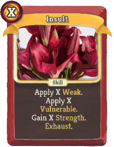 | 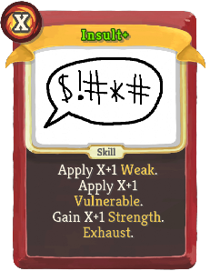 | Rare | Skill | X | Apply X (X+1) Weak. Apply X (X+1) Vulnerable. Gain X (X+1) Strength. Exhaust. |
| Strike Storm | 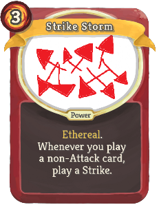 | 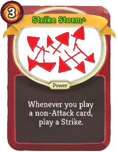 | Rare | Power | 3 | Ethereal. (not Ethereal.) Whenever you play a non-Attack card, play a πStrike. |
| Pinpoint Kick | 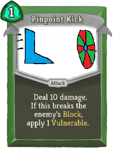 | 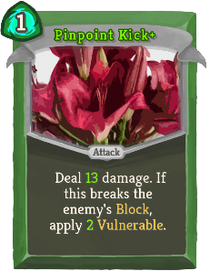 | Common | Attack | 1 | Deal 10(13) damage. If this breaks the enemy's Block, apply 1(2) Vulnerable. |
| Shadow Strike | 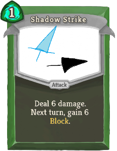 | 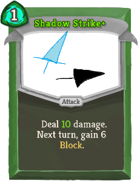 | Common | Attack | 1 | Deal 6(10) damage. Next turn, gain 6 Block. |
| Venom Sigh | 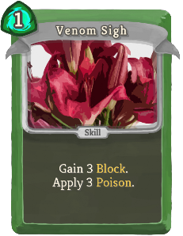 | 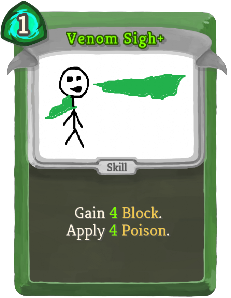 | Common | Skill | 1 | Gain 3(4) Block. Apply 3(4) Poison. |
| Bandage Whip | 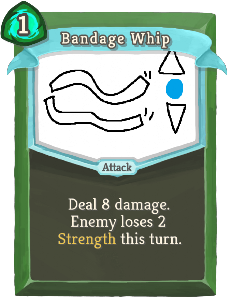 | 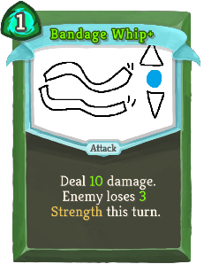 | Uncommon | Attack | 1 | Deal 8(10) damage. Enemy loses 2(3) Strength this turn. |
| Prepare Victim | 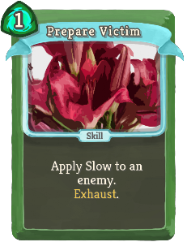 | 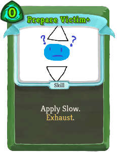 | Uncommon | Skill | 1(0) | Apply Slow. Exhaust. |
| Scaled Poison | 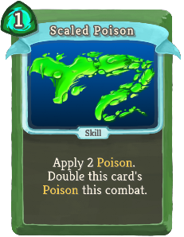 | 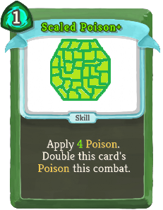 | Uncommon | Skill | 1 | Apply 2(3) Poison. Double this card's Poison this combat. |
| Shield Swipe | 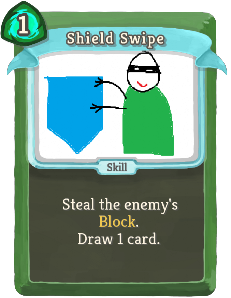 | 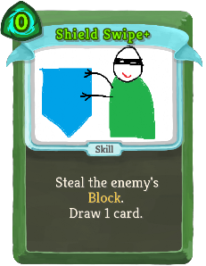 | Uncommon | Skill | 1(0) | Steal the enemy's Block. Draw 1 card. |
| Deadly Dodge | 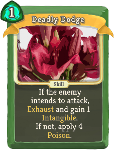 | 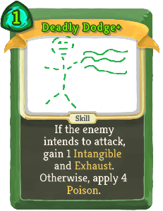 | Rare | Skill | 2(1) | If the enemy intends to attack, gain 1 Intangible and Exhaust. Otherwise, apply !vexMod:SecondMagic! Poison. |
| Evasive Thoughts | 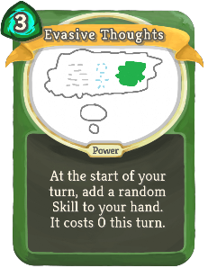 | 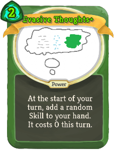 | Rare | Power | 3(2) | At the start of your turn, add a random Skill to your hand. It costs 0 this turn. |
| Ghostly Blitz | 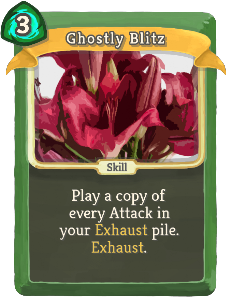 | 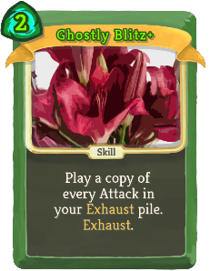 | Rare | Skill | 3(2) | Play a copy of all Attacks in your Exhaust pile. Exhaust. |
| Jackpot! | 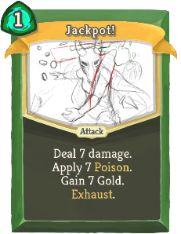 |  | Rare | Attack | 1 | (Innate.)  Deal 7 damage. Apply 7 Poison. Gain !vexMod:SecondMagic! Gold. Exhaust. |
| Midnight Strike |  | 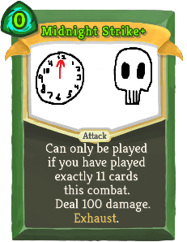 | Rare | Attack | 1(0) | Can only be played if you have played exactly 11 cards this combat. Deal 100 damage. Exhaust. |
| Nifty Moves | 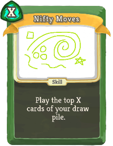 |  | Rare | Skill | X | Play the top X (X+1) cards of your draw pile. |
| Beam Pop |  |  | Common | Attack | 0 | Deal 3(4) damage. Apply 1(2) Lock-On. |
| Charge Beam |  |  | Common | Attack | 1 | Deal 7(10) damage. Next turn, draw 1 additional card. |
| Orb Boomerang |  |  | Common | Attack | 1 | Deal 6(9) damage. Does an additional effect based on your next Orb. |
| Orb Shield |  |  | Common | Skill | 0 | Gain 3(4) Block for each unique Orb you have. |
| Reflex Channel |  |  | Common | Skill | 1 | If the enemy intends to attack, Channel 1 Frost. Otherwise, Channel 1 Lightning.  (Draw 1 card.) |
| Rocket Punch |  |  | Common | Attack | 1 | Deal 10(13) damage. Choose a card in your hand. Add a copy of that card into your discard pile. |
| Golden Lightning |  |  | Uncommon | Skill | 1(0) | Channel 1 [#EFC851]Golden [#EFC851]πLightning. Exhaust. |
| Hex |  |  | Uncommon | Skill | 1 | Apply 2(3) Vulnerable. Apply 2(3) Lock-On. Evoke your next Orb. |
| Orb Hurl |  |  | Uncommon | Attack | 1 | Deal 14(20) damage. Lose 1 Orb Slot. |
| Sharp Orbs |  |  | Uncommon | Power | 1(0) | Gain 1 Orb Slot. At the end of your turn, deal 1 damage to a random enemy for each Channeled Orb. |
| Shock Kick |  |  | Uncommon | Attack | 2 | Deal 8(12) damage. Gain 2(3) Focus. At the end of this turn, lose 2(3) Focus. |
| Tune Up |  |  | Uncommon | Skill | 0 | Gain 3(4) Block. Increase the damage of a random Attack in your hand by 3(4) this combat. |
| Blaze Kick |  |  | Rare | Attack | 1 | Deal 9(11) damage. Gain 1(2) stack(s) of ANY random buff. Exhaust. |
| Block Beam |  |  | Rare | Attack | 3 | Gain 15(19) Block. Deal 15(19) damage. |
| Chaotic Reactor |  |  | Rare | Power | 2(1) | At the start of your turn, Channel 1 random Orb. |
| Dark Conflux |  |  | Rare | Skill | X | Channel 1 Dark. Trigger the passive ability of all Dark orbs X (X+1) times. |
| Growing Storm |  |  | Rare | Skill | 1 | Channel 1(2) Lightning. Increase the number of Lightning this card Channels by 1 this combat. |
| Overload |  |  | Rare | Skill | 3 | Channel 1 random Orb for each Orb slot you have. (Gain 2 Orb slots.)  Exhaust. |
| System Update |  |  | Rare | Skill | 3(2) | Gain 1 Strength. Gain 1 Dexterity. Gain 1 Focus. |
| Battle Rage |  |  | Special | Skill | 1 | Can only be played at or below 50% HP. Remove all your Debuffs. Gain 6(12) Strength. Exhaust. |
| Defensive Stance |  |  | Special | Power | 3 | Gain 15(20) Block. At the end of your turn, gain 5(7) Block. |
| Execute |  |  | Special | Attack | 3(2) | Can only be played at or below 50% HP. Deal 10 damage twice. |
| Eye Beam |  |  | Special | Attack | 1 | Deal 12(15) damage. Apply 2(3) Weak. Apply 2(3) Vulnerable. Exhaust. |
| Face Slap |  |  | Special | Attack | 2 | Remove all Block from the enemy. Deal 12(14) damage. Apply 2 Vulnerable. |
| Gloat |  |  | Special | Skill | 1 | Gain 2(4) Strength. |
| Gorgon's Glare |  |  | Special | Skill | 0 | Enemy loses 2(3) Strength. Heal 2(3) HP. Draw 1 card. Exhaust. |
| Heavy Slash |  |  | Special | Attack | 2 | Deal 16(18) damage. |
| Magic Fruit |  |  | Special | Attack | 0 | Deal 3(4) damage. Heal 1(2) HP. Draw 1 card. Exhaust. |
| Snake's Skin |  |  | Special | Power | 1 | Whenever you would receive unblocked Attack damage, reduce it by 2(3). |
| Taunt |  |  | Special | Skill | 2(1) | Apply 2 Weak. Apply 2 Vulnerable. |
| Coin Blast |  |  | Uncommon | Attack | 2(1) | Deal 12 damage. Gain some Gold. Exhaust. |
| Fruity Dash |  |  | Uncommon | Attack | 2 | Deal 12(15) damage. Shuffle 2(3) [#EFC851]Magical [#EFC851]Fruit into your draw pile. Exhaust. |
| Plotting |  |  | Uncommon | Skill | 0 | Next turn, draw 2(3) additional cards. |
| Tweet Strike |  |  | Uncommon | Attack | 1 | Deal 13(19) damage. If this kills a non-minion enemy, @DBotling tweets about it. Exhaust. |
| Antique Fury |  |  | Rare | Attack | 2 | Deal damage equal to 3 times the number of Relics you have. Exhaust. (not Exhaust.) |
| Calendar Illness |  |  | Rare | Skill | 3(2) | Apply Poison equal to the day of the month. Exhaust. |
| Chimeric Card |  |  | Rare | Skill | 0 | Always changing, never stable... can be anything. |
| Death Sprout |  |  | Rare | Attack | 2 | Deal 10(15) damage. If this kills an enemy, add a [#EFC851]Magical [#EFC851]Fruit into your deck. Exhaust. |
| Full Service |  |  | Rare | Attack | 3 | Gain 5(6) Block. Deal 5(6) damage. Gain 5(6) Block next turn. Gain 5(6) Gold. Apply !vexMod:SecondMagic! Weak. Apply !vexMod:SecondMagic! Vulnerable. Apply !vexMod:SecondMagic! Poison. Draw !vexMod:SecondMagic! cards. Draw !vexMod:SecondMagic! more cards next turn. Heal !vexMod:SecondMagic! HP. Next turn, gain 1 Energy. Upgrade a card in your hand. Exhaust. |
| Golden Touch |  |  | Rare | Power | 3(2) | Ethereal. Whenever an Attack deals unblocked damage, gain Gold equal to unblocked damage dealt. |
| Name Guard |  |  | Rare | Skill | 2(1) | Gain 4 Block for each character in your name. Exhaust. |
| Resonance |  |  | Rare | Skill | 1(0) | Effect varies based on current master volume. Exhaust. |
| Resourcefulness |  |  | Rare | Skill | 0 | (Put a card from your draw pile into your hand.)  Draw 2 cards (1 card). |
| Spire Strike |  |  | Rare | Attack | 0 | Costs 1 more for each Act cleared. Deal damage equal to your floor number. Exhaust. (not Exhaust.) |
| Very Week Card |  |  | Rare | Skill | 1 | Effect varies based on day of the week. Exhaust. (not Exhaust.) |
| Well-Timed Strike |  |  | Rare | Attack | 3 | Deal 0 damage. Damage cycles from 0 to 50 quickly (slowly). |
| Fear |  |  | Curse | Curse | 1 | Ethereal. At the end of your turn, gain 1 Vulnerable. |
| Gorgon's Gaze |  |  | Curse | Curse |  | Unplayable. At the end of your turn, Exhaust all other cards in your hand. |
| Greed |  |  | Curse | Curse |  | Unplayable. At the end of your turn, lose 6 Gold. |
| Sloth |  |  | Curse | Curse |  | Unplayable. At the end of your turn, draw 1 less card next turn. |
| The Ultimate Card |  |  | Curse | Curse | 1 |  |
| Virus |  |  | Curse | Curse |  | Unplayable. Whenever you draw this card, add a copy of it into your hand. |
| Weakness |  |  | Curse | Curse |  | Unplayable. Whenever you draw this card, reduce the damage of a random Attack in your hand by 2 this combat. |

## Potions

| Image | Name | Rarity | Description |
| ----- | ---- | ------ | ----------- |
|  | Tweet Potion | Rare | Gain 1 stack of ANY random buff. @DBotling tweets about your run. |

## Relics

| Image | Name | Rarity | Color | Description | Flavor |
| ----- | ---- | ------ | ----- | ----------- | ------ |
|  | Bandanna of Resilience | Common |  | If you have #b30 or less HP at the start of your turn, gain #b5 #yBlock. | In your strangest dreams, it appears and yells orders at you. |
|  | Charge Upper | Common | Red | Every time you gain #b30 #yBlock, gain #b1 #yStrength. | "Oops, I fell asleep without plugging it in..." |
|  | Cold Yogurt | Common | Blue | At the start of each combat, #yChannel #b1 #yFrost. | You wonder if your enemies are lactose-intolerant. |
|  | Consolation Prize | Common |  | Whenever you lose HP, gain #yGold equal to HP lost. | Gold oozes from your wounds. |
|  | Dusty Game Cartridge | Common |  | Whenever you draw a card (besides your hand each turn), gain #b1 #yBlock. | It's unclear which system the game was meant for. |
|  | Gazer Beam | Common | Blue | When you play your first targeted #yAttack each combat, apply #b2 #yLock-On. | Last used to spell "KRONOS". |
|  | Happy Drink | Common |  | Upon pickup, raise your Max HP by #b2. Whenever you enter a shop, increase your Max HP by #b2. | The shop offers free refills. |
|  | Last Will | Common |  | Upon pickup, gain #b111 #yGold. NL When you die or win, @DBotling tweets about your run. | Your possessions are bequeathed to The Merchant. |
|  | Memory Locket | Common | Green | At the end of your first turn, #yRetain your hand. | If you squeeze it hard enough you can remember the open beta. |
|  | Pain Converter | Common |  | Whenever you receive #b10 or more unblocked attack damage, draw #b1 additional card and gain [E] next turn. | The machine seems to be magnetically attracted to your exposed injuries. |
|  | Strike Shooter | Common | Red | At the start of every third turn, play a πStrike at a random target. | All your sword-firing needs in one medium package! |
|  | Well-Worn Anklet | Common |  | At the start of turns #b3 and #b7, gain #b7 #yBlock. | Still gotta dig up the paper on this one. |
|  | Backup Battery | Uncommon | Blue | If you end your turn with any empty Orb slots, gain #b3 #yBlock. | Conserve energy! Shut off Orb slots when you're not using them. |
|  | Berry Bomb | Uncommon |  | Upon pickup, raise your Max HP by #b6. After #b8 combats, explodes and deals #b100 damage to ALL enemies. | Tastes explosive! |
|  | Better-O-Tron | Uncommon |  | The next #b3 unupgraded cards you add into your deck are #yupgraded. | Mechanical device certain to improve your life! |
|  | Dragon Fruit | Uncommon |  | Upon pickup, raise your Max HP by #b5. At the end of your turn, deal #b1 damage to ALL enemies for each #yAttack played this turn. | As a connoisseur would say, piquant. |
|  | Fallen Fruit | Uncommon |  | At the start of each combat, shuffle #b2 #yMagical #yFruit into your draw pile. | This one must have fallen off the Spire. |
|  | Focus Sash | Uncommon |  | When you would die while you have at least #b10 HP, heal to #b1 HP instead. | It's super effective! |
|  | Gilded Shrine | Uncommon |  | Whenever you add a card into your deck, gain #b7 #yGold. | Molten gold pours endlessly down the shrine. |
|  | Invisible Cloak | Uncommon | Green | At the start of each combat, ALL enemies lose #b1 #yStrength. | You're far too modest to "wear" this. |
|  | Key Chain | Uncommon |  | When you play your first targeted #yAttack each combat, the enemy loses #yStrength equal to damage taken until the end of this turn. | Surprisingly sharp! |
|  | Madness Lens | Uncommon |  | At the start of each combat, reduce the cost of a random card in your hand to #b0 this combat. | The Spire looks like a hellish, twisting wasteland through this glass. |
|  | Protector Bot | Uncommon |  | Whenever you play #b2 or less cards during your turn, gain #b5 #yBlock at the end of the turn. | This little bot dives in to take attacks when you're wide open. |
|  | Randomized Relic | Uncommon |  | #gHas #gdifferent #gqualities #gevery #gtime #gyou #gfind #git. | Different every time! |
|  | Shifting Skin | Uncommon |  | At the start of each combat, gain #b1 stack of ANY random #gbuff. | Your body flows fluidly, changing to adapt to each situation... |
|  | Skull Hunter | Uncommon |  | Elites drop an additional Rare card reward. | You're bringing this conflict to a head. |
|  | Thirteen-Hour Stone | Uncommon |  | Every time you you draw #b13 cards, draw #b1 card. | Number nine is the most important. |
|  | Wand of Magic Missile | Uncommon |  | Whenever you shuffle your draw pile, deal #b2-5 damage to a random enemy #b3 times. | The end of this plain wooden staff glows dimly with magical force. |
|  | Box of Bandaids | Rare |  | Whenever you add a card into your deck, heal #b3 HP. | Vends only when shown cool techniques. |
|  | Code Smelter | Rare | Blue | Whenever you #yChannel an Orb, trigger its passive ability. | Combines subprocesses into one big clump. Simple! |
|  | Cooling Fan | Rare | Blue | Whenever you #yChannel an Orb, gain #b2 #yBlock. | This fan helps you save processes when performing monster solution options. |
|  | Helpful Mold | Rare | Red | Whenever you gain #yBlock, gain #b1 #yStrength this turn. | This mold siphons off bits of your shield to feed you. |
|  | Orb of Greed | Rare | Blue | At the start of each combat, #yChannel #b1 #yGolden #yπLightning. | Mmm, money! |
|  | Plasma Pancake | Rare |  | Upon pickup, raise your Max HP by #b6. NL At the start of each combat, deal #b11 damage to ALL enemies. | It's literally on fire. |
|  | Red Plotting Stone | Rare |  | #pGlows #psometime. NL #pRight#p click while glowing for a #gmassive #greward. NL #pRight #pclick while not glowing to #rlose. | Great for nefarious plans - as opposed to the Green Plotting Stone. |
|  | Retaliation Kit | Rare | Green | The first time your #yBlock is broken each combat, apply #b2 #yWeak to ALL enemies. | All you need to disappear in a burst of smoke! Smoke no longer included. |
|  | Starfruit | Rare |  | Upon pickup, raise your Max HP by #b6. At the start of each combat, shuffle #b3 #yMagical #yFruit into your draw pile. | Tastes like stars. |
|  | Teal Tab | Rare |  | Add #b2 copies of the #b18th card you draw each combat into your hand. They cost #b0 this combat. | Useful for categorization. |
|  | Timesight Glass | Rare |  | At the start of every even-numbered turn, put a random card from your discard pile into your hand. | You can see yourself a few minutes before. |
|  | Writhing Mask | Rare |  | At the start of each combat, gain #b4 #yMalleable. | It squirms on your face uncomfortably. |
|  | Broadsword | Special |  | At the start of your turn, draw #b1 less card. Start each combat with #b4 #yStrength. | The smith fashioned you a slightly oversized weapon! |
|  | Double-Edged Sword | Special |  | Start each combat with #b3 #yStrength. ALL enemies start combat with #b1 #yThorns. | The smith fashioned you an overly sharp blade! |
|  | Draining Sword | Special |  | Start each combat with #b1 less #yStrength. Whenever you play an #yAttack, heal #b1 HP. | The smith fashioned you a vampiric sword! |
|  | Energy Relic | Special |  | At the start of your turn, gain [E] in real life. | What do you mean you're still tired? |
|  | Gorgon's Head | Special |  | ALL enemies start combat with #b3 less #yStrength. | Pretty, but still formidable. |
|  | Grifter Satchel | Special |  | All combats drop an additional Colorless card reward. | Used for many a not-so-good deed. |
|  | Imaginary Sword | Special |  | Upon pickup, remove #b2 #yAttacks from your deck. | Already, your memories of a smith feel faint... |
|  | Infernal Sword | Special |  | At the start of each combat, add a random #yAttack into your hand. NL It costs #b0 this turn. | This sword burns endlessly. You can't even hold it... |
|  | Mini Solar System | Special |  | Relics now orbit you. | Something we all revolve around. |
|  | Ne donne pas d'énergie | Special |  | At the start of your turn, Energy. | The images are looking awfully treacherous today. |
|  | News Ticker | Special |  | Right click once per combat to see the latest Tweet by @DBotling. | Keep up with the latest and greatest of the Spire! |
|  | Pepega. | Special |  | Really dude? That was just Pepega. | That's just Pepega. |
|  | Place Exchanger | Special |  | #pRight #pclick: Exchange places with an enemy. Activate once per combat. | Works exactly as written! |
|  | Pulse Stone | Special |  | Your relics do the Wave. | So entrancing to look at. |
|  | Realism Engine | Special |  | Whenever you drink a potion, burp. | Now it all feels immersive. |
|  | Robot's Gift | Special |  | Start each combat with #b2 Orb slots. | The thankful boon of a strange automaton. |
|  | Rusty Sword | Special |  | Start each combat with #b1 less #yStrength. ALL enemies start combat with #b2 less #yStrength. | The smith fashioned you a crunchy sword... |
|  | Spire Shuffle | Special |  | Whenever you play an #yAttack, move to the right. Whenever you play a #ySkill, move to the left. | To the left! To the right! Woo-hoo! |
|  | Ssserpent's Blood | Special |  | Whenever you climb a floor, gain #b1 #yGold for each floor you have climbed. | You can buy anything! |
|  | Story Book | Special |  | Whenever you climb a floor, the Story grows. |  |
|  | Toy Sword | Special |  | Start each combat with #b2 less #yStrength. Whenever you play an #yAttack, the enemy loses #b2 #yStrength this turn. | The smith fashioned you a little sword charm! |
|  | Voice Box | Special |  | You can talk now. | You feel badly written. |
|  | bottle | Special |  | Upon pickup, choose a card. | bottle |
|  | Big Berry | Boss |  | Upon pickup, raise your Max HP by #b22. | You had no idea they could get this big. |
|  | Clock Rock | Boss |  | Gain [E] at the start of your turn. Upon pickup, set your run timer to #b-10 minutes. At the end of combat, rewind your run timer by #b30 seconds. When your run timer hits #b0, you #rlose. | Tick tock goes the clock rock. |
|  | Cursed Compass | Boss |  | Gain [E] at the start of your turn. Future maps contain only #b1 path. | No matter which way you turn, it always points forwards ... |
|  | Devious Botling | Boss |  | Gain [E] at the start of your turn. Torments you randomly in annoying ways. Insults you on Twitter when you die. | A tiny little mini-bot whose prime directive is to mess with people. Twitter at @DBotling. |
|  | Endless Sickness | Boss |  | Gain [E] at the start of your turn. At the start of each combat, shuffle a #rVirus into your draw pile. | Always multiplying. |
|  | Hatred Engine | Boss |  | Gain [E] at the start of your turn. You are #b50% more likely to find normal enemy combats in #y? rooms. | They all deserve your blade! Go! Fight! |
|  | Horrorstone | Boss |  | Gain [E] at the start of your turn. Upon pickup, obtain #b666 #yGold and a random #rBlight. | Holding it fills you with terror. Your only goal is to lose it yet it always winds up back in your pocket. |
|  | Improvement Manual | Boss |  | Upon pickup, #yUpgrade #b4 cards. | Ahh, so THAT's how you make a card Innate! |
|  | Mall Pass | Boss |  | ALL #y? rooms contain The Merchant. Whenever you encounter The Merchant, gain #b50 #yGold. | Now you can get the great discounts! |
|  | Mind Devourer | Boss |  | Gain [E] at the start of your turn. At the end of combat, remove a random card in your deck. | Mm, shiny! Wait, what was your name again? |
|  | New, Clear Reactor | Boss |  | Upon pickup, gain #b100 Energy. Energy is conserved between turns and combats. You no longer gain Energy each turn. Whenever you clear an Act, gain #b100 Energy. | Totally safe! Good for the environment! Fosters mutations! |
|  | Stone Buddy | Boss |  | Assists you randomly in helpful ways. | Your new teammate. It rocks! |
|  | Superbombomb | Boss |  | At the end of your turn, #rlose #b1 HP from #gradiation #gpoisoning. NL #pRight #pclick: #rDestroy #rthis #rrelic #rand #rall #renemies. | A superweapon beyond any technology. Who made this...? |
|  | Tangling Vine | Boss |  | Gain [E] at the start of your turn. At the end of your turn, take #b2 damage for each card in your hand. | Don't take this the wrong way. |
|  | Adventure Map | Shop |  | ALL #y? rooms contain events. | The real treasure was the friends we made along the way. |
|  | Berry Sword | Shop |  | Upon pickup, raise your Max HP by #b8. The first card you play each combat is removed from your deck. | Tiny bites of this sword invigorate you. |
|  | Broken Bowl | Shop |  | Whenever you add an unupgraded card to your deck, #yUpgrade it and lose #b2 Max HP. | Sand drains from it endlessly. |
|  | Chomping Noodles | Shop |  | Whenever you enter a #y? room, raise your Max HP by #b3 and lose #b3 HP. | These noodles bite back. |
|  | Cooldron | Shop |  | All Potions you find are Entropic Brews. | This cauldron is a lot cooler than any regular old cauldron. |
|  | Ghostly Gear | Shop |  | Whenever you play a πStrike or Defend, #yExhaust it. | The sword and shield are more difficult to see each time you look. |
|  | Gilded Clover | Shop |  | ALL future cards are #yRare. | Super-duper rare! |
|  | Golden Armor | Shop |  | Your HP and Max HP are ALWAYS set equal to your #yGold. NL Instead of losing HP, lose twice that much #yGold. | Expensive... but worth it? |
|  | Lich's Phylactery | Shop |  | Prevent ALL HP loss. For every #b8 damage prevented, remove a random card from your deck. When your deck has no cards, you #rlose. | It feels cold in your hands, no matter what you do ... |
|  | Paid Education | Shop |  | Upon pickup, #yUpgrade #b2 cards. | That was just the down payment. Two hundred thousand dollars in loans remain. |
|  | Pill Tracker | Shop |  | At the start of turn #b5, remove all of your debuffs. | Always remember to take your medication on time! |
|  | Regenerative Virus | Shop |  | Upon pickup, set your Max HP to #b30. NL At the end of combat, heal to full HP. | The side effects are ... best left unsaid. |
|  | Salvaging Tools | Shop | Green | Whenever you discard a card, reduce the cost of a random card in your hand by #b1 this turn. | "Curious! These primitive things are utterly useless." -Ranwid |
|  | Scavenger Helm | Shop |  | At the end of your turn, #yRetain up to #b1 card. | Used by the tribes far from the Spire. |
|  | Snail's Watch | Shop |  | Whenever you play #b12 cards in a single combat, end your turn and gain #b2 #yStrength. | Someone is going to want this back. |
|  | Sword of Lies | Shop | Red | Start each combat with #b2 #yStrength. At the start of each combat, add a random #rCurse into your hand. | "I am the Sword of Truth." |

| Image | Name |
| ----- | ---- |
|  | Bomb Belcher |
|  | Dagger Pharaoh |
|  | Gilded Gorgon |
|  | Grifter |
|  | Infection Beast |
|  | King of the Beyond |
|  | Lich's Phylactery |
|  | Mechanical Combatant |
|  | Ssserpent |
|  | Undercity Lichlord |

