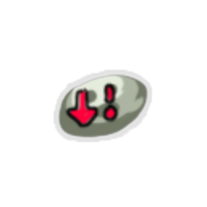
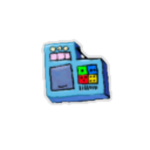
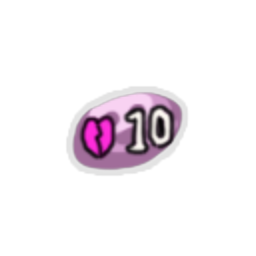
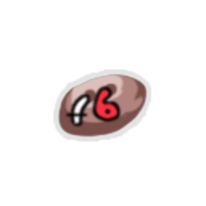
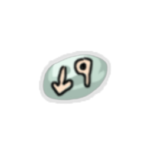
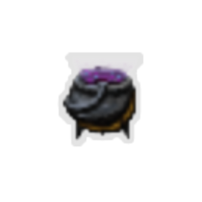
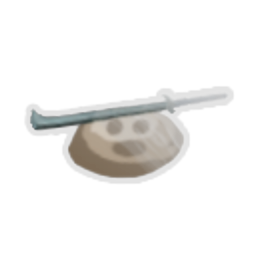
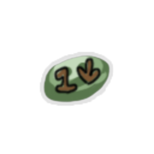

| Image | Name | Rarity | Color | Description | Flavor |
| ----- | ---- | ------ | ----- | ----------- | ------ |
|  | Charge Upper | Common | Red | Every time you gain #b35 #yBlock, gain #b1 #yStrength. | "Oops, I fell asleep without plugging it in..." |
|  | Cold Yogurt | Common | Blue | At the start of each combat, #yChannel #b1 #yFrost. | Tasteless, yet appetizing. |
|  | Consolation Prize | Common |  | Whenever you lose HP, gain that much #yGold. | Gold oozes from your wounds. |
|  | Key Chain | Common |  | Your first #yAttack each combat Shackles its target for damage dealt. | Surprisingly sharp! |
|  | Memory Locket | Common | Green | On the first turn of each combat, #yRetain your hand. | Holding it makes you think back to distant memories. |
|  | Pain Converter | Common |  | When you take #b10 or more damage in one hit, gain [E] and draw a card next turn. | The machine seems to be magnetically attracted to your exposed injuries. |
|  | Thoughtsguard | Common |  | Whenever you draw a card (besides your opening hand), gain #b1 #yBlock. | "Begone, thoughts!" |
|  | Better-O-Tron | Uncommon |  | The next #b3 unupgraded cards you add to your deck are #yUpgraded. | This mechanical worm lurches for your head intermittently. |
|  | Dragon Fruit | Uncommon |  | Upon pickup, raise your Max HP by #b5. At the end of your turn, deal #b1 damage to ALL enemies for each #yAttack played this turn. | Tastes burning hot! |
|  | Focus Sash | Uncommon |  | Damage that would bring you to #b0 HP from over #b10 HP brings you to #b1 HP instead. | It's super effective! |
|  | Invisible Cloak | Uncommon | Green | At the start of combat, ALL enemies lose #b1 #yStrength. | You're far too modest to "wear" this. |
|  | Power Charger | Uncommon | Blue | At the end of your turn, gain #b1 Block for each empty Orb slot. | Conserve energy! Shut off Orb slots when you're not using them. |
|  | Protector Bot | Uncommon |  | When you play #b2 or less cards in a turn, gain #b8 #yBlock at the end of the turn. | This little bot dives in to take attacks when you're wide open. |
|  | Shifting Skin | Uncommon |  | At the start of each combat, gain 1 stack of ANY random positive power. | Your body flows fluidly, changing to adapt to each situation... |
|  | Strike Shooter | Uncommon | Red | At the start of every third turn, play a Strike at a random target. | All your sword-firing needs in one medium package! |
|  | Bejeweled Orb | Rare | Blue | Whenever you have #b3 of the same type of Orb in a row, Evoke them and #yChannel #b2 random Orbs. | You have an urge to match items of similar color. |
|  | Box of Bandaids | Rare |  | Whenever you add a card to your deck, heal #b5 HP. | Vends only when shown cool techniques. |
|  | Broken Bowl | Rare |  | Whenever you add an unupgraded card to your deck, #yUpgrade it and lose #b2 Max HP. | Sand drains from it endlessly. |
|  | Code Smelter | Rare | Blue | Whenever you #yChannel an Orb, trigger its passive ability. | Combines subprocesses into one big clump. Simple! |
|  | Cooling Fan | Rare | Blue | Whenever you #yChannel an Orb, gain #b2 #yBlock. | This fan helps you save processes when performing monster solution options. |
|  | Helpful Mold | Rare | Red | Whenever you gain #yBlock, gain #b1 #yStrength this turn only. | This mold siphons off bits of your shield to feed you. |
|  | Plague Vial | Rare |  | Non-Boss enemies have #b15 % less HP. | This sentient sickness seeks dangerous entities. |
|  | Retaliation Kit | Rare | Green | The first time your #yBlock is broken each combat, apply #b2 #yWeak to ALL enemies. | All you need to disappear in a burst of smoke! Smoke not included. |
|  | Writhing Mask | Rare |  | At the start of each combat, gain #b3 #yMalleable. | It squirms on your face uncomfortably. |
|  | Barbed Pack | Special |  | At the start of your turn, gain #b10 Constricted. | Just a little pokey. |
|  | Broadsword | Special |  | At the start of each combat, gain #b2 #yStrength. You draw one less card each turn. | The smith fashioned you a slightly oversized weapon! |
|  | Clock Toy | Special |  | At the start of each combat, Time Eater drops in. | Time Eater collects these. |
|  | Diamond Sword | Special |  | Whenever you play an #yAttack, gain #b3 #yGold. | The smith fashioned you a rather blocky sword! |
|  | Double-Edged Sword | Special |  | At the start of each combat, gain #b2 #yStrength and each enemy gains #b1 #yThorns. | The smith fashioned you an overly sharp blade! |
|  | Draining Sword | Special |  | Whenever you play an Attack, heal #b1 HP. You start each combat with - #b1 #yStrength. | The smith fashioned you a vampiric sword! |
|  | Easy Removal | Special |  | Whenever you play a card, remove it from your deck. | Searing Blow deck, here we come... |
|  | Energy Shake | Special |  | Upon pickup, brews #b1 random potion. | Tasty. |
|  | Growing Illness | Special |  | At the end of your turn, add a #rParasite to your deck permanently. | You grow more haggard every moment. |
|  | Happy Drink | Special |  | Upon pickup, gain #b1 Max HP. NL Whenever you enter a shop, gain #b1 Max HP. | The shop offers free refills. |
|  | Imaginary Sword | Special |  | Upon pickup, remove two #yAttack cards from your deck. | Already, your memories of a smith feel faint... |
|  | Infernal Sword | Special |  | At the start of each combat, add a random #yAttack to your hand. It costs #b0 this turn. | This sword burns endlessly. You can't even hold it... |
|  | Intensificator | Special |  | ALL enemies start combat with #b50 #yStrength. | Just a mild buff. |
|  | Pitiful Bounty | Special |  | Whenever an enemy dies, gain #b3 #yBlock. | Whoever this criminal was, you'd only get a gold piece for them. |
|  | Puke Worm | Special |  | At the end of battle, gain #b2 #yGold. | This tiny worm pukes up coins when you impress it. |
|  | Robot's Gift | Special |  | At the start of each combat, gain #b2 Orb slots. | The thankful boon of a strange automaton. |
|  | Rusty Sword | Special |  | You start each combat with - #b1 #yStrength. Enemies start each combat with - #b2 #yStrength. | The smith fashioned you a crumbling sword... |
|  | Short Stop | Special |  | Future maps are 9 floors long. If stuck, use the BaseMod debug mode in the console. | Weathered from hundreds of home runs. |
|  | Snecko Spit | Special |  | Whenever you draw a card, set its cost to #b5. | Tastes disgusting. |
|  | Spin Shoes | Special |  | Upon pickup, #yTransform ALL cards in your deck into #rCurses. | You cannot remove these shoes, and they keep making you trip. |
|  | Toy Sword | Special |  | Your attacks Shackle their targets for #b2 #yStrength. Start each combat with - #b1 #yStrength. | The smith fashioned you a little sword charm! |
|  | Transient Hat | Special |  | At the start of each combat, gain #b1 #yFading. | Transient! I'm your biggest fan! |
|  | Voice Box | Special |  | You can talk now. | You feel badly written. |
|  | Big Berry | Boss |  | Upon pickup, raise your Max HP by 22. | A fruit long thought to be forgotten. The Spireblight proved to be quite the preservative. |
|  | Cursed Compass | Boss |  | Gain [E] at the start of your turn. NL Future maps have only #b1 path. | No matter which way you turn, it always points forwards... |
|  | Mind Devourer | Boss |  | Gain [E] at the start of your turn. NL At the end of each combat, a random card in your deck is removed. | You can feel knowledge of techniques and attacks drifting away as you hold it. |
|  | Morality Core | Boss | Red | Gain [E] at the start of your turn. NL At the start of each combat, gain #b3 #yWeak. | "Iron one, you gave so much for your strength... and now you give it up as well." |
|  | Sticky Tar | Boss | Green | Gain [E] at the start of your turn. NL At the start of each combat, lose #b2 #yDexterity. | "Quiet one, you think yourself so clever with your dodgy moves. Be exposed!" |
|  | System Virus | Boss | Blue | Gain [E] at the start of your turn. NL At the start of each combat, lose #b2 Orb slots. | "Defective one, your creativity needs... dulling." |
|  | Tangling Vine | Boss |  | Gain [E] at the start of your turn. NL At the start of your turn, gain #b1 #yConstricted. | It reaches for you, filled with malicious intents... |
|  | Berry Sword | Shop |  | Upon pickup, gain #b8 Max HP. The first #b2 cards you play each combat are removed from your deck permanently. | Tiny bites of this sword invigorate you. |
|  | Concentration Valve | Shop | Blue | Every time you play #b2 #yPowers in a turn, gain #b1 #yFocus. | The more you focus, the more it focuses you. |
|  | Cooldron | Shop |  | All Potions you obtain are Entropic Brews. | This cauldron is a lot cooler than any regular old cauldron. |
|  | Ghostly Gear | Shop |  | Whenever you play a Strike or Defend, #yExhaust it. | The sword and shield are more difficult to see each time you look. |
|  | Golden Armor | Shop |  | Your health is ALWAYS equal to your #yGold. Instead of losing health, lose twice that much #yGold. | Expensive... but worth it? |
|  | Pill Tracker | Shop |  | At the start of turn #b5, remove all your Debuffs. | Always remember to take your medication on time! |
|  | Salvaging Tools | Shop | Green | Whenever you discard a card, reduce the cost of a random card in your hand by #b1 this turn. | "Curious! These primitive things are utterly useless." -Ranwid |
|  | Scavenger Helm | Shop |  | If you have #b2 or less cards in your hand at the end of your turn, you may #yRetain one. | Used by the tribes far from the Spire. |
|  | Slug's Watch | Shop |  | After you play #b12 cards, end your turn and gain #b2 #yStrength. | Someone is going to want this back. |
|  | Sword of Lies | Shop | Red | Start each combat with #b1 #yStrength. At the start of each combat, add a random #rCurse to your hand. | "I am the Sword of Truth." |
